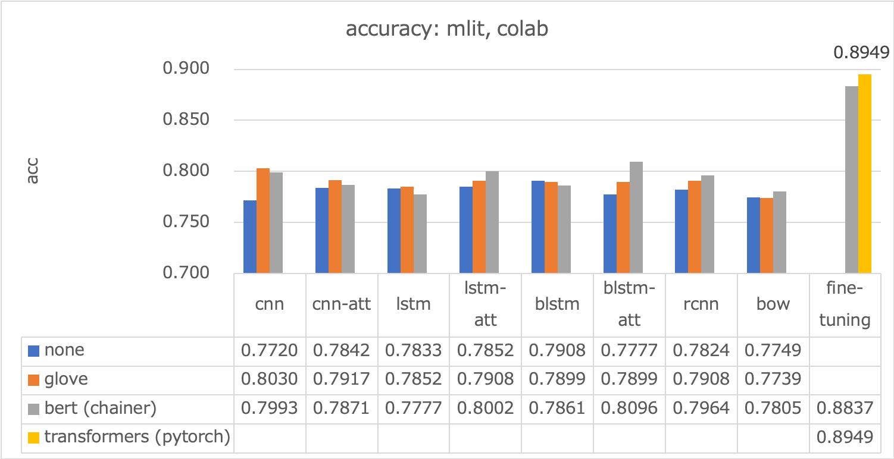

# BERT-Classification (PyTorch example code for Text Classification using BERT fine-tuning)

### Description

This example code is a text entclassification using BERT fine-tuning.

### Dependencies
- Python 3.7
- PyTorch 1.6.0
- Transformers 3.0.2
- MeCab 0.996 (for Japanese)

In addition, please add the project folder to PYTHONPATH and `conca install` the following packages:
- `matplotlib`
- `filelock`
- `tqdm`
- `mecab-python3` (for Japanese)

### Usage ###

### Preparation ###

***Data***

  - [Scale Movie Review Dataset](https://www.cs.cornell.edu/people/pabo/movie-review-data/) (rt-polarity): Predict its sentiment (positive/negative) from a review about a movie.
  - [Road Transport Bureau of MLIT](http://carinf.mlit.go.jp/jidosha/carinf/opn/index.html)
  - Create train and test datasets and put them in the appropriate place.

```
wc -l datasets/rt-polarity/04-{train,test}.txt
    9596 datasets/rt-polarity/04-train.txt
    1066 datasets/rt-polarity/04-test.txt
   10662 total

head -n 3 datasets/rt-polarity/04-train.txt
==> datasets/rt-polarity/04-train.txt <==
0	simplistic , silly and tedious .
0	it's so laddish and juvenile , only teenage boys could possibly find it funny .
0	exploitative and largely devoid of the depth or sophistication that would make watching such a graphic treatment of the crimes bearable .

head -n 3 datasets/rt-polarity/04-test.txt
0	a visually flashy but narratively opaque and emotionally vapid exercise in style and mystification .
0	while the performances are often engaging , this loose collection of largely improvised numbers would probably have worked better as a one-hour tv documentary .
0	on a cutting room floor somewhere lies . . . footage that might have made no such thing a trenchant , ironic cultural satire instead of a frustrating misfire .
```

```
wc -l datasets/mlit/04-{train,test}.txt
   46743 datasets/mlit/04-train.txt
    5197 datasets/mlit/04-test.txt
   51940 total

head -n 3 datasets/mlit/04-train.txt
エンジン	車庫にいれるために、右後方縦列駐車でバックしていたところ、アクセル操作をしていないのに車が急加速し、右後方の壁に激突した。
エンジン	一般道路を走行中、突然エンジンが停止した。
制動装置	高速道路を１００ｋｍ／ｈくらいで走行中、ＡＢＳのマーク、サイドブレーキのマークが表示された。

head -n 3 datasets/mlit/04-test.txt
車枠・車体	ダッシュボードが溶けてベトベトしている。
排ｶﾞｽ･騒音	ＮＯＸセンサーの不良により、エンジン警告灯が点きっぱなしになった。
車枠・車体	電動オープンのルーフを閉じるときに、エラーメッセージが出て幌が閉まらなくなった。
```

***Run and Evaluate***

- training for rt-polarity datasets (for English)

```
python train_bert.py \
--train datasets/rt-polarity/04-train.txt \
--valid datasets/rt-polarity/04-test.txt \
--pretrained "bert-base-uncased" \
--batchsize 64 \
--learnrate 2e-05 \
--epoch 10 \
--out results_bertrt \
2>&1 | tee train_bert-rt.log

2020-08-01 04:53:19,574 - main - INFO - {
  "train": "datasets/rt-polarity/04-train.txt",
  "valid": "datasets/rt-polarity/04-test.txt",
  "pretrained": "bert-base-uncased",
  "batchsize": 64,
  "learnrate": 2e-05,
  "epoch": 10,
  "out": "results_bert-rt",
  "noplot": false
}
# train: 9596, valid: 1066
# class: 2, labels: {'0': 0, '1': 1}
# vocab: 30522
saving early-stopped model (loss) at epoch 1
saving early-stopped model (uar) at epoch 1
2020-08-01 04:56:49,630 - main - INFO - [  2] T/loss=0.255309 T/acc1=0.902876 T/acc2=0.000000 T/sec= 129.655606 D/loss=0.300297 D/acc1=0.894934 D/acc2=0.894934 D/sec= 2.198617 
saving early-stopped model (loss) at epoch 2
saving early-stopped model (uar) at epoch 2
2020-08-01 04:59:01,653 - main - INFO - [  3] T/loss=0.150620 T/acc1=0.947582 T/acc2=0.000000 T/sec= 129.806652 D/loss=0.397301 D/acc1=0.873358 D/acc2=0.873358 D/sec= 2.216371 
2020-08-01 05:00:06,524 - main - INFO - [  4] T/loss=0.086604 T/acc1=0.972072 T/acc2=0.000000 T/sec= 62.646059 D/loss=0.464844 D/acc1=0.881801 D/acc2=0.881801 D/sec= 2.225516 
 :
2020-08-01 05:06:33,524 - main - INFO - [ 10] T/loss=0.022666 T/acc1=0.994268 T/acc2=0.000000 T/sec= 61.612779 D/loss=0.806572 D/acc1=0.876173 D/acc2=0.876173 D/sec= 2.194018 

==== Classification report (early_stopped-uar) ====

              precision    recall  f1-score   support

           0       0.90      0.89      0.89       533
           1       0.89      0.90      0.90       533

    accuracy                           0.89      1066
   macro avg       0.89      0.89      0.89      1066
weighted avg       0.89      0.89      0.89      1066
```

- training for mlit datasets (for Japanese)

```
python train_bert.py \
--train datasets/mlit/04-train.txt \
--valid datasets/mlit/04-test.txt \
--pretrained "cl-tohoku/bert-base-japanese-whole-word-masking" \
--batchsize 64 \
--learnrate 2e-05 \
--epoch 10 \
--out results_bert-mlit \
2>&1 | tee train_bert-mlit.log

2020-08-01 01:30:16,191 - main - INFO - {
  "train": "datasets/mlit/04-train.txt",
  "valid": "datasets/mlit/04-test.txt",
  "batchsize": 64,
  "learnrate": 2e-05,
  "epoch": 10,
  "out": "results_bert-mlit",
  "noplot": false
}
# train: 46742, valid: 5197
# class: 16, labels: {'エンジン': 0, '制動装置': 1, '動力伝達': 2, '排ｶﾞｽ･騒音': 3, '乗車装置': 4, '保安灯火': 5, '車枠・車体': 6, 'かじ取り': 7, '電気装置': 8, '燃料装置': 9, 'その他': 10, '電動機(モーター)': 11, '緩衝装置': 12, '走行装置': 13, '装置その他': 14, '非装置': 15}
# vocab: 32000
Linear(in_features=768, out_features=16, bias=True)
2020-08-01 01:36:39,128 - main - INFO - [  1] T/loss=0.772249 T/acc1=0.785247 T/acc2=0.000000 T/sec= 360.953966 D/loss=0.481126 D/acc1=0.862998 D/acc2=0.715137 D/sec= 12.367324 
saving early-stopped model (loss) at epoch 1
saving early-stopped model (uar) at epoch 1
2020-08-01 01:44:03,182 - main - INFO - [  2] T/loss=0.428546 T/acc1=0.876214 T/acc2=0.000000 T/sec= 431.688994 D/loss=0.448293 D/acc1=0.874735 D/acc2=0.727704 D/sec= 12.364935 
saving early-stopped model (loss) at epoch 2
saving early-stopped model (uar) at epoch 2
2020-08-01 01:51:30,491 - main - INFO - [  3] T/loss=0.341935 T/acc1=0.899726 T/acc2=0.000000 T/sec= 434.855184 D/loss=0.458531 D/acc1=0.877044 D/acc2=0.723688 D/sec= 12.453704 
 :
2020-08-01 02:38:35,008 - main - INFO - [ 10] T/loss=0.073781 T/acc1=0.978863 T/acc2=0.000000 T/sec= 403.277593 D/loss=0.747309 D/acc1=0.868193 D/acc2=0.740413 D/sec= 12.434072 

==== Classification report (early_stopped-uar) ====

              precision    recall  f1-score   support

        かじ取り       0.89      0.87      0.88       299
         その他       0.81      0.71      0.76       300
        エンジン       0.88      0.91      0.89      1494
        乗車装置       0.90      0.95      0.92       290
        保安灯火       0.90      0.95      0.92       363
        制動装置       0.93      0.93      0.93       477
        動力伝達       0.91      0.91      0.91       814
     排ｶﾞｽ･騒音       0.93      0.85      0.89       122
        燃料装置       0.86      0.88      0.87       232
        緩衝装置       0.86      0.82      0.84       129
       装置その他       0.56      0.42      0.48        12
        走行装置       0.88      0.85      0.86       127
       車枠・車体       0.73      0.73      0.73       323
   電動機(モーター)       0.81      0.50      0.62        34
        電気装置       0.79      0.69      0.73       177
         非装置       0.00      0.00      0.00         4

    accuracy                           0.87      5197
   macro avg       0.79      0.75      0.76      5197
weighted avg       0.87      0.87      0.87      5197
```

- Learning Curve (train_bert.py on Google Colaboratory)

|rt-polarity|mlit| 
|---|---|
|

 

See also: [Chainer classification experiments](/bert/classify/README.md)

See also: [other classification experiments](/classify)
