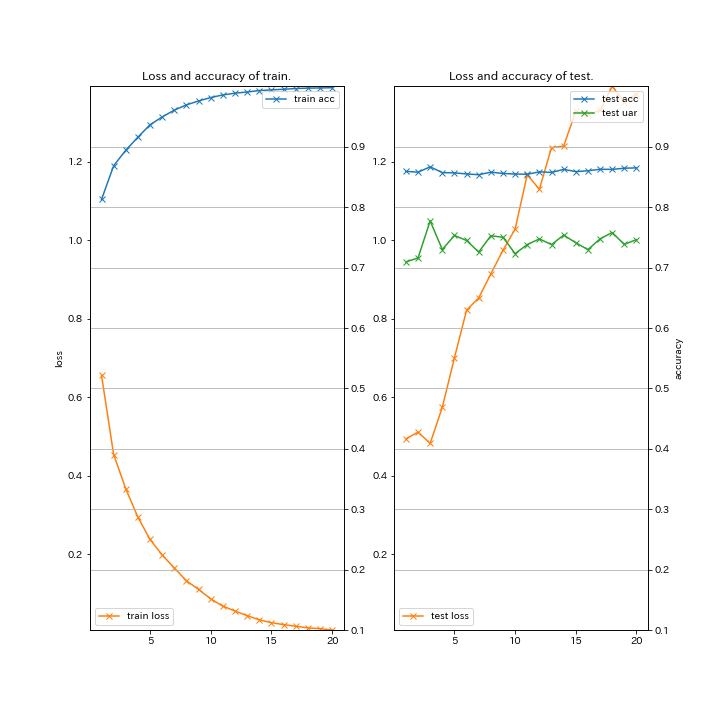
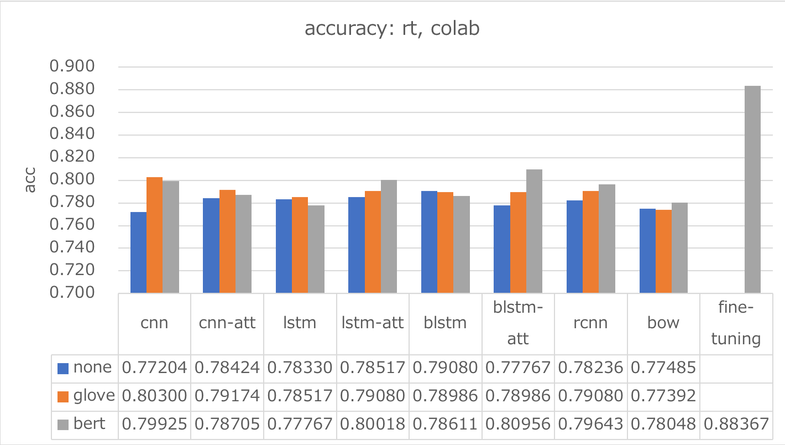

# BERT-Classification (Chainer example code for Text Classification using BERT fine-tuning)

### Description

This example code is a text entclassification using BERT fine-tuning.

### Dependencies
- python 3.7
- chainer 5.4

In addition, please add the project folder to PYTHONPATH and `conca install` the following packages:
- `matplotlib`

### Usage ###

### Preparation ###

***BERT Pretrained model***

  - Downlod [Pretrained model (English)](https://github.com/google-research/bert) and extract them in "BERT".
  - Downlod [Pretrained model (Japanese)](http://nlp.ist.i.kyoto-u.ac.jp/DLcounter/lime.cgi?down=http://nlp.ist.i.kyoto-u.ac.jp/nl-resource/JapaneseBertPretrainedModel/Japanese_L-12_H-768_A-12_E-30_BPE.zip&name=Japanese_L-12_H-768_A-12_E-30_BPE.zip) and extract them in "BERT".

***Data***

  - [Scale Movie Review Dataset](https://www.cs.cornell.edu/people/pabo/movie-review-data/) (rt-polarity): Predict its sentiment (positive/negative) from a review about a movie.
  - [Road Transport Bureau of MLIT](http://carinf.mlit.go.jp/jidosha/carinf/opn/index.html)
  - Create train and test datasets and put them in the appropriate place.

```
wc -l datasets/rt-polarity/04-{train,test}.txt
    9596 datasets/rt-polarity/04-train.txt
    1066 datasets/rt-polarity/04-test.txt
   10662 total

head -n 3 datasets/rt-polarity/04-train.txt
==> datasets/rt-polarity/04-train.txt <==
0	simplistic , silly and tedious .
0	it's so laddish and juvenile , only teenage boys could possibly find it funny .
0	exploitative and largely devoid of the depth or sophistication that would make watching such a graphic treatment of the crimes bearable .

head -n 3 datasets/rt-polarity/04-test.txt
0	a visually flashy but narratively opaque and emotionally vapid exercise in style and mystification .
0	while the performances are often engaging , this loose collection of largely improvised numbers would probably have worked better as a one-hour tv documentary .
0	on a cutting room floor somewhere lies . . . footage that might have made no such thing a trenchant , ironic cultural satire instead of a frustrating misfire .
```

```
wc -l datasets/mlit/04-{train,test}.txt
   46743 datasets/mlit/04-train.txt
    5197 datasets/mlit/04-test.txt
   51940 total

head -n 3 datasets/mlit/04-train.txt
エンジン	車庫 に いれる ため に 、 右 後方 縦列 駐車 で バック して いた ところ 、 アクセル 操作 を して い ない のに 車 が 急 加速 し 、 右 後方 の 壁 に 激突 した 。
エンジン	一般 道路 を 走行 中 、 突然 エンジン が 停止 した 。
制動装置	高速 道路 を １００ ｋｍ／ｈ くらい で 走行 中 、 ＡＢＳ の マーク 、 サイド ブレーキ の マーク が 表示 さ れた 。

head -n 3 datasets/mlit/04-test.txt
車枠・車体	ダッシュボード が 溶けて ベトベト して いる 。
排ｶﾞｽ･騒音	ＮＯＸ センサー の 不良に より 、 エンジン 警告 灯 が 点き っぱなし に なった 。
車枠・車体	電動 オープン の ルーフ を 閉じる とき に 、 エラー メッセージ が 出て 幌 が 閉まら なく なった 。
```

***Run and Evaluate***

- training for rt-polarity datasets (for English)

```
python train_bert.py \
--train datasets/rt-polarity/04-train.txt \
--eval  datasets/rt-polarity/04-test.txt \
--vocab_file       BERT/uncased_L-12_H-768_A-12/vocab.txt \
--bert_config_file BERT/uncased_L-12_H-768_A-12/bert_config.json \
--init_checkpoint  BERT/uncased_L-12_H-768_A-12/arrays_bert_model.ckpt.npz \
--gpu 0 \
--epoch 50 \
--learnrate 5e-05 \
--weightdecay 0.01 \
--batchsize 32 \
--out results_bert-rt \
2>&1 | tee train_bert-rt.log

{
  "gpu": 0,
  "batchsize": 32,
  "learnrate": 5e-05,
  "weightdecay": 0.01,
  "epoch": 50,
  "train": "../datasets/rt-polarity/04-train.txt",
  "eval": "../datasets/rt-polarity/04-test.txt",
  "init_checkpoint": "../../BERT/uncased_L-12_H-768_A-12/arrays_bert_model.ckpt.npz",
  "bert_config_file": "../../BERT/uncased_L-12_H-768_A-12/bert_config.json",
  "vocab_file": "../../BERT/uncased_L-12_H-768_A-12/vocab.txt",
  "out": "results_bert-rt",
  "resume": "",
  "start_epoch": 1,
  "noplot": false
}
2019-08-16 00:15:57,399 - load_data - INFO - Loading dataset ... done.
2019-08-16 00:15:58,262 - load_data - INFO - Loading dataset ... done.
# train: 9596, eval: 1066,
# class: 2, labels: {'0': 0, '1': 1}
# vocab: 30522
2019-08-16 00:21:09,383 - main - INFO - [  1] T/loss=0.397143 T/acc1=0.825552 T/acc2=0.000000 T/sec= 270.508771 D/loss=0.312218 D/acc1=0.873358 D/acc2=0.873358 D/sec= 16.910139 lr=0.509208 eta=0.000050
saving early-stopped model (loss) at epoch 1
saving early-stopped model (uar) at epoch 1
2019-08-16 00:28:26,624 - main - INFO - [  2] T/loss=0.193262 T/acc1=0.930075 T/acc2=0.000000 T/sec= 420.337496 D/loss=0.355167 D/acc1=0.869606 D/acc2=0.869606 D/sec= 16.903430 lr=0.671828 eta=0.000049
2019-08-16 00:34:13,282 - main - INFO - [  3] T/loss=0.094704 T/acc1=0.969675 T/acc2=0.000000 T/sec= 329.799550 D/loss=0.522871 D/acc1=0.866792 D/acc2=0.866792 D/sec= 16.858395 lr=0.770463 eta=0.000048
 :
2019-08-16 03:12:16,458 - main - INFO - [ 30] T/loss=0.002826 T/acc1=0.999479 T/acc2=0.000000 T/sec= 331.914541 D/loss=1.109903 D/acc1=0.883677 D/acc2=0.883677 D/sec= 16.938877 lr=0.999939 eta=0.000021
saving early-stopped model (uar) at epoch 30
 :
2019-08-16 05:09:12,896 - main - INFO - [ 50] T/loss=0.000548 T/acc1=0.999896 T/acc2=0.000000 T/sec= 332.742293 D/loss=1.314032 D/acc1=0.868668 D/acc2=0.868668 D/sec= 16.919984 lr=1.000000 eta=0.000001

==== Classification report (early_stopped-uar) ====

              precision    recall  f1-score   support

           0       0.91      0.85      0.88       533
           1       0.86      0.91      0.89       533

    accuracy                           0.88      1066
   macro avg       0.89      0.88      0.88      1066
weighted avg       0.89      0.88      0.88      1066
```

- training for mlit datasets (for Japanese)

```
python train_bert.py \
--train datasets/mlit/04-train.txt \
--eval  datasets/mlit/04-test.txt \
--vocab_file       BERT/Japanese_L-12_H-768_A-12_E-30_BPE/vocab.txt \
--bert_config_file BERT/Japanese_L-12_H-768_A-12_E-30_BPE/bert_config.json \
--init_checkpoint  BERT/Japanese_L-12_H-768_A-12_E-30_BPE/arrays_bert_model.ckpt.npz \
--gpu 0 \
--epoch 50 \
--learnrate 5e-05 \
--weightdecay 0.01 \
--batchsize 16 \
--out results_bert-mlit \
2>&1 | tee train_bert-mlit.log

{
  "gpu": 0,
  "batchsize": 16,
  "learnrate": 5e-05,
  "weightdecay": 0.01,
  "epoch": 20,
  "train": "../datasets/mlit/04-train.txt",
  "eval": "../datasets/mlit/04-test.txt",
  "init_checkpoint": "../../BERT/Japanese_L-12_H-768_A-12_E-30_BPE/arrays_bert_model.ckpt.npz",
  "bert_config_file": "../../BERT/Japanese_L-12_H-768_A-12_E-30_BPE/bert_config.json",
  "vocab_file": "../../BERT/Japanese_L-12_H-768_A-12_E-30_BPE/vocab.txt",
  "out": "results_bert-mlit",
  "resume": "",
  "start_epoch": 1,
  "noplot": false
}
2019-08-18 00:18:46,559 - load_data - INFO - Loading dataset ... done.
2019-08-18 00:18:48,403 - load_data - INFO - Loading dataset ... done.
# train: 46742, eval: 5197,
# class: 16, labels: {'エンジン': 0, '制動装置': 1, '動力伝達': 2, '排ｶﾞｽ･騒音': 3, '乗車装置': 4, '保安灯火': 5, '車枠・車体': 6, 'かじ取り': 7, '電気装置': 8, '燃料装置': 9, 'その他': 10, '電動機(モーター)': 11, '緩衝装置': 12, '走行装置': 13, '装置その他': 14, '非装置': 15}
# vocab: 32005
2019-08-18 00:51:24,479 - main - INFO - [  1] T/loss=0.656468 T/acc1=0.812866 T/acc2=0.000000 T/sec= 1819.035205 D/loss=0.494502 D/acc1=0.859342 D/acc2=0.709411 D/sec= 99.328302 lr=0.972755 eta=0.000050
saving early-stopped model (loss) at epoch 1
saving early-stopped model (uar) at epoch 1
2019-08-18 01:25:51,698 - main - INFO - [  2] T/loss=0.454335 T/acc1=0.868662 T/acc2=0.000000 T/sec= 1967.863285 D/loss=0.511545 D/acc1=0.857995 D/acc2=0.715947 D/sec= 99.355580 lr=0.998555 eta=0.000048
saving early-stopped model (uar) at epoch 2
2019-08-18 01:59:26,481 - main - INFO - [  3] T/loss=0.367100 T/acc1=0.894399 T/acc2=0.000000 T/sec= 1915.353535 D/loss=0.483086 D/acc1=0.866846 D/acc2=0.777255 D/sec= 99.428910 lr=0.999922 eta=0.000045
saving early-stopped model (loss) at epoch 3
saving early-stopped model (uar) at epoch 3
 :
2019-08-18 11:25:40,079 - main - INFO - [ 20] T/loss=0.007478 T/acc1=0.997839 T/acc2=0.000000 T/sec= 1907.703713 D/loss=1.372899 D/acc1=0.865114 D/acc2=0.746334 D/sec= 99.867510 lr=1.000000 eta=0.000003

==== Classification report (early_stopped-loss) ====

              precision    recall  f1-score   support

        かじ取り       0.88      0.87      0.88       299
         その他       0.86      0.68      0.76       300
        エンジン       0.88      0.90      0.89      1494
        乗車装置       0.88      0.95      0.92       290
        保安灯火       0.89      0.94      0.92       363
        制動装置       0.94      0.93      0.94       477
        動力伝達       0.91      0.89      0.90       814
     排ｶﾞｽ･騒音       0.80      0.93      0.86       122
        燃料装置       0.85      0.87      0.86       232
        緩衝装置       0.88      0.83      0.86       129
       装置その他       0.57      0.67      0.62        12
        走行装置       0.91      0.77      0.83       127
       車枠・車体       0.73      0.68      0.70       323
   電動機(モーター)       0.47      0.79      0.59        34
        電気装置       0.72      0.73      0.72       177
         非装置       0.00      0.00      0.00         4

    accuracy                           0.87      5197
   macro avg       0.76      0.78      0.76      5197
weighted avg       0.87      0.87      0.87      5197
```

- Learning Curve (train_bert.py on Google Colaboratory)

|rt-polarity|mlit| 
|---|---|
|

 

See also: [other classification experiments](/classify/README.md)

###Explaining text classifiers using LIME

```
pip install lime
```

- for rt-polarity datasets

```
python lime_bert.py \
--gpu -1 \
--batchsize 16 \
--test  "datasets/rt-polarity/04-test.txt" \
--model "models/rt-polarity/early_stopped-uar.model" \
--label "models/rt-polarity/labels.bin" \
--init_checkpoint  "BERT/uncased_L-12_H-768_A-12/arrays_bert_model.ckpt.npz" \
--bert_config_file "BERT/uncased_L-12_H-768_A-12/bert_config.json" \
--vocab_file       "BERT/uncased_L-12_H-768_A-12/vocab.txt" \
--topN 1 \
--out "results_lime-bert-rt"
```

- for mlit datasets (for Japanese)

```
python lime_bert.py \
--gpu -1 \
--batchsize 16 \
--test  "datasets/mlit/04-test.txt" \
--model "models/mlit/early_stopped-uar.model" \
--label "models/mlit/labels.bin" \
--init_checkpoint  "BERT/Japanese_L-12_H-768_A-12_E-30_BPE/arrays_bert_model.ckpt.npz" \
--bert_config_file "BERT/Japanese_L-12_H-768_A-12_E-30_BPE/bert_config.json" \
--vocab_file       "BERT/Japanese_L-12_H-768_A-12_E-30_BPE/vocab.txt" \
--topN 1 \
--out "results_lime-bert-mlit"
```

|LIME output (rt-polarity)|
||

|LIME output (mlit)|
||
