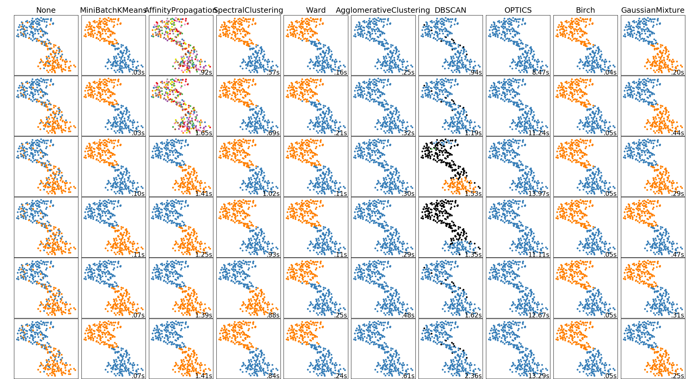
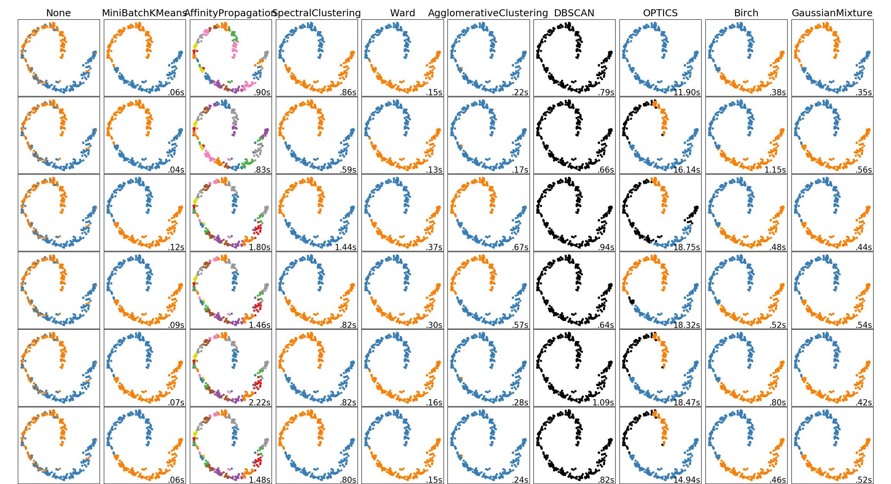
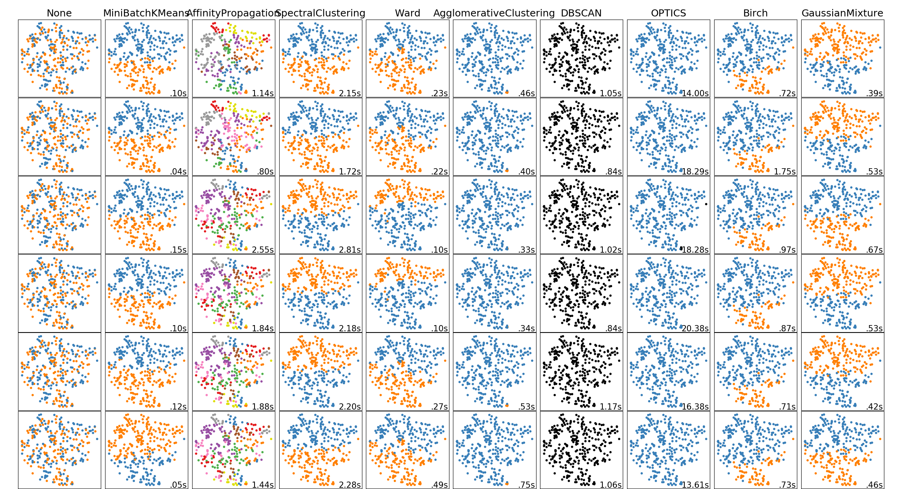
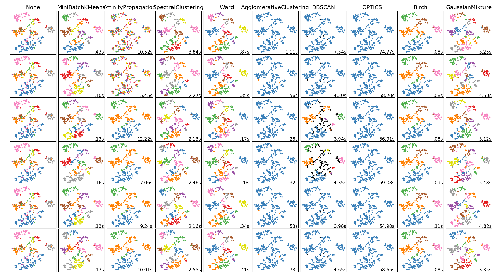
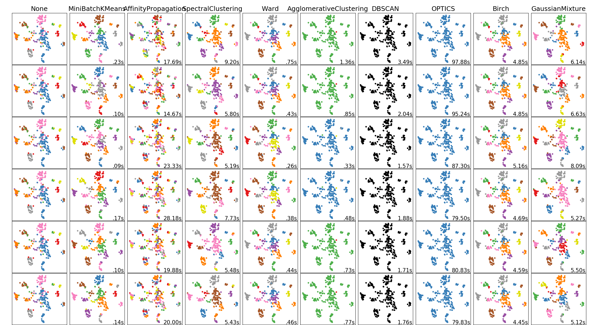
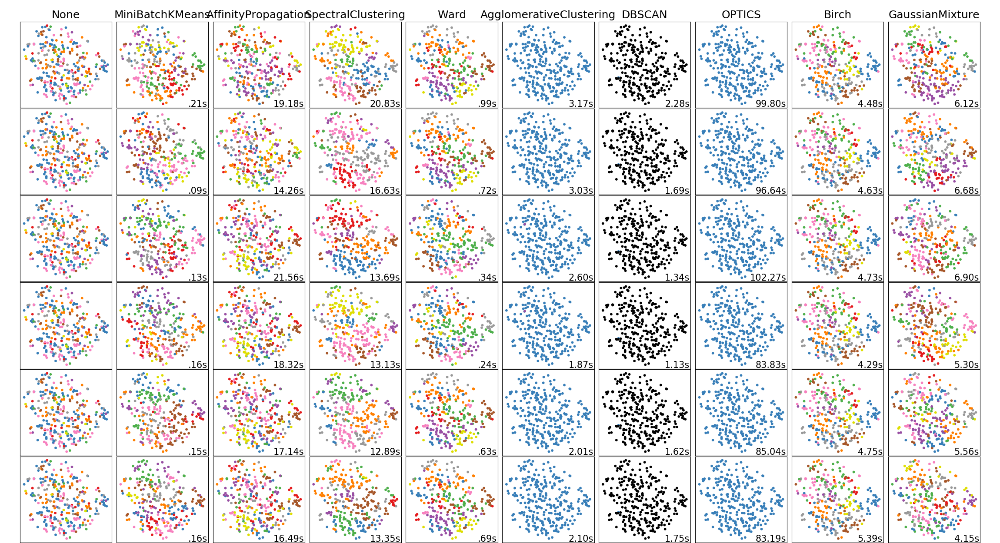

# BERT-Embeddings Clustering (Chainer example code for Text Clustering using BERT embeddings)

### Description

This example code is a text clustering using BERT embeddings.

### Dependencies
- python 3.7
- chainer 5.4

In addition, please add the project folder to PYTHONPATH and `conca install` the following packages:
- `matplotlib`

### Usage ###

### Preparation ###

***BERT Pretrained model***

  - Downlod [Pretrained model (English)](https://github.com/google-research/bert) and extract them in "BERT".
  - Downlod [Pretrained model (Japanese)](http://nlp.ist.i.kyoto-u.ac.jp/DLcounter/lime.cgi?down=http://nlp.ist.i.kyoto-u.ac.jp/nl-resource/JapaneseBertPretrainedModel/Japanese_L-12_H-768_A-12_E-30_BPE.zip&name=Japanese_L-12_H-768_A-12_E-30_BPE.zip) and extract them in "BERT".

***Data***

  - [Scale Movie Review Dataset](https://www.cs.cornell.edu/people/pabo/movie-review-data/) (rt-polarity): Predict its sentiment (positive/negative) from a review about a movie.
  - [Road Transport Bureau of MLIT](http://carinf.mlit.go.jp/jidosha/carinf/opn/index.html)
  - Create train and test datasets and put them in the appropriate place.

```
wc -l datasets/rt-polarity/04-{train,test}.txt
    9596 datasets/rt-polarity/04-train.txt
    1066 datasets/rt-polarity/04-test.txt
   10662 total

head -n 3 datasets/rt-polarity/04-train.txt
==> datasets/rt-polarity/04-train.txt <==
0	simplistic , silly and tedious .
0	it's so laddish and juvenile , only teenage boys could possibly find it funny .
0	exploitative and largely devoid of the depth or sophistication that would make watching such a graphic treatment of the crimes bearable .

head -n 3 datasets/rt-polarity/04-test.txt
0	a visually flashy but narratively opaque and emotionally vapid exercise in style and mystification .
0	while the performances are often engaging , this loose collection of largely improvised numbers would probably have worked better as a one-hour tv documentary .
0	on a cutting room floor somewhere lies . . . footage that might have made no such thing a trenchant , ironic cultural satire instead of a frustrating misfire .
```

```
wc -l datasets/mlit/04-{train,test}.txt
   46743 datasets/mlit/04-train.txt
    5197 datasets/mlit/04-test.txt
   51940 total

head -n 3 datasets/mlit/04-train.txt
エンジン	車庫 に いれる ため に 、 右 後方 縦列 駐車 で バック して いた ところ 、 アクセル 操作 を して い ない のに 車 が 急 加速 し 、 右 後方 の 壁 に 激突 した 。
エンジン	一般 道路 を 走行 中 、 突然 エンジン が 停止 した 。
制動装置	高速 道路 を １００ ｋｍ／ｈ くらい で 走行 中 、 ＡＢＳ の マーク 、 サイド ブレーキ の マーク が 表示 さ れた 。

head -n 3 datasets/mlit/04-test.txt
車枠・車体	ダッシュボード が 溶けて ベトベト して いる 。
排ｶﾞｽ･騒音	ＮＯＸ センサー の 不良に より 、 エンジン 警告 灯 が 点き っぱなし に なった 。
車枠・車体	電動 オープン の ルーフ を 閉じる とき に 、 エラー メッセージ が 出て 幌 が 閉まら なく なった 。
```

***Run and Evaluate***

- Extract BERT Pre-trained feature (no fine-tuning)

```
python extruct_bert_embed.py \
--input  datasets/rt-polarity/04-test.txt \
--vocab_file       BERT/uncased_L-12_H-768_A-12/vocab.txt \
--bert_config_file BERT/uncased_L-12_H-768_A-12/bert_config.json \
--init_checkpoint  BERT/uncased_L-12_H-768_A-12/arrays_bert_model.ckpt.npz \
--gpu -1 \
--batchsize 64 \
> features/rt-embed-04-test.txt

python extruct_bert_embed.py \
--input datasets/mlit/04-test.txt \
--vocab_file       BERT/Japanese_L-12_H-768_A-12_E-30_BPE/vocab.txt \
--bert_config_file BERT/Japanese_L-12_H-768_A-12_E-30_BPE/bert_config.json \
--init_checkpoint  BERT/Japanese_L-12_H-768_A-12_E-30_BPE/arrays_bert_model.ckpt.npz \
--gpu -1 \
--batchsize 64 \
> features/mlit-embed-04-test.txt
```

- Extract [BERT Classified](../classify/README.md) features (fine-tuning)

```
python extruct_bert_classified.py \
--input  datasets/rt-polarity/04-test.txt \
--vocab_file       BERT/uncased_L-12_H-768_A-12/vocab.txt \
--bert_config_file BERT/uncased_L-12_H-768_A-12/bert_config.json \
--init_checkpoint  BERT/uncased_L-12_H-768_A-12/arrays_bert_model.ckpt.npz \
--model models/classified/rt-polarity/early_stopped-uar.model \
--label models/classified/rt-polarity/labels.bin \
--gpu -1 \
--batchsize 64 \
> features/rt-clsed-04-test.txt

python extruct_bert_classified.py \
--input datasets/mlit/04-test.txt \
--vocab_file       BERT/Japanese_L-12_H-768_A-12_E-30_BPE/vocab.txt \
--bert_config_file BERT/Japanese_L-12_H-768_A-12_E-30_BPE/bert_config.json \
--init_checkpoint  BERT/Japanese_L-12_H-768_A-12_E-30_BPE/arrays_bert_model.ckpt.npz \
--model models/classified/mlit/early_stopped-uar.model \
--label models/classified/mlit/labels.bin \
--gpu -1 \
--batchsize 64 \
> features/mlit-clsed-04-test.txt
```

- Extract [BERT Deep Metrics Learning](../metrics/README.md) features (fine-tuning)

```
python extruct_bert_metrics.py \
--input  datasets/rt-polarity/04-test.txt \
--vocab_file       BERT/uncased_L-12_H-768_A-12/vocab.txt \
--bert_config_file BERT/uncased_L-12_H-768_A-12/bert_config.json \
--init_checkpoint  BERT/uncased_L-12_H-768_A-12/arrays_bert_model.ckpt.npz \
--model models/metrics/rt-polarity/final.model \
--label models/metrics/rt-polarity/labels.bin \
--gpu -1 \
--batchsize 64 \
> features/rt-dml-04-test.txt

python extruct_bert_metrics.py \
--input datasets/mlit/04-test.txt \
--vocab_file       BERT/Japanese_L-12_H-768_A-12_E-30_BPE/vocab.txt \
--bert_config_file BERT/Japanese_L-12_H-768_A-12_E-30_BPE/bert_config.json \
--init_checkpoint  BERT/Japanese_L-12_H-768_A-12_E-30_BPE/arrays_bert_model.ckpt.npz \
--model models/metrics/mlit/final.model \
--label models/metrics/mlit/labels.bin \
--gpu -1 \
--batchsize 64 \
> features/mlit-dml-04-test.txt
```

***Results*** (using [scikit-learn demo](https://scikit-learn.org/stable/auto_examples/cluster/plot_cluster_comparison.html))

- Clustering for t-polarity datasets (for English) using sicikit-clustering

|DML (fine-tuning)|Classified (fine-tuning)|Pre-train (no fine-tuning)| 
|---|---|---|
||

- Clustering for mlit datasets (for Japanese)

|DML (fine-tuning)|Classified (fine-tuning)|Pre-train (no fine-tuning)| 
|---|---|---|
||
