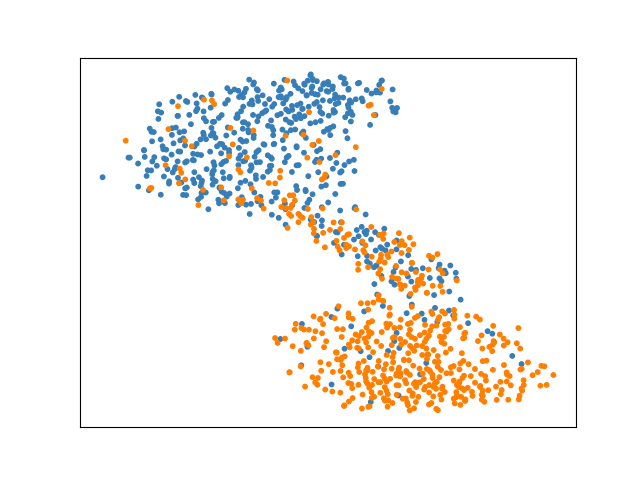
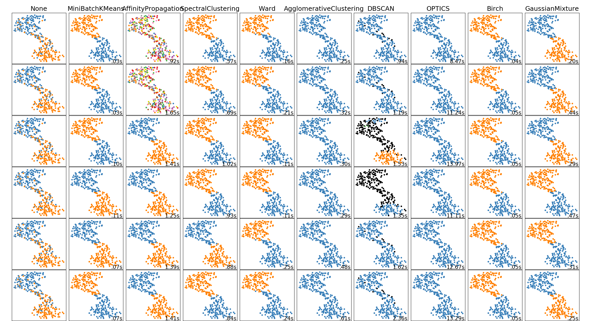
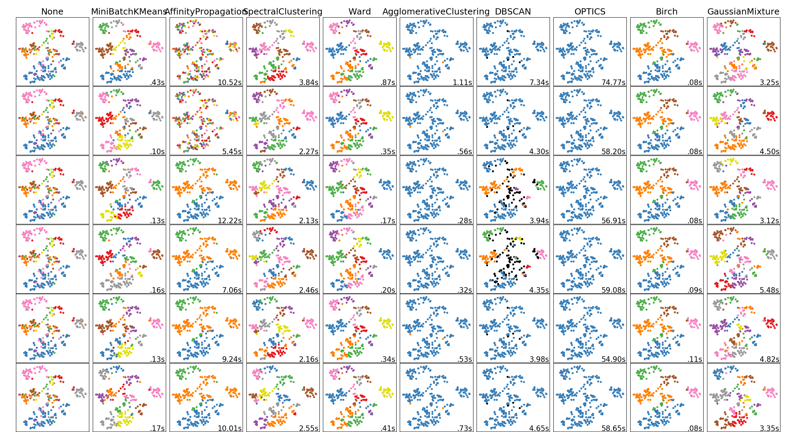
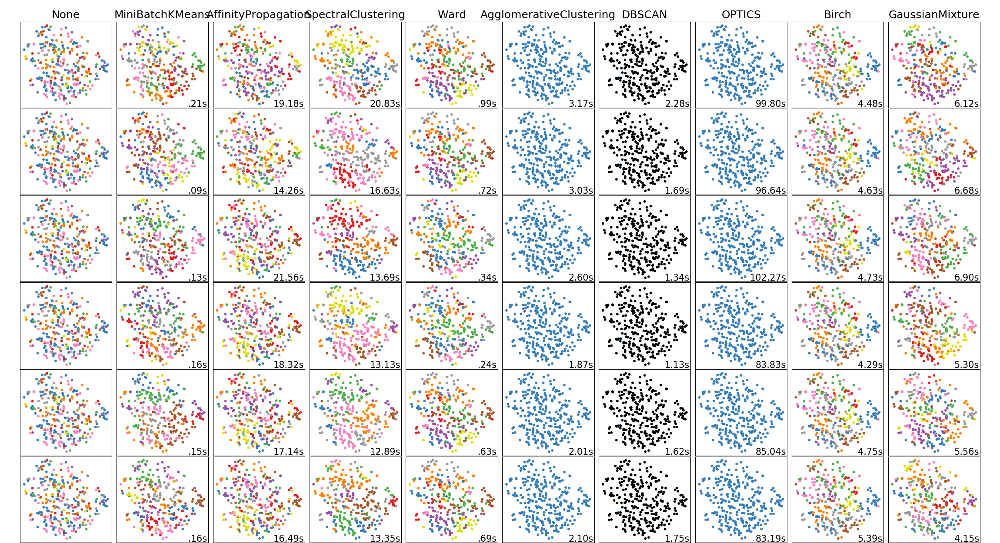

# BERT-DML (Deep Metrics Learning using BERT)

### Description

This example code is Deep Metrics Learning (DML) using BERT.

### Dependencies
- python 3.7
- chainer 5.4

In addition, please add the project folder to PYTHONPATH and `conca install` the following packages:
- `matplotlib`

### Usage ###

### Preparation ###

***BERT Pretrained model***

  - Downlod [Pretrained model (English)](https://github.com/google-research/bert) and extract them in "BERT".
  - Downlod [Pretrained model (Japanese)](http://nlp.ist.i.kyoto-u.ac.jp/DLcounter/lime.cgi?down=http://nlp.ist.i.kyoto-u.ac.jp/nl-resource/JapaneseBertPretrainedModel/Japanese_L-12_H-768_A-12_E-30_BPE.zip&name=Japanese_L-12_H-768_A-12_E-30_BPE.zip) and extract them in "BERT".

***Data***

  - [Scale Movie Review Dataset](https://www.cs.cornell.edu/people/pabo/movie-review-data/) (rt-polarity): Predict its sentiment (positive/negative) from a review about a movie.
  - [Road Transport Bureau of MLIT](http://carinf.mlit.go.jp/jidosha/carinf/opn/index.html)
  - Create train and test datasets and put them in the appropriate place.

```
wc -l datasets/rt-polarity/04-{train,test}.txt
    9596 datasets/rt-polarity/04-train.txt
    1066 datasets/rt-polarity/04-test.txt
   10662 total

head -n 3 datasets/rt-polarity/04-train.txt
==> datasets/rt-polarity/04-train.txt <==
0	simplistic , silly and tedious .
0	it's so laddish and juvenile , only teenage boys could possibly find it funny .
0	exploitative and largely devoid of the depth or sophistication that would make watching such a graphic treatment of the crimes bearable .

head -n 3 datasets/rt-polarity/04-test.txt
0	a visually flashy but narratively opaque and emotionally vapid exercise in style and mystification .
0	while the performances are often engaging , this loose collection of largely improvised numbers would probably have worked better as a one-hour tv documentary .
0	on a cutting room floor somewhere lies . . . footage that might have made no such thing a trenchant , ironic cultural satire instead of a frustrating misfire .
```

```
wc -l datasets/mlit/04-{train,test}.txt
   46743 datasets/mlit/04-train.txt
    5197 datasets/mlit/04-test.txt
   51940 total

head -n 3 datasets/mlit/04-train.txt
エンジン	車庫 に いれる ため に 、 右 後方 縦列 駐車 で バック して いた ところ 、 アクセル 操作 を して い ない のに 車 が 急 加速 し 、 右 後方 の 壁 に 激突 した 。
エンジン	一般 道路 を 走行 中 、 突然 エンジン が 停止 した 。
制動装置	高速 道路 を １００ ｋｍ／ｈ くらい で 走行 中 、 ＡＢＳ の マーク 、 サイド ブレーキ の マーク が 表示 さ れた 。

head -n 3 datasets/mlit/04-test.txt
車枠・車体	ダッシュボード が 溶けて ベトベト して いる 。
排ｶﾞｽ･騒音	ＮＯＸ センサー の 不良に より 、 エンジン 警告 灯 が 点き っぱなし に なった 。
車枠・車体	電動 オープン の ルーフ を 閉じる とき に 、 エラー メッセージ が 出て 幌 が 閉まら なく なった 。
```

***Run and Evaluate***

- for rt-polarity datasets (for English)

```
python train_dml.py \
--batchsize 64 \
--epoch 100 \
--train datasets/rt-polarity/04-train.txt \
--eval  datasets/rt-polarity/04-test.txt \
--init_checkpoint   BERT/uncased_L-12_H-768_A-12/arrays_bert_model.ckpt.npz \
--bert_config_file  BERT/uncased_L-12_H-768_A-12/bert_config.json \
--vocab_file        BERT/uncased_L-12_H-768_A-12/vocab.txt \
--out results_dml-rt \
| tee train_dml-rt.log

{
  "gpu": 0,
  "batchsize": 16,
  "learnrate": 5e-05,
  "weightdecay": 0.01,
  "epoch": 100,
  "train": "datasets/rt-polarity/04-train.txt",
  "eval": "datasets/rt-polarity/04-test.txt",
  "init_checkpoint": "BERT/uncased_L-12_H-768_A-12/arrays_bert_model.ckpt.npz",
  "bert_config_file": "BERT/uncased_L-12_H-768_A-12/bert_config.json",
  "vocab_file": "BERT/uncased_L-12_H-768_A-12/vocab.txt",
  "out": "results_dml-rt",
  "resume": "",
  "start_epoch": 1,
  "noplot": false
}
WARNING:tensorflow:From /content/drive/My Drive/Colab Notebooks/kenkyu/200224_dml/bertlib/tokenization.py:74: The name tf.gfile.GFile is deprecated. Please use tf.io.gfile.GFile instead.

2020-02-24 05:12:13,673 - load_data - INFO - Loading dataset ... done.
2020-02-24 05:12:14,168 - load_data - INFO - Loading dataset ... done.
# train: 9596, eval: 1066,
# class: 2, labels: {'0': 0, '1': 1}
# vocab: 30522
2020-02-24 05:14:01,554 - main - INFO - [  1] T/loss=1.290314 T/acc1=0.000000 T/acc2=0.000000 T/sec= 82.316538 D/loss=0.336179 D/acc1=0.000000 D/acc2=0.000000 D/sec= 9.554560 lr=0.247480 eta=0.000050
saving final model at epoch 1
2020-02-24 05:16:20,575 - main - INFO - [  2] T/loss=0.583780 T/acc1=0.000000 T/acc2=0.000000 T/sec= 129.990178 D/loss=0.198501 D/acc1=0.000000 D/acc2=0.000000 D/sec= 9.031214 lr=0.344153 eta=0.000050
saving final model at epoch 2
  :
2020-02-24 09:43:05,951 - main - INFO - [100] T/loss=0.001288 T/acc1=0.000000 T/acc2=0.000000 T/sec= 154.077329 D/loss=0.158275 D/acc1=0.000000 D/acc2=0.000000 D/sec= 11.699124 lr=0.999084 eta=0.000001
saving final model at epoch 100
2020-02-24 09:44:13,550 - <module> - INFO - time spent: 16332.387188 sec
```

- for mlit datasets (for Japanese)

```
python train_dml.py \
--batchsize 64 \
--epoch 100 \
--train datasets/mlit/04-train.txt \
--eval  datasets/mlit/04-test.txt \
--init_checkpoint   BERT/Japanese_L-12_H-768_A-12_E-30_BPE/arrays_bert_model.ckpt.npz \
--bert_config_file  BERT/Japanese_L-12_H-768_A-12_E-30_BPE/bert_config.json \
--vocab_file        BERT/Japanese_L-12_H-768_A-12_E-30_BPE/vocab.txt \
--out results_dml-mlit \
| tee train_dml-mlit.log

{
  "gpu": 0,
  "batchsize": 16,
  "learnrate": 5e-05,
  "weightdecay": 0.01,
  "epoch": 100,
  "train": "../datasets/mlit/04-train.txt",
  "eval": "../datasets/mlit/04-test.txt",
  "init_checkpoint": "../../BERT/Japanese_L-12_H-768_A-12_E-30_BPE/arrays_bert_model.ckpt.npz",
  "bert_config_file": "../../BERT/Japanese_L-12_H-768_A-12_E-30_BPE/bert_config.json",
  "vocab_file": "../../BERT/Japanese_L-12_H-768_A-12_E-30_BPE/vocab.txt",
  "out": "results_dml-2-mlit",
  "resume": "",
  "start_epoch": 1,
  "noplot": false
}
WARNING:tensorflow:From /content/drive/My Drive/Colab Notebooks/kenkyu/200224_dml/bertlib/tokenization.py:74: The name tf.gfile.GFile is deprecated. Please use tf.io.gfile.GFile instead.

2020-02-24 05:12:25,029 - load_data - INFO - Loading dataset ... done.
2020-02-24 05:12:26,501 - load_data - INFO - Loading dataset ... done.
# train: 46742, eval: 5197,
# class: 16, labels: {'エンジン': 0, '制動装置': 1, '動力伝達': 2, '排ｶﾞｽ･騒音': 3, '乗車装置': 4, '保安灯火': 5, '車枠・車体': 6, 'かじ取り': 7, '電気装置': 8, '燃料装置': 9, 'その他': 10, '電動機(モーター)': 11, '緩衝装置': 12, '走行装置': 13, '装置その他': 14, '非装置': 15}
# vocab: 32005
2020-02-24 05:17:32,428 - main - INFO - [  1] T/loss=1.059858 T/acc1=0.000000 T/acc2=0.000000 T/sec= 269.662931 D/loss=0.227168 D/acc1=0.000000 D/acc2=0.000000 D/sec= 13.991639 lr=0.247480 eta=0.000050
saving final model at epoch 1
2020-02-24 05:23:30,137 - main - INFO - [  2] T/loss=0.392980 T/acc1=0.000000 T/acc2=0.000000 T/sec= 343.205449 D/loss=0.195281 D/acc1=0.000000 D/acc2=0.000000 D/sec= 14.503519 lr=0.344153 eta=0.000050
saving final model at epoch 2
  :
2020-02-24 15:02:24,366 - main - INFO - [100] T/loss=0.035327 T/acc1=0.000000 T/acc2=0.000000 T/sec= 334.345377 D/loss=0.034324 D/acc1=0.000000 D/acc2=0.000000 D/sec= 13.194691 lr=0.999084 eta=0.000001
saving final model at epoch 100
2020-02-24 15:03:35,690 - <module> - INFO - time spent: 35485.988713 sec
```

- Results (training and test Loss)

|rt-polarity|mlit| 
|---|---|
|

***Comparison***

- Extract BERT DML features (fine-tuning)

```
python extruct_bert_metrics.py \
--input  datasets/rt-polarity/04-test.txt \
--vocab_file       BERT/uncased_L-12_H-768_A-12/vocab.txt \
--bert_config_file BERT/uncased_L-12_H-768_A-12/bert_config.json \
--init_checkpoint  BERT/uncased_L-12_H-768_A-12/arrays_bert_model.ckpt.npz \
--model models/metrics/rt-polarity/final.model \
--label models/metrics/rt-polarity/labels.bin \
--gpu -1 \
--batchsize 64 \
> features/rt-dml-04-test.txt

python extruct_bert_metrics.py \
--input datasets/mlit/04-test.txt \
--vocab_file       BERT/Japanese_L-12_H-768_A-12_E-30_BPE/vocab.txt \
--bert_config_file BERT/Japanese_L-12_H-768_A-12_E-30_BPE/bert_config.json \
--init_checkpoint  BERT/Japanese_L-12_H-768_A-12_E-30_BPE/arrays_bert_model.ckpt.npz \
--model models/metrics/mlit/final.model \
--label models/metrics/mlit/labels.bin \
--gpu -1 \
--batchsize 64 \
> features/mlit-dml-04-test.txt
```

- Extract BERT Classified features [(fine-tuning)](/bert/classify/README.md)

```
python extruct_bert_classified.py \
--input  datasets/rt-polarity/04-test.txt \
--vocab_file       BERT/uncased_L-12_H-768_A-12/vocab.txt \
--bert_config_file BERT/uncased_L-12_H-768_A-12/bert_config.json \
--init_checkpoint  BERT/uncased_L-12_H-768_A-12/arrays_bert_model.ckpt.npz \
--model models/classified/rt-polarity/early_stopped-uar.model \
--label models/classified/rt-polarity/labels.bin \
--gpu -1 \
--batchsize 64 \
> features/rt-clsed-04-test.txt

python extruct_bert_classified.py \
--input datasets/mlit/04-test.txt \
--vocab_file       BERT/Japanese_L-12_H-768_A-12_E-30_BPE/vocab.txt \
--bert_config_file BERT/Japanese_L-12_H-768_A-12_E-30_BPE/bert_config.json \
--init_checkpoint  BERT/Japanese_L-12_H-768_A-12_E-30_BPE/arrays_bert_model.ckpt.npz \
--model models/classified/mlit/early_stopped-uar.model \
--label models/classified/mlit/labels.bin \
--gpu -1 \
--batchsize 64 \
> features/mlit-clsed-04-test.txt
```

- Extract BERT Pre-trained features [(no fine-tuning)](/bert/clustering/README.md)

```
python extruct_bert_embed.py \
--input  datasets/rt-polarity/04-test.txt \
--vocab_file       BERT/uncased_L-12_H-768_A-12/vocab.txt \
--bert_config_file BERT/uncased_L-12_H-768_A-12/bert_config.json \
--init_checkpoint  BERT/uncased_L-12_H-768_A-12/arrays_bert_model.ckpt.npz \
--gpu -1 \
--batchsize 64 \
> features/rt-embed-04-test.txt

python extruct_bert_embed.py \
--input datasets/mlit/04-test.txt \
--vocab_file       BERT/Japanese_L-12_H-768_A-12_E-30_BPE/vocab.txt \
--bert_config_file BERT/Japanese_L-12_H-768_A-12_E-30_BPE/bert_config.json \
--init_checkpoint  BERT/Japanese_L-12_H-768_A-12_E-30_BPE/arrays_bert_model.ckpt.npz \
--gpu -1 \
--batchsize 64 \
> features/mlit-embed-04-test.txt
```

- Plot rt-polarity datasets (for English)

|DML (fine-tuning)|Classified (fine-tuning)|Pre-train (no fine-tuning)| 
|---|---|---|
||

- Plot mlit datasets (for Japanese)

|DML (fine-tuning)|Classified (fine-tuning)|Pre-train (no fine-tuning)| 
|---|---|---|
||

- Clustering rt-polarity datasets (for English)

|DML (fine-tuning)|Classified (fine-tuning)|Pre-train (no fine-tuning)| 
|---|---|---|
||

- Clustering mlit datasets (for Japanese)

|DML (fine-tuning)|Classified (fine-tuning)|Pre-train (no fine-tuning)| 
|---|---|---|
||

rt-clsed-full.png