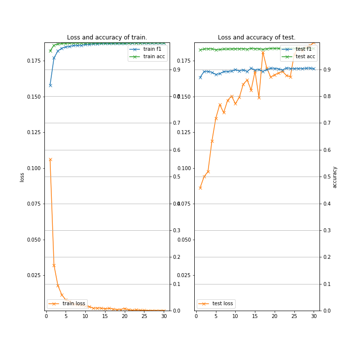
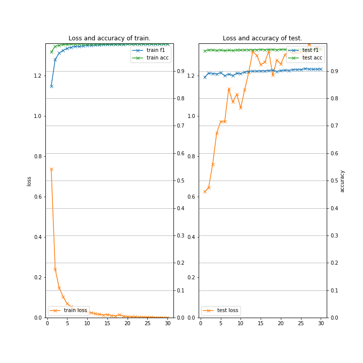

# BERT-NER (Chainer example code for Neural Architectures for Named Entity Recognition using BERT fine-tuning)

### Description

This example code is a named entity recognition using BERT fine-tuning.

- ["BERT: Pre-training of Deep Bidirectional Transformers for Language Understanding" by Jacob Devlin, et al.,](https://arxiv.org/abs/1810.04805)

### Dependencies
- python 3.7
- chainer 5.4

In addition, please add the project folder to PYTHONPATH and `conca install` the following packages:
- `matplotlib`
- `seqeval`

### Usage ###

### Preparation ###

***BERT Pretrained model***

  - Downlod [Pretrained model](https://github.com/google-research/bert) and extract them in "BERT".

***Data***

  - Downlod [CoNLL-2003 Datasets](https://github.com/glample/tagger/tree/master/dataset) and put them in the appropriate place.

  - ~~Convert from BIO to BIOES format~~

```
mkdir -p datasets && cd datasets
wget https://github.com/synalp/NER/raw/master/corpus/CoNLL-2003/eng.train
wget https://github.com/synalp/NER/raw/master/corpus/CoNLL-2003/eng.testa
wget https://github.com/synalp/NER/raw/master/corpus/CoNLL-2003/eng.testb
cd ..
```


***Run and Evaluate***

- Cross-Entropy Loss

```
python train_ner-bert.py \
--gpu 0 \
--batchsize 64 \
--learnrate 5e-05 \
--weightdecay 0.01 \
--epoch 30 \
--train datasets/eng.train.bioes \
--test  datasets/eng.testb.bioes \
--init_checkpoint  BERT/uncased_L-12_H-768_A-12/arrays_bert_model.ckpt.npz \
--bert_config_file BERT/uncased_L-12_H-768_A-12/bert_config.json \
--vocab_file       BERT/uncased_L-12_H-768_A-12/vocab.txt \
--out results_ner-bert-cross \
2>&1 | tee train_ner-bert-cross.log
```

- CRF Loss

```
python train_ner-bert.py \
--gpu 0 \
--batchsize 64 \
--learnrate 5e-05 \
--weightdecay 0.01 \
--epoch 30 \
--train datasets/eng.train.bioes \
--test  datasets/eng.testb.bioes \
--init_checkpoint  BERT/uncased_L-12_H-768_A-12/arrays_bert_model.ckpt.npz \
--bert_config_file BERT/uncased_L-12_H-768_A-12/bert_config.json \
--vocab_file       BERT/uncased_L-12_H-768_A-12/vocab.txt \
--out results_ner-bert-crf \
--crf \
2>&1 | tee train_ner-bert-crf.log
```

***Input***

- format (use [word] and [tag3])
```
[word] [tag1] [tag2] [tag3]
[word] [tag1] [tag2] [tag3]
 :
```

- eng.train
```
-DOCSTART- -X- O O

EU NNP I-NP I-ORG
rejects VBZ I-VP O
German JJ I-NP I-MISC
call NN I-NP O
to TO I-VP O
boycott VB I-VP O
British JJ I-NP I-MISC
lamb NN I-NP O
. . O O

Peter NNP I-NP I-PER
Blackburn NNP I-NP I-PER
 :
```

- eng.testb
```
-DOCSTART- -X- -X- O

SOCCER NN I-NP O
- : O O
JAPAN NNP I-NP I-LOC
GET VB I-VP O
LUCKY NNP I-NP O
WIN NNP I-NP O
, , O O
CHINA NNP I-NP I-PER
IN IN I-PP O
SURPRISE DT I-NP O
DEFEAT NN I-NP O
. . O O

Nadim NNP I-NP I-PER
Ladki NNP I-NP I-PER
 :
```

***Output***

- train_ner-bert-cross.log (use **train_ner-bert.py**)
```
{
  "gpu": 0,
  "batchsize": 16,
  "learnrate": 5e-05,
  "weightdecay": 0.01,
  "epoch": 30,
  "train": "datasets/eng.train",
  "test": "datasets/eng.testb",
  "init_checkpoint": "../../BERT/uncased_L-12_H-768_A-12/arrays_bert_model.ckpt.npz",
  "bert_config_file": "../../BERT/uncased_L-12_H-768_A-12/bert_config.json",
  "vocab_file": "../../BERT/uncased_L-12_H-768_A-12/vocab.txt",
  "out": "results_ner-5-cross-u",
  "resume": "",
  "start_epoch": 1,
  "crf": false,
  "noplot": false
}

2019-08-14 08:11:24,735 - load_conll2003 - INFO - Loading dataset ... done.
2019-08-14 08:11:26,214 - load_conll2003 - INFO - Loading dataset ... done.
# train: 14041, test: 3453, class: 11
# vocab: 30522
2019-08-14 08:20:19,239 - main - INFO - [  1] T/loss=0.106190 T/f1=0.841372 T/acc=0.968843 T/sec= 481.874003 D/loss=0.086211 D/f1=0.870488 D/acc=0.973241 D/sec= 26.710001 lr=0.764571 eta=0.000050
2019-08-14 08:30:45,304 - main - INFO - [  2] T/loss=0.031957 T/f1=0.943000 T/acc=0.990303 T/sec= 599.062706 D/loss=0.093875 D/f1=0.892133 D/acc=0.975969 D/sec= 27.001760 lr=0.909625 eta=0.000048
2019-08-14 08:40:45,218 - main - INFO - [  3] T/loss=0.017755 T/f1=0.968716 T/acc=0.994802 T/sec= 572.873630 D/loss=0.097480 D/f1=0.892920 D/acc=0.977039 D/sec= 27.041336 lr=0.963485 eta=0.000047
 :
2019-08-14 11:54:13,427 - main - INFO - [ 23] T/loss=0.000717 T/f1=0.998468 T/acc=0.999810 T/sec= 548.250582 D/loss=0.164739 D/f1=0.905687 D/acc=0.978575 D/sec= 27.320294 lr=1.000000 eta=0.000013
 :
2019-08-14 13:01:44,019 - main - INFO - [ 30] T/loss=0.000279 T/f1=0.999170 T/acc=0.999885 T/sec= 546.749608 D/loss=0.187672 D/f1=0.902418 D/acc=0.977798 D/sec= 26.914432 lr=1.000000 eta=0.000002

==== Classification report (early-stopped model) ====

           precision    recall  f1-score   support

      PER       0.96      0.96      0.96      1617
     MISC       0.80      0.79      0.79       702
      LOC       0.92      0.93      0.92      1668
      ORG       0.88      0.88      0.88      1661

micro avg       0.90      0.91      0.91      5648
macro avg       0.90      0.91      0.91      5648

2019-08-14 13:03:02,801 - <module> - INFO - time spent: 17510.057731 sec
```

- train_ner-bert-crf.log (use **train_ner-bert.py**)
```
{
  "gpu": 0,
  "batchsize": 16,
  "learnrate": 5e-05,
  "weightdecay": 0.01,
  "epoch": 30,
  "train": "datasets/eng.train",
  "test": "datasets/eng.testb",
  "init_checkpoint": "../../BERT/uncased_L-12_H-768_A-12/arrays_bert_model.ckpt.npz",
  "bert_config_file": "../../BERT/uncased_L-12_H-768_A-12/bert_config.json",
  "vocab_file": "../../BERT/uncased_L-12_H-768_A-12/vocab.txt",
  "out": "results_ner-5-crf-u",
  "resume": "",
  "start_epoch": 1,
  "crf": true,
  "noplot": false
}

2019-08-14 08:11:19,739 - load_conll2003 - INFO - Loading dataset ... done.
2019-08-14 08:11:21,480 - load_conll2003 - INFO - Loading dataset ... done.
# train: 14041, test: 3453, class: 11
# vocab: 30522
2019-08-14 08:21:34,774 - main - INFO - [  1] T/loss=0.738494 T/f1=0.844042 T/acc=0.969108 T/sec= 556.607685 D/loss=0.624295 D/f1=0.877409 D/acc=0.973914 D/sec= 33.413827 lr=0.764571 eta=0.000050
2019-08-14 08:33:22,308 - main - INFO - [  2] T/loss=0.241301 T/f1=0.942333 T/acc=0.989966 T/sec= 673.506728 D/loss=0.645739 D/f1=0.892507 D/acc=0.976797 D/sec= 34.026600 lr=0.909625 eta=0.000048
2019-08-14 08:44:43,559 - main - INFO - [  3] T/loss=0.148610 T/f1=0.965519 T/acc=0.994255 T/sec= 647.232721 D/loss=0.760715 D/f1=0.890954 D/acc=0.976366 D/sec= 34.019097 lr=0.963485 eta=0.000047
 :
2019-08-14 12:59:57,783 - main - INFO - [ 26] T/loss=0.003696 T/f1=0.998638 T/acc=0.999829 T/sec= 626.088854 D/loss=1.290686 D/f1=0.908527 D/acc=0.979024 D/sec= 34.062213 lr=1.000000 eta=0.000008
 :
2019-08-14 13:44:36,019 - main - INFO - [ 30] T/loss=0.001058 T/f1=0.999298 T/acc=0.999901 T/sec= 628.360614 D/loss=1.335464 D/f1=0.907435 D/acc=0.978852 D/sec= 33.850668 lr=1.000000 eta=0.000002

==== Classification report (early-stopped model) ====

           precision    recall  f1-score   support

      ORG       0.90      0.88      0.89      1661
     MISC       0.78      0.81      0.79       702
      PER       0.96      0.97      0.96      1617
      LOC       0.93      0.92      0.92      1668

micro avg       0.91      0.91      0.91      5648
macro avg       0.91      0.91      0.91      5648

2019-08-14 13:45:54,326 - <module> - INFO - time spent: 20086.595194 sec
```

- Learning Curve (train_ner-bert.py on Google Colaboratory)

|Cross-Entropy Loss|CRF Loss| 
|---|---|
|
