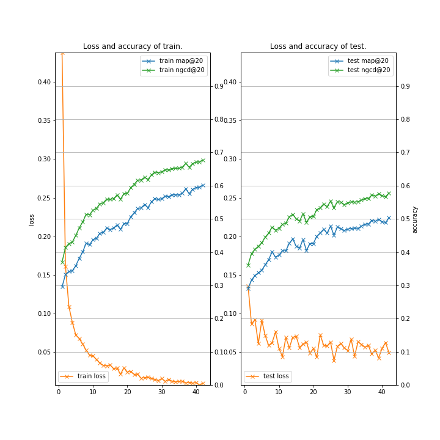
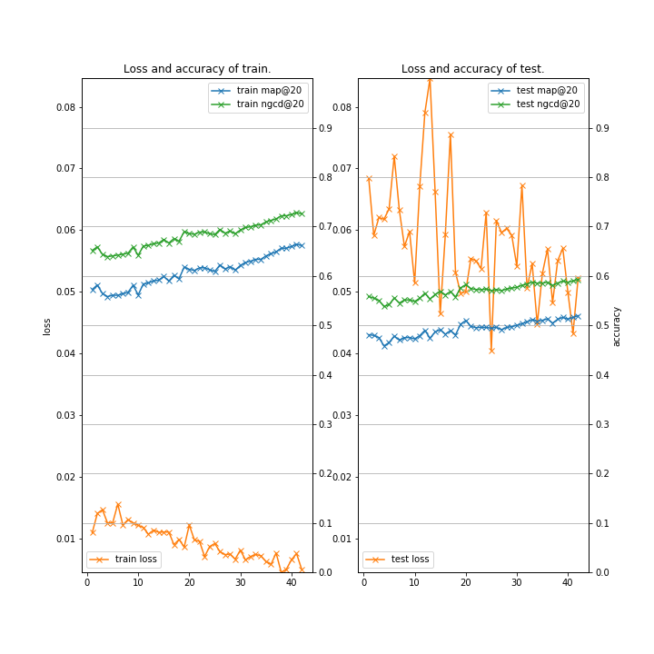
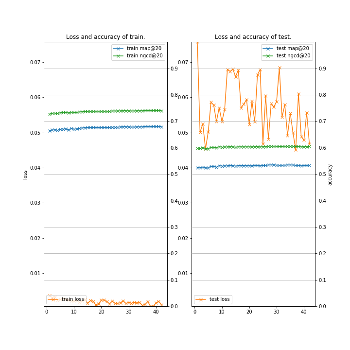
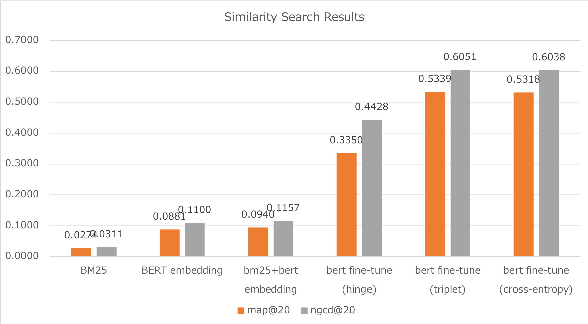
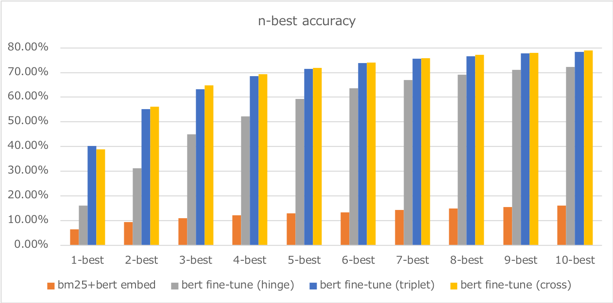

# BERT-Ranking (Chainer example code for Neural Ranking for Ad-Hoc Text Retrieval using BERT fine-tuning)

### Description

This example code is to convert a patient disease expression to a standard expression using BERT fine-tuning.

### Dependencies
- python 3.6
- chainer 5.4

In addition, please add the project folder to PYTHONPATH and `conca install` the following packages:
- `matplotlib`
- `pytrec_eval`

### Preparation ###

***BERT Pretrained model***

  - Downlod [BERT Japanese Pretrained model](http://nlp.ist.i.kyoto-u.ac.jp/index.php?BERT日本語Pretrainedモデル) and extract them in "BERT".

***Data***

  - Downlod [Patient Disease Expression](http://sociocom.jp/~data/2019-pde/data/D3_20190326.xlsx), convert them to tsv format, and put in "datasets/patient".

```
cd datasets/patient
cat d3_20190326.txt \
| cut -f 1-2 \
| sort -u \
| python ../tools/sampling.py /dev/stdin 8483 \
| grep -v "^$" > train-all.txt

cat train-all.txt | head -n  1000 >  test.txt
cat train-all.txt | tail -n +1001 > train.txt
python ../make_datasets.py train.txt
python ../make_datasets.py  test.txt

cat train.queries | cut -f 2 > _train-q.txt
cat  test.queries | cut -f 2 > __test-q.txt
cat train.docs    | cut -f 2 > _train-d.txt
cat  test.docs    | cut -f 2 > __test-d.txt

python ../tools/juman-wakachi.py _train-q.txt > _train-q-wakachi.txt
python ../tools/juman-wakachi.py __test-q.txt > __test-q-wakachi.txt
python ../tools/juman-wakachi.py _train-d.txt > _train-d-wakachi.txt
python ../tools/juman-wakachi.py __test-d.txt > __test-d-wakachi.txt

paste train.queries _train-q-wakachi.txt | cut -f 1,3 > train-wakachi.queries
paste  test.queries __test-q-wakachi.txt | cut -f 1,3 >  test-wakachi.queries
paste train.docs    _train-d-wakachi.txt | cut -f 1,3 > train-wakachi.docs   
paste  test.docs    __test-d-wakachi.txt | cut -f 1,3 >  test-wakachi.docs   

tail -n 3 test-wakachi.queries test-wakachi.docs test.qrel
==> test-wakachi.queries <==
Q-0993	右 わき腹 が 痛い
Q-0994	偏 頭痛
Q-0995	体重 低下

==> test-wakachi.docs <==
D-0338	門脈 ガス 血 症
D-0339	高 ビリルビン 血 症
D-0340	咽喉 痛

==> test.qrel <==
Q-0993	0	D-0031	1
Q-0994	0	D-0198	1
Q-0995	0	D-0335	1
```

***Run and Evaluate***

```
python train_patient-triplet.py \
--gpu 0 \
--batchsize 64 \
--learnrate 5e-05 \
--weightdecay 0.01 \
--epoch 50 \
--train_docs    datasets/patient/train-wakachi.docs \
--train_queries datasets/patient/train-wakachi.queries \
--train_qrels   datasets/patient/train.qrel \
--test_docs     datasets/patient/test-wakachi.docs \
--test_queries  datasets/patient/test-wakachi.queries \
--test_qrels    datasets/patient/test.qrel \
--init_checkpoint  BERT/Japanese_L-12_H-768_A-12_E-30_BPE/arrays_bert_model.ckpt.npz \
--bert_config_file BERT/Japanese_L-12_H-768_A-12_E-30_BPE/bert_config.json \
--vocab_file       BERT/Japanese_L-12_H-768_A-12_E-30_BPE/vocab.txt \
--max_eval 1000 \
2>&1 | tee train_patient-triplet.log
```

```
/Data/haradatm/src/trec_eval.9.0/trec_eval -m all_trec \
  datasets/patient/test.qrel \
  results/test.results.txt \
| grep -E "ndcg|map" | grep "cut_20 "

ndcg_cut_20           	all	0.6051
map_cut_20            	all	0.5339
```

***Learning Curve (train_patient-triplet.py on Google Colaboratory)***

|epoch 1-42|epoch 43-84|epoch 85-121| 
|---|---|---|
||

***Summary of results***




