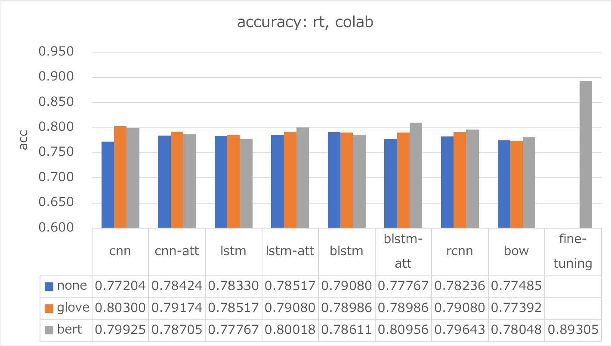
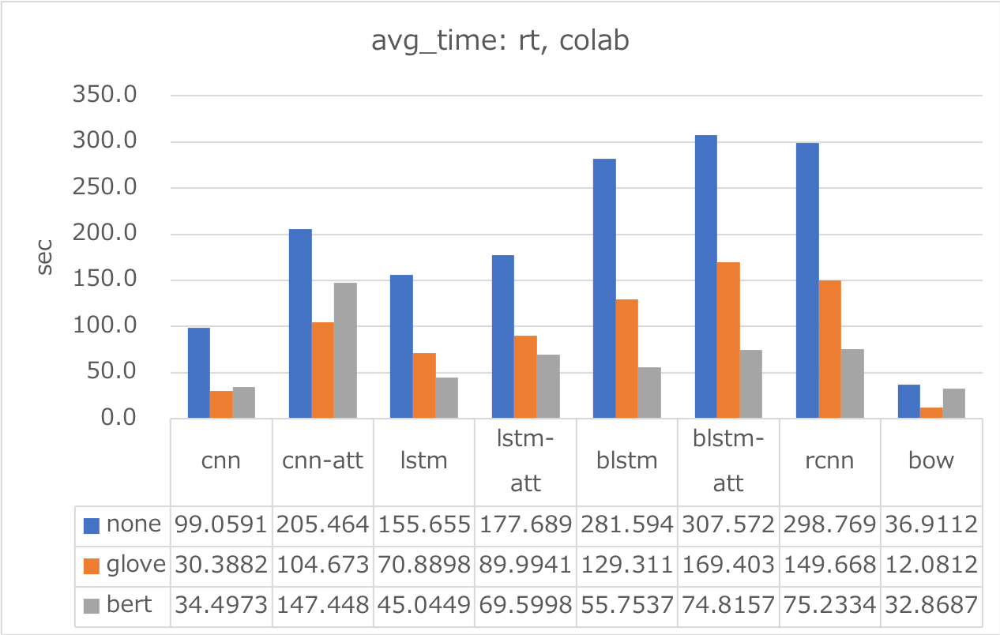

# Chainer example code to write for Text Classification research and evaluation

### Description

This example code is a recurrent net for language modeling using three kinds of approaches below: 
- CNN
- CNN + Self-Attention
- LSTM
- LSTM + Self-Attention
- bi-LSTM
- bi-LSTM + Self-Attention
- RCNN
- BoW
- using Glove/BERT pre-trained embedding models of those

### Dependencies
- python 3.6
- chainer 3.4

In addition, please add the project folder to PYTHONPATH and `conca install` the following packages:
- `matplotlib`

### Usage ###

***Data***

  - [Scale Movie Review Dataset](https://www.cs.cornell.edu/people/pabo/movie-review-data/) (rt-polarity): Predict its sentiment (positive/negative) from a review about a movie.
  - [Road Transport Bureau of MLIT](http://carinf.mlit.go.jp/jidosha/carinf/opn/index.html)
  - Create train and test datasets and put them in the appropriate place.

```
cd datasets
wc -l rt-polaritydata/rt-polaritydata/rt-polarity.*
    5331 rt-polaritydata/rt-polaritydata/rt-polarity.neg
    5331 rt-polaritydata/rt-polaritydata/rt-polarity.pos
   10662 total

for i in `seq 5331`; do echo "0"; done > label-neg.txt
for i in `seq 5331`; do echo "1"; done > label-pos.txt
iconv -f WINDOWS-1252 -t UTF-8 rt-polaritydata/rt-polarity.neg > rt-polarity.neg.utf8
iconv -f WINDOWS-1252 -t UTF-8 rt-polaritydata/rt-polarity.pos > rt-polarity.pos.utf8
paste label-neg.txt rt-polarity.neg.utf8 >  rt-polarity.txt
paste label-pos.txt rt-polarity.pos.utf8 >> rt-polarity.txt

python ../tools/skfold_splitter.py rt-polarity.txt

wc -l 04-t*.txt
    1066 04-test.txt
    9596 04-train.txt
   10662 total
```

```
cd datasets
python ../tools/mlit-fetch.py --start    1 --end  870 > mlit-1.txt 2> mlit-1.log &
python ../tools/mlit-fetch.py --start  871 --end 1740 > mlit-2.txt 2> mlit-2.log &
python ../tools/mlit-fetch.py --start 1741 --end 2610 > mlit-3.txt 2> mlit-3.log &
python ../tools/mlit-fetch.py --start 2611 --end 3480 > mlit-4.txt 2> mlit-4.log &
python ../tools/mlit-fetch.py --start 3481 --end 4350 > mlit-5.txt 2> mlit-5.log &
python ../tools/mlit-fetch.py --start 4351 --end 5194 > mlit-6.txt 2> mlit-6.log &
cat mlit-?.txt > mlit.txt

cut -f 12 mlit.txt > class.txt
cut -f 14 mlit.txt | gsed -E "s/<tab>/ /g" | gsed -E "s/ +/ /g" > text.txt
cat text.txt | mecab -r ../mecabrc -F"%f[6] " -U"%m " -E"\n" > text-wakachi.txt
paste class.txt text-wakachi.txt > train.txt
wc -l train.txt
   51940 train.txt

python ../tools/skfold_splitter.py train.txt

wc -l 04-t*.txt
    5196 04-test.txt
   46744 04-train.txt
   51940 total
```

***Run and Evaluate***
- training and test w/Glove

```
python train_cnn-glove.py    --train datasets/mlit/04-train.txt --test datasets/mlit/04-test.txt --gpu 0 --epoch 30 --batchsize 50 --out result_cnn    2>&1 | tee train_cnn-glove.log   
python train_cnn-a-glove.py  --train datasets/mlit/04-train.txt --test datasets/mlit/04-test.txt --gpu 0 --epoch 30 --batchsize 50 --out result_cnn-a  2>&1 | tee train_cnn-a-glove.log 
python train_rnn-glove.py    --train datasets/mlit/04-train.txt --test datasets/mlit/04-test.txt --gpu 0 --epoch 30 --batchsize 50 --out result_rnn    2>&1 | tee train_rnn-glove.log   
python train_rnn-a-glove.py  --train datasets/mlit/04-train.txt --test datasets/mlit/04-test.txt --gpu 0 --epoch 30 --batchsize 50 --out result_rnn-a  2>&1 | tee train_rnn-a-glove.log 
python train_rnn-b-glove.py  --train datasets/mlit/04-train.txt --test datasets/mlit/04-test.txt --gpu 0 --epoch 30 --batchsize 50 --out result_rnn-b  2>&1 | tee train_rnn-b-glove.log 
python train_rnn-ba-glove.py --train datasets/mlit/04-train.txt --test datasets/mlit/04-test.txt --gpu 0 --epoch 30 --batchsize 50 --out result_rnn-ba 2>&1 | tee train_rnn-ba-glove.log
python train_rcnn-glove.py   --train datasets/mlit/04-train.txt --test datasets/mlit/04-test.txt --gpu 0 --epoch 30 --batchsize 50 --out result_rcnn   2>&1 | tee train_rcnn-glove.log  
python train_bow-glove.py    --train datasets/mlit/04-train.txt --test datasets/mlit/04-test.txt --gpu 0 --epoch 30 --batchsize 50 --out result_bow    2>&1 | tee train_bow-glove.log   
```

- training and test w/BERT
```
python train_cnn-bert.py    --train datasets/mlit/04-train.txt --test datasets/mlit/04-test.txt --gpu 0 --epoch 30 --batchsize 50 --out result_cnn    2>&1 | tee train_cnn-bert.log   
python train_cnn-a-bert.py  --train datasets/mlit/04-train.txt --test datasets/mlit/04-test.txt --gpu 0 --epoch 30 --batchsize 50 --out result_cnn-a  2>&1 | tee train_cnn-a-bert.log 
python train_rnn-bert.py    --train datasets/mlit/04-train.txt --test datasets/mlit/04-test.txt --gpu 0 --epoch 30 --batchsize 50 --out result_rnn    2>&1 | tee train_rnn-bert.log   
python train_rnn-a-bert.py  --train datasets/mlit/04-train.txt --test datasets/mlit/04-test.txt --gpu 0 --epoch 30 --batchsize 50 --out result_rnn-a  2>&1 | tee train_rnn-a-bert.log 
python train_rnn-b-bert.py  --train datasets/mlit/04-train.txt --test datasets/mlit/04-test.txt --gpu 0 --epoch 30 --batchsize 50 --out result_rnn-b  2>&1 | tee train_rnn-b-bert.log 
python train_rnn-ba-bert.py --train datasets/mlit/04-train.txt --test datasets/mlit/04-test.txt --gpu 0 --epoch 30 --batchsize 50 --out result_rnn-ba 2>&1 | tee train_rnn-ba-bert.log
python train_rcnn-bert.py   --train datasets/mlit/04-train.txt --test datasets/mlit/04-test.txt --gpu 0 --epoch 30 --batchsize 50 --out result_rcnn   2>&1 | tee train_rcnn-bert.log  
python train_bow-bert.py    --train datasets/mlit/04-train.txt --test datasets/mlit/04-test.txt --gpu 0 --epoch 30 --batchsize 50 --out result_bow    2>&1 | tee train_bow-bert.log   
```

 
