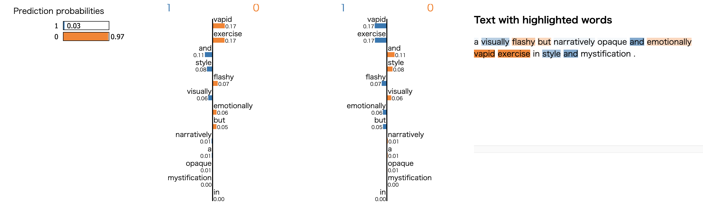
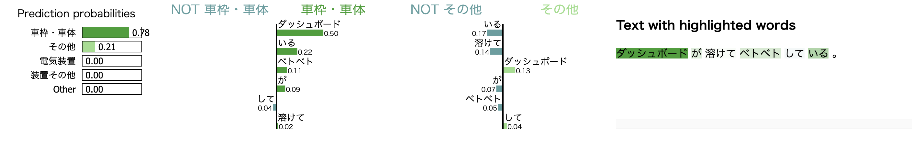

# fastText-Classification (Sample code for Text Classification using fastTest classification)

### Description

This example code is a text entclassification using fastText.

### Dependencies
- python 3.7
- fasttext 0.9.1

In addition, please add the project folder to PYTHONPATH and `conca install` the following packages:
- `matplotlib`

### Usage ###

### Preparation ###

***Data***

  - [Scale Movie Review Dataset](https://www.cs.cornell.edu/people/pabo/movie-review-data/) (rt-polarity): Predict its sentiment (positive/negative) from a review about a movie.
  - [Road Transport Bureau of MLIT](http://carinf.mlit.go.jp/jidosha/carinf/opn/index.html)
  - Create train and test datasets and put them in the appropriate place.

```
wc -l datasets/rt-polarity/04-{train,test}.txt
    9596 datasets/rt-polarity/04-train.txt
    1066 datasets/rt-polarity/04-test.txt
   10662 total

head -n 3 datasets/rt-polarity/04-train.txt
==> datasets/rt-polarity/04-train.txt <==
__label__0 , simplistic , silly and tedious .
__label__0 , it's so laddish and juvenile , only teenage boys could possibly find it funny .
__label__0 , exploitative and largely devoid of the depth or sophistication that would make watching such a graphic treatment of the crimes bearable .

head -n 3 datasets/rt-polarity/04-test.txt
__label__0 , a visually flashy but narratively opaque and emotionally vapid exercise in style and mystification .
__label__0 , while the performances are often engaging , this loose collection of largely improvised numbers would probably have worked better as a one-hour tv documentary .
__label__0 , on a cutting room floor somewhere lies . . . footage that might have made no such thing a trenchant , ironic cultural satire instead of a frustrating misfire .
```

```
wc -l datasets/mlit/04-{train,test}.txt
   46742 datasets/mlit/04-train.txt
    5197 datasets/mlit/04-test.txt
   51939 total

head -n 3 datasets/mlit/04-train.txt
__label__エンジン , 車庫 に いれる ため に 、 右 後方 縦列 駐車 で バック して いた ところ 、 アクセル 操作 を して い ない のに 車 が 急 加速 し 、 右 後方 の 壁 に 激突 した 。
__label__エンジン , 一般 道路 を 走行 中 、 突然 エンジン が 停止 した 。
__label__制動装置 , 高速 道路 を １００ ｋｍ／ｈ くらい で 走行 中 、 ＡＢＳ の マーク 、 サイド ブレーキ の マーク が 表示 さ れた 。

head -n 3 datasets/mlit/04-test.txt
__label__車枠・車体 , ダッシュボード が 溶けて ベトベト して いる 。
__label__排ｶﾞｽ･騒音 , ＮＯＸ センサー の 不良に より 、 エンジン 警告 灯 が 点き っぱなし に なった 。
__label__車枠・車体 , 電動 オープン の ルーフ を 閉じる とき に 、 エラー メッセージ が 出て 幌 が 閉まら なく なった 。
```

***Run and Evaluate***

- training for rt-polarity datasets (for English)

```
python train_fasttext-classify.py \
--train datasets/rt-polarity/04-train.txt \
--test  datasets/rt-polarity/04-test.txt  \
--out models/rt \
| tee results/train_fasttext-rt.log 2>&1

2020-03-13 9:11:50,446 - main - INFO - {
  "train": "datasets/rt-polarity/04-train.txt",
  "test": "datasets/rt-polarity/04-test.txt",
  "out": "models/rt"
}
Read 0M words
Number of words:  20330
Number of labels: 2
Progress: 100.0% words/sec/thread: 1592672 lr:  0.000000 loss:  0.302120 ETA:   0h 0m
2020-03-13 9:11:51,026 - load_data - INFO - Loading dataset ... done.
2020-03-13 9:11:51,026 - main - DEBUG - ['a visually flashy but narratively opaque and emotionally vapid exercise in style and mystification .', 'while the performances are often engaging', 'on a cutting room floor somewhere lies . . . footage that might have made no such thing a trenchant']
Start time: 2020-03-13 9:11:50.446471
(1066, 0.7682926829268293, 0.7682926829268293)
End time: 2020-03-13 9:11:51.011875
2020-03-13 9:11:51,026 - main - DEBUG - [1, 1, 1]

Start time: 2020-03-13 9:11:51.026353
End time: 2020-03-13 9:11:51.064177
              precision    recall  f1-score   support

           0       0.70      0.77      0.74       533
           1       0.75      0.67      0.71       533

    accuracy                           0.72      1066
   macro avg       0.73      0.72      0.72      1066
weighted avg       0.73      0.72      0.72      1066
```

- training for mlit datasets (for Japanese)

```
python train_fasttext-classify.py \
--train datasets/mlit/04-train.txt \
--test  datasets/mlit/04-test.txt  \
--out models/mlit \
| tee results/train_fasttext-mlit.log 2>&1

2020-03-13 9:12:32,646 - main - INFO - {
  "train": "datasets/mlit/04-train.txt",
  "test": "datasets/mlit/04-test.txt",
  "out": "models/mlit"
}
Read 1M words
Number of words:  14991
Number of labels: 16
Progress: 100.0% words/sec/thread: 1648484 lr:  0.000000 loss:  0.527193 ETA:   0h 0m
2020-03-13 9:12:34,946 - load_data - INFO - Loading dataset ... done.
2020-03-13 9:12:34,946 - main - DEBUG - ['ダッシュボード が 溶けて ベトベト して いる 。', 'ＮＯＸ センサー の 不良に より 、 エンジン 警告 灯 が 点き っぱなし に なった 。', '電動 オープン の ルーフ を 閉じる とき に 、 エラー メッセージ が 出て 幌 が 閉まら なく なった 。']
Start time: 2020-03-13 9:12:32.646923
(5197, 0.8368289397729459, 0.8368289397729459)
End time: 2020-03-13 9:12:34.928371
2020-03-13 9:12:34,946 - main - DEBUG - [4, 12, 4]
Start time: 2020-03-13 9:12:34.946344
End time: 2020-03-13 9:12:35.021920

              precision    recall  f1-score   support

        かじ取り       0.85      0.83      0.84       299
         その他       0.77      0.62      0.69       300
        エンジン       0.83      0.91      0.87      1494
        乗車装置       0.88      0.90      0.89       290
        保安灯火       0.88      0.90      0.89       363
        制動装置       0.90      0.90      0.90       477
        動力伝達       0.88      0.89      0.89       814
     排ｶﾞｽ･騒音       0.91      0.81      0.86       122
        燃料装置       0.86      0.81      0.84       232
        緩衝装置       0.80      0.79      0.80       129
       装置その他       0.00      0.00      0.00        12
        走行装置       0.77      0.80      0.78       127
       車枠・車体       0.71      0.65      0.68       323
   電動機(モーター)       0.72      0.53      0.61        34
        電気装置       0.64      0.57      0.60       177
         非装置       0.00      0.00      0.00         4

    accuracy                           0.84      5197
   macro avg       0.71      0.68      0.70      5197
weighted avg       0.83      0.84      0.83      5197
```

### Explaining text classifiers using LIME

```
pip install lime
```

- for rt-polarity datasets

```
python lime_fasttext.py \
--train datasets/rt-polarity/04-train.txt \
--test datasets/rt-polarity/04-test.txt \
--model models/rt/model.bin \
--label models/rt/labels.bin \
--topN 2 \
--out results/rt \
| tee results/lime_fasttext-rt.log 2>&1

{
  "train": "datasets/rt-polarity/04-train.txt",
  "test": "datasets/rt-polarity/04-test.txt",
  "model": "models/rt/model.bin",
  "label": "models/rt/labels.bin",
  "topN": 2,
  "out": "results/rt"
}
2020-03-13 9:13:28,761 - load_data - INFO - Loading dataset ... done.
2020-03-13 9:13:28,761 - main - DEBUG - ['a visually flashy but narratively opaque and emotionally vapid exercise in style and mystification .', 'while the performances are often engaging', 'on a cutting room floor somewhere lies . . . footage that might have made no such thing a trenchant']
2020-03-13 9:13:28,761 - main - DEBUG - [1, 1, 1]
# test  X: 1066, y: 1066, class: 2

              precision    recall  f1-score   support

           0       0.70      0.77      0.74       533
           1       0.75      0.67      0.71       533

    accuracy                           0.72      1066
   macro avg       0.73      0.72      0.72      1066
weighted avg       0.73      0.72      0.72      1066

Enter document ID [0..1066]=> 0
Document id: 0
True class: 0
Probability (0) = 0.971945
Probability (1) = 0.028075

Explanation of document id 0 for class 0
('vapid', 0.16872827839126178)
('exercise', 0.1653101523340092)
('and', -0.10690473259890376)
('style', -0.07894005080714339)
('flashy', 0.0714360925447177)
('visually', -0.0607230172127873)
('emotionally', 0.055091145014140974)
('but', 0.053990928827794375)
('narratively', -0.013908267848750556)
('a', -0.01117671056957955)
('opaque', -0.007903721363549675)
('mystification', -0.004618546653918644)
('in', 0.004490152867578441)

Explanation of document id 0 for class 1
('vapid', -0.16872827666218554)
('exercise', -0.1653101519820666)
('and', 0.10690473089104877)
('style', 0.07894005024911996)
('flashy', -0.0714360923700639)
('visually', 0.060723013383634665)
('emotionally', -0.055091146141886274)
('but', -0.05399093183967029)
('narratively', 0.013908268639105898)
('a', 0.011176711894179854)
('opaque', 0.007903722113894934)
('mystification', 0.004618545415557018)
('in', -0.004490155294149905)
```

- for mlit datasets (for Japanese)

```
python lime_fasttext.py \
--train datasets/mlit/04-train.txt \
--test datasets/mlit/04-test.txt \
--model models/mlit/model.bin \
--label models/mlit/labels.bin \
--out results/mlit \
--topN 2 \
| tee results/lime_fasttext-mlit.log 2>&1

{
  "train": "datasets/mlit/04-train.txt",
  "test": "datasets/mlit/04-test.txt",
  "model": "models/mlit/model.bin",
  "label": "models/mlit/labels.bin",
  "topN": 2,
  "out": "results/mlit"
}
2020-03-13 9:14:26,304 - load_data - INFO - Loading dataset ... done.
2020-03-13 9:14:26,304 - main - DEBUG - ['ダッシュボード が 溶けて ベトベト して いる 。', 'ＮＯＸ センサー の 不良に より 、 エンジン 警告 灯 が 点き っぱなし に なった 。', '電動 オープン の ルーフ を 閉じる とき に 、 エラー メッセージ が 出て 幌 が 閉まら なく なった 。']
2020-03-13 9:14:26,305 - main - DEBUG - [4, 12, 4]
# test  X: 5197, y: 5197, class: 16

              precision    recall  f1-score   support

        かじ取り       0.85      0.83      0.84       299
         その他       0.77      0.62      0.69       300
        エンジン       0.83      0.91      0.87      1494
        乗車装置       0.88      0.90      0.89       290
        保安灯火       0.88      0.90      0.89       363
        制動装置       0.90      0.90      0.90       477
        動力伝達       0.88      0.89      0.89       814
     排ｶﾞｽ･騒音       0.91      0.81      0.86       122
        燃料装置       0.86      0.81      0.84       232
        緩衝装置       0.80      0.79      0.80       129
       装置その他       0.00      0.00      0.00        12
        走行装置       0.77      0.80      0.78       127
       車枠・車体       0.71      0.65      0.68       323
   電動機(モーター)       0.72      0.53      0.61        34
        電気装置       0.64      0.57      0.60       177
         非装置       0.00      0.00      0.00         4

    accuracy                           0.84      5197
   macro avg       0.71      0.68      0.70      5197
weighted avg       0.83      0.84      0.83      5197

Enter document ID [0..5197]=> 0
Document id: 0
True class: 車枠・車体
Probability (車枠・車体) = 0.777189
Probability (その他) = 0.214100

Explanation of document id 0 for class 車枠・車体
('ダッシュボード', 0.5002775990007382)
('いる', 0.22231472414811965)
('ベトベト', 0.11338267571469779)
('が', 0.09383360994683997)
('して', -0.037675729225728496)
('溶けて', 0.018372872209925877)

Explanation of document id 0 for class その他
('いる', -0.1706988593307154)
('溶けて', -0.13815136481134602)
('ダッシュボード', 0.1314503514695571)
('が', -0.07112911641865582)
('ベトベト', -0.054265392559514826)
('して', 0.041451308341008124)
```

|LIME output (rt-polarity, docid=0)|
|---|
||

|LIME output (mlit, docid=0)|
|---|
||
