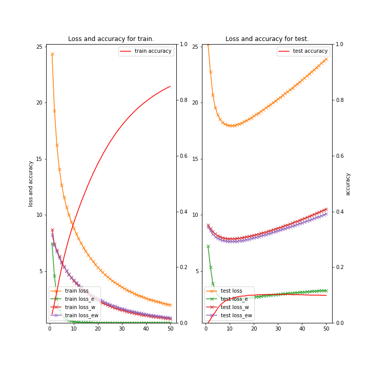
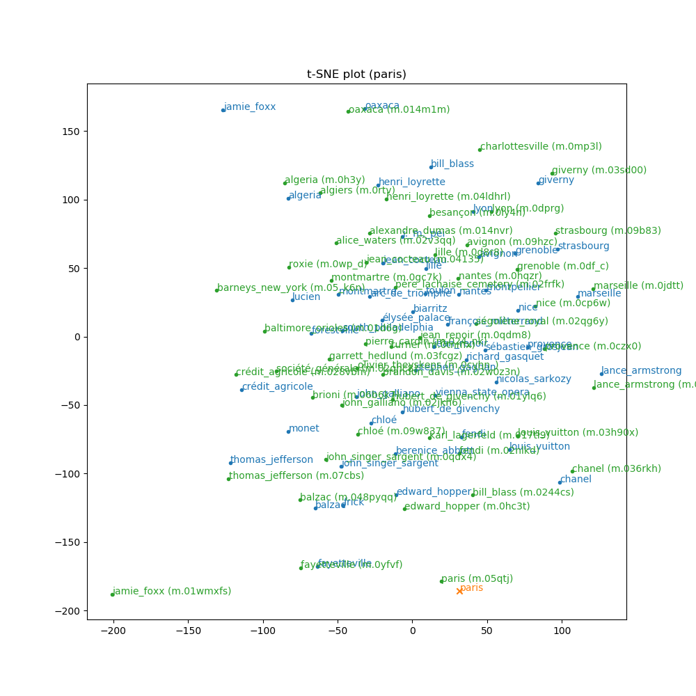
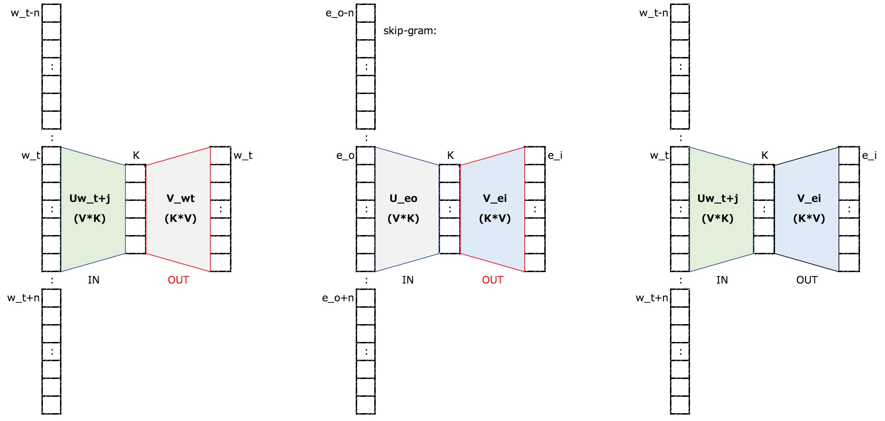

# Chainer example code for Joint Representation Learning of Words and Entities

### Description

This toy example is a method to search related entities on Knowledge Graph by a query (mention) inspired by the following paper.
- ["Wikipedia2Vec: An Optimized Tool for Learning Embeddings of Words and Entities from Wikipedia" by Yamada, Ikuya and Asai, Akari and Shindo, Hiroyuki and Takeda, Hideaki and Takefuji, Yoshiyasu, (arXiv preprint 1812.06280).](https://arxiv.org/abs/1601.01343)


### Dependencies
- python 3.7
- chainer 5.4

In addition, please add the project folder to PYTHONPATH and `conca install` the following packages:
- `matplotlib`

### ToDo ###

- [x] A fairly naive implementation.
- [ ] Using some other pre-trained KG embedded model (e.g. TransE, GNN, ..) for entities.
- [ ] Using BERT embedding and fine-tuning for words.

### Usage ###

### Preparation ###

***Data***

  - Downlod datasets [origin_data.zip](https://pan.baidu.com/s/1q7rctsoJ_YdlLa55yckwbQ) and put them in "datasets/nyt-fb60k/".
    - kg/train.txt: the knowledge graph for training, format (e1, e2, rel).
    - text/relation2id.txt: the relation needed to be predicted for RE, format (rel, id).
    - text/train.txt: the text for training, format (e1, e2, name1, name2, rel, sentence).
    - text/vec.txt: the initial word embeddings.

```
wc -l datasets/nyt-fb60k/*/*
  335350 datasets/nyt-fb60k/kg/train.txt
      53 datasets/nyt-fb60k/text/relation2id.txt
  172448 datasets/nyt-fb60k/text/test.txt
  570088 datasets/nyt-fb60k/text/train.txt
  114043 datasets/nyt-fb60k/text/vec.txt
 1191982 total

head -n 5 datasets/nyt-fb60k/kg/*.txt
m.01063t	m.01063t	/location/hud_county_place/place
m.01063t	m.07b_l	/location/location/containedby
m.011hq1	m.03rk0	/location/location/containedby
m.011hq1	m.04vdf2	/location/in_state/legislative_capital
m.011hq1	m.04vdf2	/location/in_state/judicial_capital

head -n 5 datasets/nyt-fb60k/text/*.txt
==> datasets/nyt-fb60k/text/relation2id.txt <==
53
NA 0
/location/neighborhood/neighborhood_of 1
/location/fr_region/capital 2
/location/cn_province/capital 3

==> datasets/nyt-fb60k/text/train.txt <==
m.0ccvx	m.05gf08	queens	belle_harbor	/location/location/contains	sen. charles e. schumer called on federal safety officials yesterday to reopen their investigation into the fatal crash of a passenger jet in belle_harbor , queens , because equipment failure , not pilot error , might have been the cause . ###END###
m.0ccvx	m.05gf08	queens	belle_harbor	/location/location/contains	but instead there was a funeral , at st. francis de sales roman catholic church , in belle_harbor , queens , the parish of his birth . ###END###
m.0ccvx	m.05gf08	queens	belle_harbor	/location/location/contains	rosemary antonelle , the daughter of teresa l. antonelle and patrick antonelle of belle_harbor , queens , was married yesterday afternoon to lt. thomas joseph quast , a son of peggy b. quast and vice adm. philip m. quast of carmel , calif. . ###END###
m.0ccvx	m.05gf08	queens	belle_harbor	/location/location/contains	one was for st. francis de sales roman catholic church in belle_harbor ; another board studded with electromechanical magnets will go under the pipes of an organ at the evangelical lutheran church of christ in rosedale , queens . ###END###
m.0ccvx	m.05gf08	queens	belle_harbor	/location/location/contains	the firefighter , whom a fire department official identified as joseph moore , of belle_harbor , queens , was taken to newyork-presbyterian\/weill cornell hospital , where he was in critical but stable condition last night , the police said . ###END###

==> datasets/nyt-fb60k/text/nyt-fb60k/test.txt <==
m.01l443l	m.04t_bj	dave_holland	barry_altschul	NA	the occasion was suitably exceptional : a reunion of the 1970s-era sam rivers trio , with dave_holland on bass and barry_altschul on drums .	###END###
m.01l443l	m.04t_bj	dave_holland	barry_altschul	NA	tonight he brings his energies and expertise to the miller theater for the festival 's thrilling finale : a reunion of the 1970s sam rivers trio , with dave_holland on bass and barry_altschul on drums .	###END###
m.04t_bj	m.01l443l	barry_altschul	dave_holland	NA	the occasion was suitably exceptional : a reunion of the 1970s-era sam rivers trio , with dave_holland on bass and barry_altschul on drums .	###END###
m.04t_bj	m.01l443l	barry_altschul	dave_holland	NA	tonight he brings his energies and expertise to the miller theater for the festival 's thrilling finale : a reunion of the 1970s sam rivers trio , with dave_holland on bass and barry_altschul on drums .	###END###
m.0frkwp	m.04mh_g	ruth	little_neck	NA	shapiro -- ruth of little_neck , ny .	###END###

==> datasets/nyt-fb60k/text/vec.txt <==
114042 50 #File: vec.bin
</s> 0.198994 0.219711 -0.190422 -0.162968 0.067939 0.150194 0.046775 0.010506 -0.179149 0.110292 -0.216578 0.062121 -0.037353 -0.047586 -0.164842 -0.093572 0.128232 0.150406 0.147607 0.079417 0.076800 -0.189049 -0.203621 0.247066 0.188980 0.153622 -0.030025 0.199639 -0.024609 0.036526 -0.007419 -0.148312 0.065239 -0.066491 -0.190179 0.236354 0.217716 -0.054444 -0.011242 0.025314 -0.180848 -0.199214 0.226440 0.003133 -0.128384 -0.151240 -0.152947 0.084363 0.010013 0.066172
, -0.006928 0.031052 -0.140201 0.041724 0.123242 0.190794 0.203675 -0.113365 -0.185090 -0.064685 -0.121526 -0.181298 -0.168961 -0.101821 0.065601 0.017016 0.185144 0.166453 -0.037932 -0.035018 0.085429 0.268255 0.209383 -0.174111 -0.297756 -0.163482 -0.009407 -0.060967 -0.124566 -0.165751 -0.313936 0.067265 -0.071646 0.182648 -0.059417 0.218453 -0.155121 -0.115864 0.083180 0.011243 0.043711 0.126674 -0.200785 0.076185 -0.034229 0.057695 0.143920 -0.106381 -0.098294 -0.119184
. -0.065975 0.037477 0.009166 0.189686 0.044195 0.098803 0.107485 -0.064479 -0.045651 -0.141465 0.099904 -0.063798 -0.094544 -0.082237 0.171831 0.101691 -0.127171 0.147792 -0.163068 -0.020603 0.141402 0.136974 0.219767 -0.155362 -0.263290 -0.171139 0.062929 -0.036967 -0.140195 -0.054274 -0.067326 0.125838 -0.059307 0.270899 -0.078861 0.342242 0.102977 -0.178348 0.182673 -0.063852 0.066294 0.176532 -0.302609 0.140813 -0.114922 -0.020522 0.024977 -0.155762 -0.222827 -0.025948
the -0.147404 -0.030840 -0.020694 0.023617 -0.059968 -0.218174 0.065429 -0.111840 -0.199702 -0.053980 -0.164187 -0.065125 -0.329183 -0.261769 -0.099997 0.335120 0.052471 0.185267 0.136528 0.126488 0.068405 0.037022 0.086991 0.019716 -0.158666 -0.097603 -0.072622 -0.051868 -0.241315 0.112409 -0.190365 -0.102333 0.173091 0.214270 -0.171160 0.135202 -0.100616 -0.126148 0.009865 0.076331 -0.082064 0.040625 0.001139 -0.104827 0.099331 0.039002 0.221366 0.047286 -0.211125 -0.084951
```

***Run and Evaluate***

- training

```
python train_entity.py \
--gpu 0 \
--kg    datasets/nyt-fb60k/kg/train.txt \
--train datasets/nyt-fb60k/text/train.txt \
--valid datasets/nyt-fb60k/text/test.txt \
--epoch 100 \
--batchsize 1500 \
--window 5 \
--model cbow \
--out result_entity \
2>&1 | tee train_entity.log
```

- testing

```
python test_entity.py \
--gpu -1 \
--unit 100 \
--saved_entity     result_entity/entity2id.bin \
--saved_vocabulary result_entity/mention2id.bin \
--saved_mid2name   result_entity/mid2name.bin \
--saved_model      result_entity/early_stopped-accuracy.model \
--N 10 \
2>&1 | tee test_entity.log
```

***Output***

- test_entity.log (use **test_entity.py**)
```
2019-08-23 09:46:30,069 - main - INFO - mention: size=197080, dim=100
2019-08-23 09:46:30,069 - main - INFO - entity : size=37548, dim=100

Enter query (mention) => paris
#query	#rank	#word	#similarity
paris	1	paris	1.000000
paris	2	montmartre	0.399250
paris	3	marseille	0.394699
paris	4	henri_loyrette	0.390152
paris	5	avignon	0.388601
paris	6	fayetteville	0.379730
paris	7	jean_cocteau	0.373670
paris	8	lille	0.360374
paris	9	giverny	0.351922
paris	10	strasbourg	0.350592

#query	#rank	#entity(mid)	#similarity
paris	1	paris (m.05qtj)	0.999531
paris	2	marseille (m.0jdtt)	0.401592
paris	3	nice (m.0cp6w)	0.399728
paris	4	fayetteville (m.0yfvf)	0.383538
paris	5	montmartre (m.0gc7k)	0.371230
paris	6	hubert_de_givenchy (m.01ylq6)	0.367869
paris	7	giverny (m.03sd00)	0.359363
paris	8	henri_loyrette (m.04ldhrl)	0.349045
paris	9	pierre_cardin (m.024_nk)	0.348978
paris	10	olivier_theyskens (m.0cvhn_)	0.341324

Enter query (mention) => tokyo
#query	#rank	#word	#similarity
tokyo	1	tokyo	1.000000
tokyo	2	shinto	0.537918
tokyo	3	lazaro_hernandez	0.449616
tokyo	4	japanese	0.443984
tokyo	5	sapporo	0.437663
tokyo	6	albert_brooks	0.423209
tokyo	7	osaka	0.412872
tokyo	8	nagasaki	0.384065
tokyo	9	iwo_jima	0.379351
tokyo	10	nagoya	0.376804

#query	#rank	#entity(mid)	#similarity
tokyo	1	tokyo (m.07dfk)	0.999458
tokyo	2	shinto (m.0703j)	0.574976
tokyo	3	lazaro_hernandez (m.079ltnj)	0.497542
tokyo	4	sapporo (m.0gp5l6)	0.476284
tokyo	5	japanese (m.019kn7)	0.462976
tokyo	6	iwo_jima (m.017twv)	0.420261
tokyo	7	proenza_schouler (m.02858gq)	0.416264
tokyo	8	mitsubishi (m.0czgc)	0.408632
tokyo	9	osaka (m.0dqyw)	0.408200
tokyo	10	albert_brooks (m.013cr)	0.406217

Enter query (mention) => obama
#query	#rank	#word	#similarity
obama	1	obama	1.000000
obama	2	barack_obama	0.655231
obama	3	christopher_dodd	0.560359
obama	4	rahm_emanuel	0.533947
obama	5	joe_biden	0.528333
obama	6	richard_durbin	0.497254
obama	7	mark_pryor	0.492401
obama	8	dodd	0.480643
obama	9	sonny_bono	0.470944
obama	10	marty_meehan	0.465825

#query	#rank	#entity(mid)	#similarity
obama	1	obama (m.01wjz4)	0.824195
obama	2	barack_obama (m.02mjmr)	0.610778
obama	3	christopher_dodd (m.01xcly)	0.585935
obama	4	rahm_emanuel (m.0256f7)	0.526976
obama	5	joe_biden (m.012gx2)	0.517448
obama	6	richard_durbin (m.01xcd1)	0.506131
obama	7	ken_salazar (m.03mdtj)	0.452544
obama	8	evan_bayh (m.01rcnr)	0.446977
obama	9	mark_pryor (m.01gb3p)	0.432480
obama	10	russ_feingold (m.01nvvl)	0.424668

Enter query (mention) => Ctrl-D
```
|Learning Curve<br>(train_entity.py on Google Colab)|Similarity Search for "paris"<br>(test_entity.py)| 
|:---:|:---:|
| (orange: guery,  blue: words,  green: entities)| 

***Appendix***

- Illustration of 3 embedding models (word, entity, word-entity)



Train to minimizes the loss of the three models at the same time. (L = L_left + L_center + K_right)
