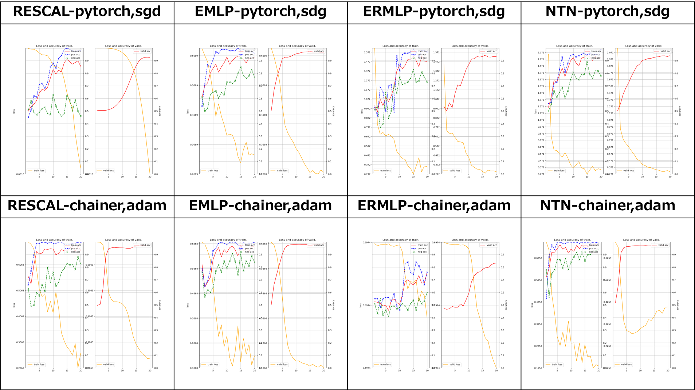
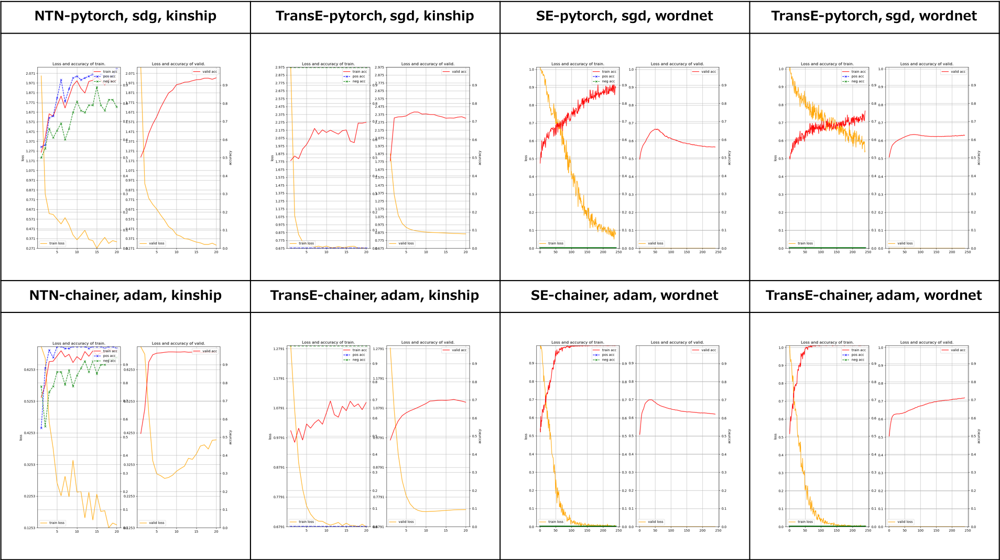
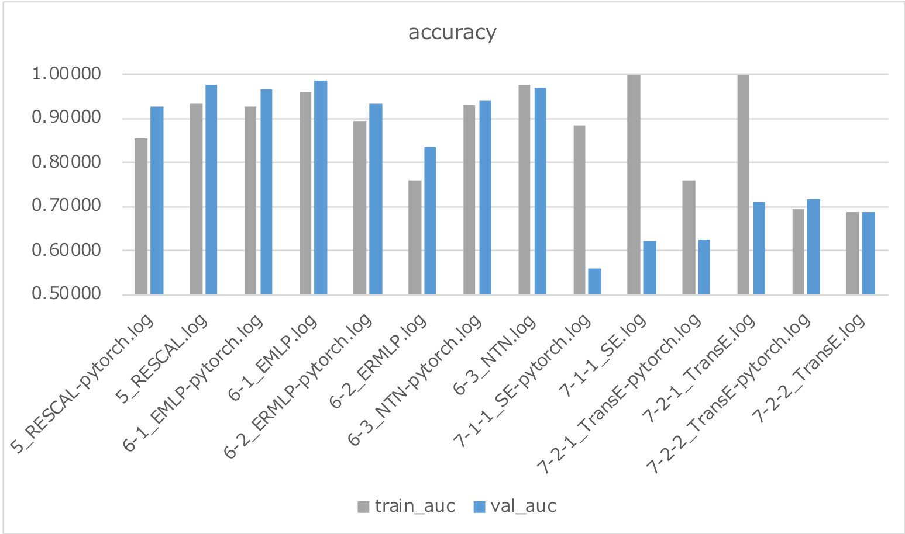

# Exercises for the Analysis of Knowledge Graphs

## Description

This example code are exercises for the study of Knowledge Graphs Embedding.
See also the web site of the [SDA Group](http://sda.tech) at the University of Bonn. 

## Dependencies
- python 3.6
- chainer 3.4
- pytorch 0.4.0

In addition, please add the project folder to PYTHONPATH and `conca install` the following packages:
- `matplotlib`

## TODOs

## Usage

```
python train_kge-5_RESCAL-pytorch.py     | tee train_kge-5_RESCAL-pytorch.log     2>&1
python train_kge-5_RESCAL.py             | tee train_kge-5_RESCAL.log             2>&1
python train_kge-6-1_EMLP-pytorch.py     | tee train_kge-6-1_EMLP-pytorch.log     2>&1
python train_kge-6-1_EMLP.py             | tee train_kge-6-1_EMLP.log             2>&1
python train_kge-6-2_ERMLP-pytorch.py    | tee train_kge-6-2_ERMLP-pytorch.log    2>&1
python train_kge-6-2_ERMLP.py            | tee train_kge-6-2_ERMLP.log            2>&1
python train_kge-6-3_NTN-pytorch.py      | tee train_kge-6-3_NTN-pytorch.log      2>&1
python train_kge-6-3_NTN.py              | tee train_kge-6-3_NTN.log              2>&1
python train_kge-7-1-1_SE-pytorch.py     | tee train_kge-7-1-1_SE-pytorch.log     2>&1
python train_kge-7-1-1_SE.py             | tee train_kge-7-1-1_SE.log             2>&1
python train_kge-7-2-1_TransE-pytorch.py | tee train_kge-7-2-1_TransE-pytorch.log 2>&1
python train_kge-7-2-1_TransE.py         | tee train_kge-7-2-1_TransE.log         2>&1
python train_kge-7-2-2_TransE-pytorch.py | tee train_kge-7-2-2_TransE-pytorch.log 2>&1
python train_kge-7-2-2_TransE.py         | tee train_kge-7-2-2_TransE.log         2>&1
```

## Outputs




