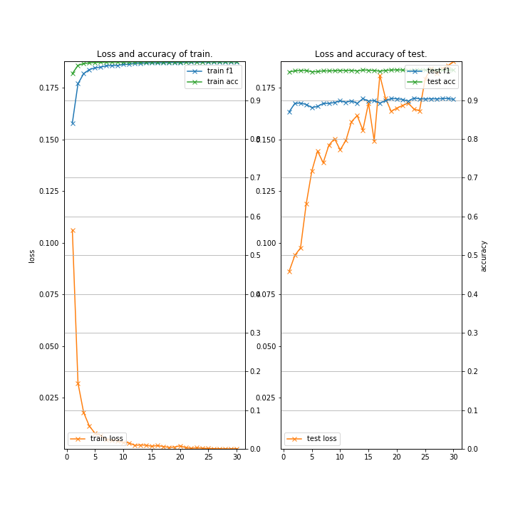
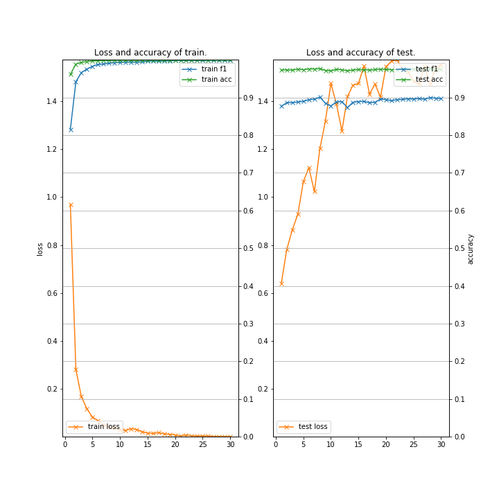

# BERT-NER (Neural Architectures for Named Entity Recognition using BERT fine-tuning)

### Description

This example code is a named entity recognition using BERT fine-tuning.

- ["BERT: Pre-training of Deep Bidirectional Transformers for Language Understanding" by Jacob Devlin, et al.,](https://arxiv.org/abs/1810.04805)

### Dependencies
- python 3.7
- chainer 5.4

In addition, please add the project folder to PYTHONPATH and `conca install` the following packages:
- `matplotlib`
- `seqeval`

### Usage ###

### Preparation ###

***BERT Pretrained model***

  - Downlod [Pretrained model](https://github.com/google-research/bert) and extract them in "BERT".

***Data***

  - Downlod [CoNLL-2003 Datasets](https://github.com/glample/tagger/tree/master/dataset) and put them in the appropriate place.

  - Convert from BIO to IOBES format as follows.

```
cd datasets
python ../tools/conv_iobes.py --file eng.train > eng.train.bioes
python ../tools/conv_iobes.py --file eng.testa > eng.testa.bioes
python ../tools/conv_iobes.py --file eng.testb > eng.testb.bioes
```


***Run and Evaluate***

- Cross-Entropy Loss

```
python train_ner-bert.py \
--gpu 0 \
--batchsize 64 \
--learnrate 5e-05 \
--weightdecay 0.01 \
--epoch 30 \
--train datasets/eng.train.bioes \
--test  datasets/eng.testb.bioes \
--init_checkpoint  BERT/uncased_L-12_H-768_A-12/arrays_bert_model.ckpt.npz \
--bert_config_file BERT/uncased_L-12_H-768_A-12/bert_config.json \
--vocab_file       BERT/uncased_L-12_H-768_A-12/vocab.txt \
--out results_ner-bert-cross \
2>&1 | tee train_ner-bert-cross.log
```

- CRF Loss

```
python train_ner-bert.py \
--gpu 0 \
--batchsize 64 \
--learnrate 5e-05 \
--weightdecay 0.01 \
--epoch 30 \
--train datasets/eng.train.bioes \
--test  datasets/eng.testb.bioes \
--init_checkpoint  BERT/uncased_L-12_H-768_A-12/arrays_bert_model.ckpt.npz \
--bert_config_file BERT/uncased_L-12_H-768_A-12/bert_config.json \
--vocab_file       BERT/uncased_L-12_H-768_A-12/vocab.txt \
--out results_ner-bert-crf \
--crf \
2>&1 | tee train_ner-bert-crf.log
```

***Input***

- format
```
[word] [tag]
[word] [tag]
...
```

- eng.train  (**BIO** format)
```
EU   B-ORG
rejects O
German  B-MISC
call    O
to  O
boycott O
British B-MISC
lamb    O
.   O

Peter   B-PER
Blackburn   I-PER
...
```

- eng.train.bioes  (**IOBES** format)
```
EU	S-ORG
rejects	O
German	S-MISC
call	O
to	O
boycott	O
British	S-MISC
lamb	O
.	O

Peter	B-PER
Blackburn	E-PER
...
```

***Output***

- train_ner-bert-cross.log (use **train_ner-bert.py**)
```
{
  "gpu": 0,
  "batchsize": 16,
  "learnrate": 5e-05,
  "weightdecay": 0.01,
  "epoch": 30,
  "train": "datasets/eng.train.bioes",
  "test": "datasets/eng.testb.bioes",
  "init_checkpoint": "../../BERT/uncased_L-12_H-768_A-12/arrays_bert_model.ckpt.npz",
  "bert_config_file": "../../BERT/uncased_L-12_H-768_A-12/bert_config.json",
  "vocab_file": "../../BERT/uncased_L-12_H-768_A-12/vocab.txt",
  "out": "results_ner-4",
  "max_eval": 1000,
  "resume": "",
  "start_epoch": 1,
  "crf": false,
  "noplot": false
}

2019-08-13 01:48:53,295 - load_data - INFO - Loading dataset ... done.
2019-08-13 01:48:54,492 - load_data - INFO - Loading dataset ... done.
# train: 14986, test: 3683, class: 20
# vocab: 30522
2019-08-13 01:54:55,990 - main - INFO - [  1] T/loss=0.140780 T/f1=0.820586 T/acc=0.962188 T/sec= 334.482679 D/loss=0.101339 D/f1=0.875239 D/acc=0.972458 D/sec= 14.611923 lr=0.779989 eta=0.000050
2019-08-13 02:02:27,434 - main - INFO - [  2] T/loss=0.038447 T/f1=0.943426 T/acc=0.989142 T/sec= 436.854918 D/loss=0.100838 D/f1=0.895060 D/acc=0.975641 D/sec= 14.589645 lr=0.920128 eta=0.000048
2019-08-13 02:10:02,165 - main - INFO - [  3] T/loss=0.021613 T/f1=0.967268 T/acc=0.994080 T/sec= 439.982089 D/loss=0.131141 D/f1=0.888384 D/acc=0.973491 D/sec= 14.748159 lr=0.969505 eta=0.000047
 :
2019-08-13 04:46:23,151 - main - INFO - [ 26] T/loss=0.000366 T/f1=0.999213 T/acc=0.999864 T/sec= 425.647473 D/loss=0.198227 D/f1=0.904460 D/acc=0.977113 D/sec= 14.962472 lr=1.000000 eta=0.000008
 :
2019-08-13 05:14:41,335 - main - INFO - [ 30] T/loss=0.000313 T/f1=0.999106 T/acc=0.999868 T/sec= 394.347038 D/loss=0.208481 D/f1=0.902572 D/acc=0.976352 D/sec= 14.603778 lr=1.000000 eta=0.000002

==== Classification report (early-stopped model at epoch 26) ====

           precision    recall  f1-score   support

      PER       0.96      0.96      0.96      1617
      ORG       0.87      0.87      0.87      1661
      LOC       0.92      0.93      0.93      1668
     MISC       0.79      0.82      0.80       702

micro avg       0.90      0.91      0.90      5648
macro avg       0.90      0.91      0.90      5648

2019-08-13 05:15:49,583 - <module> - INFO - time spent: 12426.978765 sec
```

- train_ner-bert-crf.log (use **train_ner-bert.py**)
```
{
  "gpu": 0,
  "batchsize": 16,
  "learnrate": 5e-05,
  "weightdecay": 0.01,
  "epoch": 30,
  "train": "datasets/eng.train.bioes",
  "test": "datasets/eng.testb.bioes",
  "init_checkpoint": "../../BERT/uncased_L-12_H-768_A-12/arrays_bert_model.ckpt.npz",
  "bert_config_file": "../../BERT/uncased_L-12_H-768_A-12/bert_config.json",
  "vocab_file": "../../BERT/uncased_L-12_H-768_A-12/vocab.txt",
  "out": "results_ner-4-crf",
  "max_eval": 1000,
  "resume": "",
  "start_epoch": 1,
  "crf": true,
  "noplot": false
}

2019-08-13 02:43:34,698 - load_data - INFO - Loading dataset ... done.
2019-08-13 02:43:36,154 - load_data - INFO - Loading dataset ... done.
# train: 14986, test: 3683, class: 20
# vocab: 30522
2019-08-13 02:54:53,982 - main - INFO - [  1] T/loss=0.968978 T/f1=0.815481 T/acc=0.961335 T/sec= 611.611175 D/loss=0.640759 D/f1=0.876779 D/acc=0.973406 D/sec= 36.778193 lr=0.779989 eta=0.000050
2019-08-13 03:07:33,780 - main - INFO - [  2] T/loss=0.281056 T/f1=0.942047 T/acc=0.988745 T/sec= 723.232518 D/loss=0.782314 D/f1=0.886569 D/acc=0.973355 D/sec= 36.565821 lr=0.920128 eta=0.000048
2019-08-13 03:19:47,079 - main - INFO - [  3] T/loss=0.167899 T/f1=0.966280 T/acc=0.993648 T/sec= 696.296594 D/loss=0.863432 D/f1=0.886401 D/acc=0.972898 D/sec= 37.002493 lr=0.969505 eta=0.000047
 :
2019-08-13 04:20:41,915 - main - INFO - [  8] T/loss=0.041561 T/f1=0.991184 T/acc=0.998625 T/sec= 698.878719 D/loss=1.201550 D/f1=0.900996 D/acc=0.976707 D/sec= 36.926556 lr=0.999723 eta=0.000038
 :
2019-08-13 08:42:54,272 - main - INFO - [ 30] T/loss=0.001836 T/f1=0.999319 T/acc=0.999895 T/sec= 680.775155 D/loss=1.549746 D/f1=0.897208 D/acc=0.975099 D/sec= 37.120380 lr=1.000000 eta=0.000002

==== Classification report (early-stopped model at epoch 8) ====

           precision    recall  f1-score   support

      PER       0.96      0.96      0.96      1617
      ORG       0.87      0.87      0.87      1661
      LOC       0.91      0.93      0.92      1668
     MISC       0.78      0.80      0.79       702

micro avg       0.90      0.90      0.90      5648
macro avg       0.90      0.90      0.90      5648

2019-08-13 08:44:11,232 - <module> - INFO - time spent: 21649.076855 sec
```

- Learning Curve (train_patient-triplet.py on Google Colaboratory)

|Cross-Entropy Loss|CRF Loss| 
|---|---|
|
