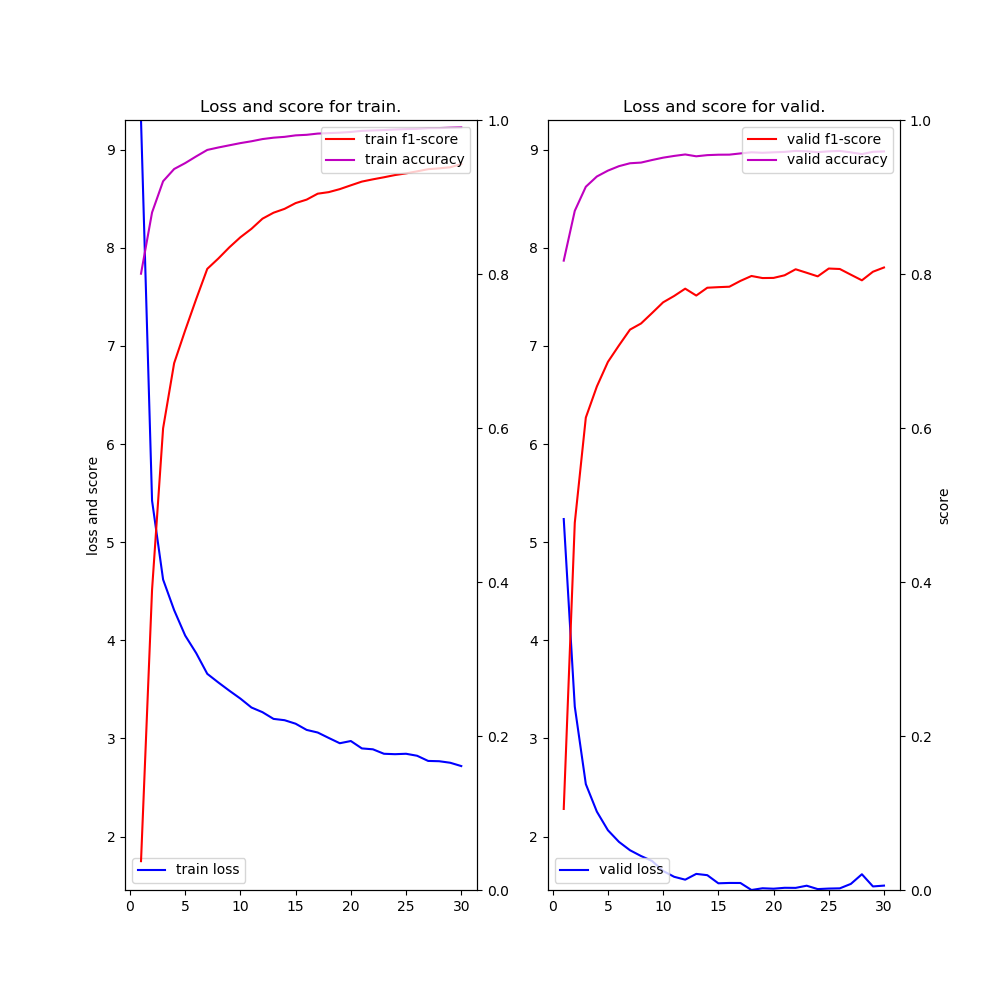
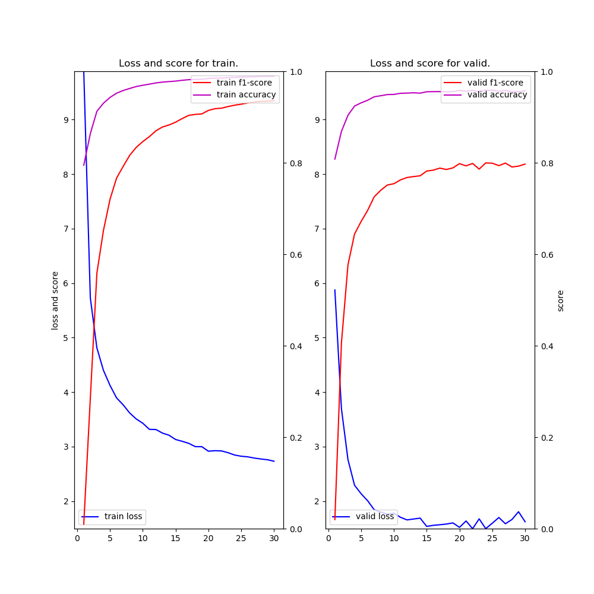

# NER (Neural Architectures for Named Entity Recognition) example

### Description

This example code is a named entity recognition using, Bidirectional LSTM-CRF for Sequence Labeling based on ["Neural Architectures for Named Entity Recognition by Lample, Guillaume, et al., NAACL 2016"](https://arxiv.org/abs/1603.01360) and ["End-to-end Sequence Labeling via Bi-directional LSTM-CNNs-CRF by Ma and Hovy 2016"](https://arxiv.org/abs/1603.01354).

### Dependencies
- python 3.6
- chainer 3.4

In addition, please add the project folder to PYTHONPATH and `conca install` the following packages:
- `matplotlib`

### Usage ###

***Data***

  - Downlod [CoNLL-2003 Datasets](https://www.clips.uantwerpen.be/conll2003/ner/) and put them in the appropriate place.

***Run and Evaluate***

- Words embedding BiLSTM + CRF

```
python train_ner-blstm.py      --gpu -1 --epoch 30 --batchsize 100 --train datasets/train.txt --valid datasets/test.txt --test datasets/test.txt --out results --glove datasets/glove.6B.100d.txt 2>&1 | tee train_ner-blstm.log     
```

- (Chars w/BiLSTM + Words) embedding BiLSTM + CRF
```
python train_ner-blstm-lstm.py --gpu -1 --epoch 30 --batchsize 100 --train datasets/train.txt --valid datasets/test.txt --test datasets/test.txt --out results --glove datasets/glove.6B.100d.txt 2>&1 | tee train_ner-blstm-lstm.log
```

- (Chars w/CNN + Words) embedding BiLSTM + CRF
```
python train_ner-blstm-cnn.py  --gpu -1 --epoch 30 --batchsize 100 --train datasets/train.txt --valid datasets/test.txt --test datasets/test.txt --out results --glove datasets/glove.6B.100d.txt 2>&1 | tee train_ner-blstm-cnn.log 
```

***Input***

- format
```
[word] [tag]
[word] [tag]
...
```

- train.txt
```
EU   B-ORG
rejects O
German  B-MISC
call    O
to  O
boycott O
British B-MISC
lamb    O
.   O

Peter   B-PER
Blackburn   I-PER
...
```


***Output***

- train_ner-blstm.log (use **train_ner-blstm.py**)
```
2018-09-02 10:26:03,569 - main - INFO - vocabulary size: 24279
2018-09-02 10:26:03,569 - main - INFO - number of word embedding dims: 100
2018-09-02 10:26:03,569 - main - INFO - number of lstm units: 200
2018-09-02 10:26:03,569 - main - INFO - number of tags: 12
2018-09-02 10:26:03,569 - main - INFO - train data length: 14986
2018-09-02 10:26:03,569 - main - INFO - valid data length: 3683
2018-09-02 10:26:03,569 - main - INFO - test  data length: 3683
Initialize word embedding by pre-trained model: datasets/glove.6B.100d.txt
2018-09-02 10:29:52,696 - main - INFO - [  1] T/loss=8.969002 T/f1=0.039367 T/acc=0.813577 T/sec= 205.683472 V/loss=5.340519 V/f1=0.075995 V/acc=0.817870 V/sec= 22.967965 lr=0.015000
 :
2018-09-02 13:11:34,859 - main - INFO - [ 30] T/loss=2.731622 T/f1=0.942859 T/acc=0.990203 T/sec= 212.041916 V/loss=1.727283 V/f1=0.787506 V/acc=0.955804 V/sec= 19.909130 lr=0.012971
saving early stopped-model at epoch 30
loading early stopped-model at epoch 30
             precision    recall  f1-score   support

        PER       0.90      0.79      0.84      1617
       MISC       0.80      0.62      0.70       702
        ORG       0.85      0.63      0.72      1661
        LOC       0.86      0.86      0.86      1668

avg / total       0.86      0.74      0.80      5648

2018-09-02 13:11:41,206 - <module> - INFO - time spent: 10001.290546 sec
```

- train_ner-blstm-lstm.log (use **train_ner-blstm-lstm.py**)
```
2018-09-02 15:01:42,350 - main - INFO - vocabulary size: 24279
2018-09-02 15:01:42,350 - main - INFO - number of word embedding dims: 100
2018-09-02 15:01:42,350 - main - INFO - number of lstm units: 200
2018-09-02 15:01:42,350 - main - INFO - number of tags: 12
2018-09-02 15:01:42,350 - main - INFO - train data length: 14986
2018-09-02 15:01:42,351 - main - INFO - valid data length: 3683
2018-09-02 15:01:42,351 - main - INFO - test  data length: 3683
Initialize word embedding by pre-trained model: datasets/glove.6B.100d.txt
2018-09-02 15:07:40,546 - main - INFO - [  1] T/loss=9.301710 T/f1=0.037451 T/acc=0.800393 T/sec= 319.146127 V/loss=5.235821 V/f1=0.105273 V/acc=0.817353 V/sec= 38.657964 lr=0.015000
 :
2018-09-02 17:54:53,246 - main - INFO - [ 30] T/loss=2.718759 T/f1=0.942709 T/acc=0.990452 T/sec= 301.511632 V/loss=1.500667 V/f1=0.808454 V/acc=0.959200 V/sec= 37.769493 lr=0.012971
saving early stopped-model at epoch 30
loading early stopped-model at epoch 30
             precision    recall  f1-score   support

       MISC       0.78      0.61      0.69       702
        LOC       0.84      0.88      0.86      1668
        PER       0.94      0.86      0.90      1617
        ORG       0.84      0.67      0.74      1661

avg / total       0.86      0.78      0.82      5648

2018-09-02 17:55:13,929 - <module> - INFO - time spent: 10482.548023 sec

```

- train_ner-blstm-cnn.log (use **train_ner-blstm-cnn.py**)
```
2018-09-02 10:26:49,397 - main - INFO - vocabulary size: 24279
2018-09-02 10:26:49,397 - main - INFO - number of word embedding dims: 100
2018-09-02 10:26:49,397 - main - INFO - number of lstm units: 200
2018-09-02 10:26:49,398 - main - INFO - number of tags: 12
2018-09-02 10:26:49,398 - main - INFO - train data length: 14986
2018-09-02 10:26:49,398 - main - INFO - valid data length: 3683
2018-09-02 10:26:49,398 - main - INFO - test  data length: 3683
Initialize word embedding by pre-trained model: datasets/glove.6B.100d.txt
2018-09-02 10:35:19,566 - main - INFO - [  1] T/loss=9.885661 T/f1=0.010051 T/acc=0.794756 T/sec= 452.820981 V/loss=5.874088 V/f1=0.019874 V/acc=0.808041 V/sec= 56.707849 lr=0.015000
 :
loading early stopped-model at epoch 30
             precision    recall  f1-score   support

        PER       0.93      0.82      0.87      1617
        ORG       0.86      0.63      0.73      1661
       MISC       0.80      0.60      0.68       702
        LOC       0.87      0.87      0.87      1668

avg / total       0.87      0.75      0.81      5648

2018-09-02 14:37:45,574 - <module> - INFO - time spent: 15131.272154 sec
```

- result-{blstm,blstm-lstm,blstm-cnn}.png (use **train_ner-{blstm,blstm-lstm,blstm-cnn}.py**)

  
