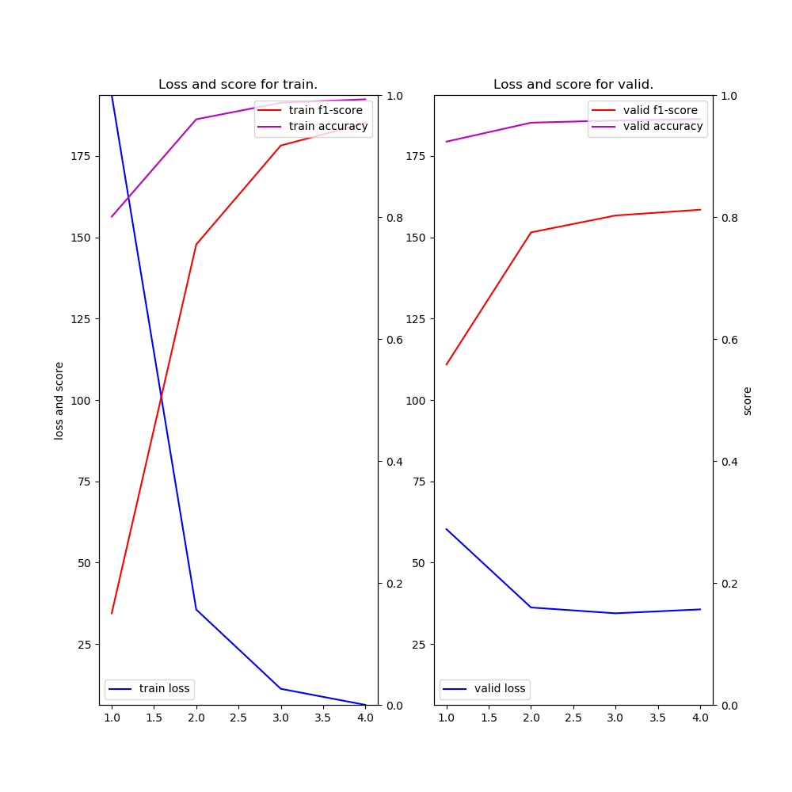

# NER (Neural Architectures for Named Entity Recognition) example

### Description

This example code is a named entity recognition using, Bidirectional LSTM-CRF for Sequence Labeling based on ["Neural Architectures for Named Entity Recognition by Lample, Guillaume, et al., NAACL 2016"](https://arxiv.org/abs/1603.01360).

### Dependencies
- python 3.6
- chainer 3.4

In addition, please add the project folder to PYTHONPATH and `conca install` the following packages:
- `matplotlib`

### Usage ###

***Data***

  - Downlod [CoNLL-2003 Datasets](https://github.com/synalp/NER/blob/master/corpus/CoNLL-2003/) and put them in the appropriate place.

***Run and Evaluate***

```
python train_ner-2.py --gpu 0 --epoch 10                            --train datasets/train.txt --valid datasets/valid.txt --test  datasets/test.txt --out results/result-ner     2>&1 | tee results/train_ner.log
python train_ner-2.py --gpu 0 --epoch 10 --w2v datasets/ner_w2v.bin --train datasets/train.txt --valid datasets/valid.txt --test  datasets/test.txt --out results/result-ner-w2v 2>&1 | tee results/train_ner-w2v.log
```

***Input***

- format
```
[word] [tag]
[word] [tag]
...
```

- train.txt
```
EU   B-ORG
rejects O
German  B-MISC
call    O
to  O
boycott O
British B-MISC
lamb    O
.   O

Peter   B-PER
Blackburn   I-PER
...
```


***Output***

- train_ner-w2v.log (use **train_ner.py**)
```
2018-08-26 23:40:59,316 - main - INFO - vocabulary size: 30291
2018-08-26 23:40:59,317 - main - INFO - number of word embedding dims: 100
2018-08-26 23:40:59,318 - main - INFO - number of lstm units: 100
2018-08-26 23:40:59,325 - main - INFO - number of tags: 13
2018-08-26 23:40:59,327 - main - INFO - train data length: 14041
2018-08-26 23:40:59,330 - main - INFO - valid data length: 3250
2018-08-26 23:40:59,332 - main - INFO - test  data length: 3453
2018-08-26 23:42:48,825 - main - INFO - [  1] T/loss=232.384121 T/f1=0.050008 T/acc=0.782777 T/sec= 97.154211 V/loss=86.347415 V/f1=0.314074 V/acc=0.881040 V/sec= 12.116898 lr=0.015000
 :
2018-08-27 00:02:49,594 - main - INFO - [ 10] T/loss=1.509320 T/f1=0.987788 T/acc=0.998412 T/sec= 125.075724 V/loss=31.750890 V/f1=0.830045 V/acc=0.964075 V/sec= 12.418182 lr=0.009454
             precision    recall  f1-score   support

        LOC       0.90      0.78      0.83      1668
        PER       0.84      0.59      0.69      1617
        ORG       0.68      0.69      0.68      1661
       MISC       0.81      0.69      0.75       702

avg / total       0.81      0.69      0.74      5648

2018-08-27 00:03:32,922 - <module> - INFO - time spent: 1354.546996 sec
```

- result_ner-w2v.png (use **train_ner.py**)


