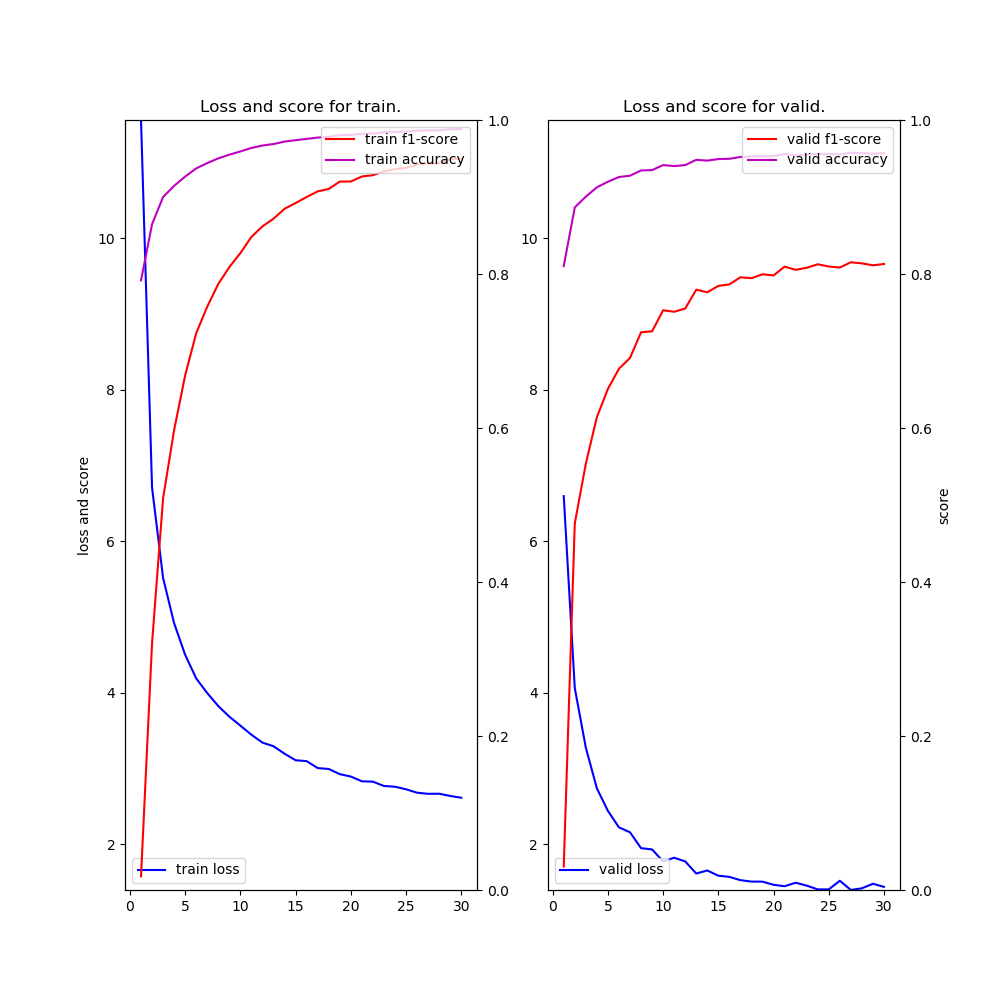

# NER (Neural Architectures for Named Entity Recognition) example

### Description

This example code is a named entity recognition using, Bidirectional LSTM-CRF for Sequence Labeling based on the following two papers.
- ["Neural Architectures for Named Entity Recognition" by Lample, Guillaume, et al., NAACL 2016](https://arxiv.org/abs/1603.01360)
- ["End-to-end Sequence Labeling via Bi-directional LSTM-CNNs-CRF" by Ma and Hovy, ACL 2016](https://arxiv.org/abs/1603.01354)
- ["Reporting Score Distributions Makes a Difference: Performance Study of LSTM-networks for Sequence Tagging" by Reimers and Gurevych, ACL 2017](http://aclweb.org/anthology/D17-1035)

### Dependencies
- python 3.6
- chainer 3.4

In addition, please add the project folder to PYTHONPATH and `conca install` the following packages:
- `matplotlib`
- `seqeval`

### Usage ###

***Data***

  - Downlod [CoNLL-2003 Datasets](https://www.clips.uantwerpen.be/conll2003/ner/) and put them in the appropriate place.

  - Convert from BIO to IOBES format as follows.

```
cd datasets
python ../conv_iobes.py --file train.txt > train-iobes.txt
python ../conv_iobes.py --file valid.txt > valid-iobes.txt
python ../conv_iobes.py --file test.txt  > test-iobes.txt 
```


***Run and Evaluate***

- Words embedding BiLSTM + CRF

```
python train_ner-blstm.py      --gpu -1 --epoch 30 --batchsize 100 --train datasets/train-iobes.txt --valid datasets/test-iobes.txt --test datasets/test-iobes.txt --out results --glove datasets/glove.6B.100d.txt 2>&1 | tee train_ner-blstm.log     
```

- (Chars w/BiLSTM + Words) embedding BiLSTM + CRF
```
python train_ner-blstm-lstm.py --gpu -1 --epoch 30 --batchsize 100 --train datasets/train-iobes.txt --valid datasets/test-iobes.txt --test datasets/test-iobes.txt --out results --glove datasets/glove.6B.100d.txt 2>&1 | tee train_ner-blstm-lstm.log
```

- (Chars w/CNN + Words) embedding BiLSTM + CRF
```
python train_ner-blstm-cnn.py  --gpu -1 --epoch 30 --batchsize 100 --train datasets/train-iobes.txt --valid datasets/test-iobes.txt --test datasets/test-iobes.txt --out results --glove datasets/glove.6B.100d.txt 2>&1 | tee train_ner-blstm-cnn.log 
```

***Input***

- format
```
[word] [tag]
[word] [tag]
...
```

- train.txt  (**BIO** format)
```
EU   B-ORG
rejects O
German  B-MISC
call    O
to  O
boycott O
British B-MISC
lamb    O
.   O

Peter   B-PER
Blackburn   I-PER
...
```

- train-iobes.txt  (**IOBES** format)
```
EU	S-ORG
rejects	O
German	S-MISC
call	O
to	O
boycott	O
British	S-MISC
lamb	O
.	O

Peter	B-PER
Blackburn	E-PER
...
```

***Output***

- iobes-train_ner-blstm.log (use **train_ner-blstm.py**)
```
2018-09-04 08:05:27,347 - main - INFO - vocabulary size: 24279
2018-09-04 08:05:27,347 - main - INFO - number of word embedding dims: 100
2018-09-04 08:05:27,347 - main - INFO - number of lstm units: 200
2018-09-04 08:05:27,347 - main - INFO - number of tags: 17
2018-09-04 08:05:27,347 - main - INFO - train data length: 14986
2018-09-04 08:05:27,347 - main - INFO - valid data length: 3683
2018-09-04 08:05:27,348 - main - INFO - test  data length: 3683
Initialize word embedding by pre-trained model: datasets/glove.6B.100d.txt
2018-09-04 08:06:29,126 - main - INFO - [  1] T/loss=11.535595 T/f1=0.016110 T/acc=0.790955 T/sec= 55.327039 V/loss=6.535969 V/f1=0.033284 V/acc=0.808947 V/sec= 6.036303 lr=0.015000
saving early stopped-model at epoch 1
 :
2018-09-04 08:39:39,869 - main - INFO - [ 30] T/loss=2.610390 T/f1=0.952064 T/acc=0.988733 T/sec= 63.416778 V/loss=1.771711 V/f1=0.787922 V/acc=0.947691 V/sec= 6.427992 lr=0.012971
loading early stopped-model at epoch 22
             precision    recall  f1-score   support

        ORG       0.85      0.65      0.74      1661
       MISC       0.84      0.60      0.70       702
        PER       0.95      0.77      0.85      1617
        LOC       0.86      0.84      0.85      1668

avg / total       0.88      0.74      0.80      5648

2018-09-04 08:39:43,562 - <module> - INFO - time spent: 2132.490583 sec
```

- iobes-train_ner-blstm-lstm.log (use **train_ner-blstm-lstm.py**)
```
2018-09-04 16:33:50,094 - main - INFO - vocabulary size: 24279
2018-09-04 16:33:50,094 - main - INFO - number of word embedding dims: 100
2018-09-04 16:33:50,094 - main - INFO - number of lstm units: 200
2018-09-04 16:33:50,094 - main - INFO - number of tags: 17
2018-09-04 16:33:50,094 - main - INFO - train data length: 14986
2018-09-04 16:33:50,094 - main - INFO - valid data length: 3683
2018-09-04 16:33:50,094 - main - INFO - test  data length: 3683
Initialize word embedding by pre-trained model: datasets/glove.6B.100d.txt
2018-09-04 16:39:22,682 - main - INFO - [  1] T/loss=11.556778 T/f1=0.017740 T/acc=0.791779 T/sec= 292.626435 V/loss=6.595389 V/f1=0.030442 V/acc=0.810334 V/sec= 39.536179 lr=0.015000
saving early stopped-model at epoch 1
 :
2018-09-04 19:21:24,493 - main - INFO - [ 30] T/loss=2.616697 T/f1=0.949855 T/acc=0.988145 T/sec= 259.323202 V/loss=1.440748 V/f1=0.812974 V/acc=0.956680 V/sec= 35.980867 lr=0.012971
loading early stopped-model at epoch 27
             precision    recall  f1-score   support

        ORG       0.84      0.69      0.76      1661
        LOC       0.88      0.86      0.87      1668
       MISC       0.81      0.62      0.70       702
        PER       0.94      0.87      0.90      1617

avg / total       0.88      0.78      0.83      5648

2018-09-04 19:21:42,537 - <module> - INFO - time spent: 10148.917621 sec
```

- iobes-train_ner-blstm-cnn.log (use **train_ner-blstm-cnn.py**)
```
2018-09-04 16:33:49,561 - main - INFO - vocabulary size: 24279
2018-09-04 16:33:49,561 - main - INFO - number of word embedding dims: 100
2018-09-04 16:33:49,561 - main - INFO - number of lstm units: 200
2018-09-04 16:33:49,561 - main - INFO - number of tags: 17
2018-09-04 16:33:49,561 - main - INFO - train data length: 14986
2018-09-04 16:33:49,561 - main - INFO - valid data length: 3683
2018-09-04 16:33:49,561 - main - INFO - test  data length: 3683
Initialize word embedding by pre-trained model: datasets/glove.6B.100d.txt
2018-09-04 16:39:04,904 - main - INFO - [  1] T/loss=11.104684 T/f1=0.015134 T/acc=0.799322 T/sec= 274.267547 V/loss=6.626841 V/f1=0.021359 V/acc=0.809365 V/sec= 40.667884 lr=0.015000
saving early stopped-model at epoch 1
 :
2018-09-04 19:13:21,999 - main - INFO - [ 30] T/loss=2.611063 T/f1=0.951635 T/acc=0.988530 T/sec= 278.114111 V/loss=1.488794 V/f1=0.813527 V/acc=0.955321 V/sec= 44.068302 lr=0.012971
loading early stopped-model at epoch 26
             precision    recall  f1-score   support

       MISC       0.81      0.62      0.70       702
        PER       0.96      0.82      0.89      1617
        ORG       0.86      0.69      0.77      1661
        LOC       0.90      0.86      0.88      1668

avg / total       0.89      0.77      0.83      5648

2018-09-04 19:13:44,030 - <module> - INFO - time spent: 9672.676817 sec
```

- iobes-result-{blstm,blstm-lstm,blstm-cnn}.png (use **train_ner-{blstm,blstm-lstm,blstm-cnn}.py**)

|Words only<br>BiLSTM-CRF|Chars (w/BiLSTM) + Words<br>BiLSTM-CRF|Chars (w/CNN) + Words<br>BiLSTM-CRF|
|---|---|---|
||||
