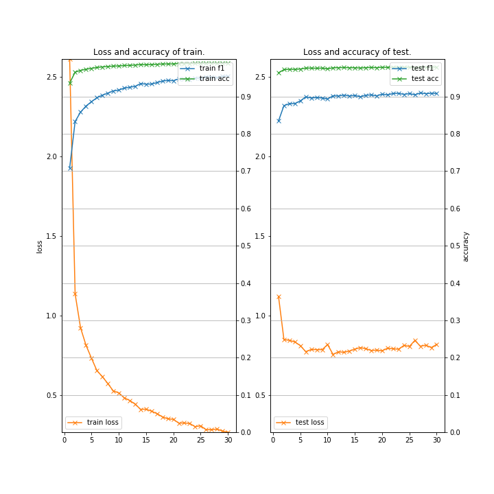

# NCRF++ wrapper (Example code verify the performance of NCRF++)

### Description

This example code is to verify the performance of NCRF++.

- ["NCRF++: An Open-source Neural Sequence Labeling Toolkit" by Jie Yang, Yue Zhang.](https://arxiv.org/abs/1806.05626)

See also [github](https://github.com/jiesutd/NCRFpp).

### Dependencies
- python 3.7
- pytorch 1.0 

In addition, please add the project folder to PYTHONPATH and `conca install` the following packages:
- `matplotlib`
- `seqeval`

### Usage ###

### Preparation ###

***NCRF++***

  - Clone from [NCRF++](https://github.com/jiesutd/NCRFpp) repository and put them in "NCRFpp" directory.

```
git clone https://github.com/jiesutd/NCRFpp
```

***Data***

  - Downlod [CoNLL-2003 Datasets](https://github.com/glample/tagger/tree/master/dataset) and put them in "datasets" directory.

```
mkdir -p datasets && cd datasets
wget https://github.com/synalp/NER/raw/master/corpus/CoNLL-2003/eng.train
wget https://github.com/synalp/NER/raw/master/corpus/CoNLL-2003/eng.testa
wget https://github.com/synalp/NER/raw/master/corpus/CoNLL-2003/eng.testb

python ../NCRFpp/utils/tagSchemeConverter.py BIO2BIOES eng.train eng.train.bioes
python ../NCRFpp/utils/tagSchemeConverter.py BIO2BIOES eng.testa eng.testa.bioes
python ../NCRFpp/utils/tagSchemeConverter.py BIO2BIOES eng.testb eng.testb.bioes

cd ..
```
  - Downlod [GloVe](https://nlp.stanford.edu/projects/glove/) pre-trained word vectors and put them in "GloVe" directory.

```
mkdir -p datasets && cd datasets
wget http://nlp.stanford.edu/data/glove.6B.zip
unzip glove.6B.zip
mv glove.6B GloVe
cd ..
```

***Run and Evaluate***

- Training

```
python train_ncrfpp.py \
--gpu 0 \
--train "datasets/eng.train.bioes" \
--dev   "datasets/eng.testb.bioes" \
--test  "datasets/eng.testb.bioes" \
--glove "GloVe/glove.6B.100d.txt" \
--batchsize 10 \
--epoch 30 \
--out results_ncrfpp \
2>&1 | tee train_ncrfpp.log

{
  "gpu": -1,
  "config": "",
  "train": "datasets/eng.train.bioes",
  "dev": "datasets/eng.testb.bioes",
  "test": "datasets/eng.testb.bioes",
  "glove": "GloVe/glove.6B.100d.txt",
  "batchsize": 10,
  "epoch": 30,
  "out": "results_ncrfpp",
  "noplot": false
}
Save dset directory:  None
Seed num:  42
MODEL:  train
Load pretrained word embedding, norm: False, dir: ../../GloVe/glove.6B.100d.txt
Embedding:
     pretrain word:400000, prefect match:10481, case_match:10553, oov:1924, oov%:0.0838015593013633
++++++++++++++++++++++++++++++++++++++++++++++++++++++++++++++++++++++++++++++++++++++++++++++++++++
DATA SUMMARY START:
 I/O:
     Start   Sequence   Laebling   task...
     Tag          scheme: BMES
     Split         token:  ||| 
     MAX SENTENCE LENGTH: 250
     MAX   WORD   LENGTH: -1
     Number   normalized: True
     Word  alphabet size: 22959
     Char  alphabet size: 78
     Label alphabet size: 18
     Word embedding  dir: ../../GloVe/glove.6B.100d.txt
     Char embedding  dir: None
     Word embedding size: 100
     Char embedding size: 30
     Norm   word     emb: False
     Norm   char     emb: False
     Train  file directory: ../datasets/CoNLL-2013/eng.train.bioes
     Dev    file directory: ../datasets/CoNLL-2013/eng.testb.bioes
     Test   file directory: ../datasets/CoNLL-2013/eng.testb.bioes
     Raw    file directory: None
     Dset   file directory: None
     Model  file directory: None
     Loadmodel   directory: None
     Decode file directory: None
     Train instance number: 14986
     Dev   instance number: 3683
     Test  instance number: 3683
     Raw   instance number: 0
     FEATURE num: 0
 ++++++++++++++++++++++++++++++++++++++++
 Model Network:
     Model        use_crf: True
     Model word extractor: LSTM
     Model       use_char: True
     Model char extractor: CNN
     Model char_hidden_dim: 50
 ++++++++++++++++++++++++++++++++++++++++
 Training:
     Optimizer: SGD
     Iteration: 100
     BatchSize: 10
     Average  batch   loss: False
 ++++++++++++++++++++++++++++++++++++++++
 Hyperparameters:
     Hyper              lr: 0.015
     Hyper        lr_decay: 0.05
     Hyper         HP_clip: None
     Hyper        momentum: 0
     Hyper              l2: 1e-08
     Hyper      hidden_dim: 200
     Hyper         dropout: 0.5
     Hyper      lstm_layer: 1
     Hyper          bilstm: True
     Hyper             GPU: True
DATA SUMMARY END.
++++++++++++++++++++++++++++++++++++++++++++++++++++++++++++++++++++++++++++++++++++++++++++++++++++
build sequence labeling network...
use_char:  True
char feature extractor:  CNN
word feature extractor:  LSTM
use crf:  True
build word sequence feature extractor: LSTM...
build word representation...
build char sequence feature extractor: CNN ...
build CRF...
 Learning rate is set as: 0.014285714285714285
Shuffle: first input word list:  [1567, 4044, 10146, 237, 2656, 12133, 10]
2019-09-14 01:16:59,489 - main - INFO - [  1] T/loss=2.611312 T/f1=0.708629 T/acc=0.936211 T/sec= 128.859690 D/loss=1.121117 D/f1=0.834516 D/acc=0.963806 D/sec= 12.209485 lr=0.014286 
  :
2019-09-14 02:22:07,388 - main - INFO - [ 28] T/loss=0.285877 T/f1=0.950797 T/acc=0.989319 T/sec= 132.650917 D/loss=0.813278 D/f1=0.907817 D/acc=0.978892 D/sec= 12.290469 lr=0.006250 
2019-09-14 02:24:32,460 - main - INFO - [ 29] T/loss=0.273522 T/f1=0.954356 T/acc=0.990135 T/sec= 132.419468 D/loss=0.798472 D/f1=0.908785 D/acc=0.978828 D/sec= 12.652373 lr=0.006122 
2019-09-14 02:26:56,205 - main - INFO - [ 30] T/loss=0.265906 T/f1=0.954988 T/acc=0.990228 T/sec= 130.642800 D/loss=0.818018 D/f1=0.908447 D/acc=0.978956 D/sec= 13.102102 lr=0.006000 

==== Classification report (final model) ====

           precision    recall  f1-score   support

      ORG       0.90      0.87      0.88      1661
      PER       0.96      0.95      0.96      1617
     MISC       0.80      0.81      0.81       702
      LOC       0.92      0.94      0.93      1668

micro avg       0.91      0.91      0.91      5648
macro avg       0.91      0.91      0.91      5648

2019-09-14 02:26:57,921 - <module> - INFO - time spent: 4390.690090 sec
```

- Testing

```
python test_ncrfpp.py \
--gpu -1 \
--savemodel "results_ncrfpp/final.model" \
--savedset "results_ncrfpp/data.bin" \
--test  "datasets/eng.testb.bioes" \
--batchsize 10 \
2>&1 | tee test_ncrfpp.log

{
  "gpu": 0,
  "config": "",
  "savemodel": "results_ncrfpp/final.model",
  "savedset": "results_ncrfpp/data.bin",
  "test": "datasets/eng.testb.bioes",
  "batchsize": 10
}
Load dataset from file:  results_ncrfpp/data.bin
MODEL:  decode
++++++++++++++++++++++++++++++++++++++++++++++++++++++++++++++++++++++++++++++++++++++++++++++++++++
DATA SUMMARY START:
 I/O:
     Start   Sequence   Laebling   task...
     Tag          scheme: BMES
     Split         token:  ||| 
     MAX SENTENCE LENGTH: 250
     MAX   WORD   LENGTH: -1
     Number   normalized: True
  :

-DOCSTART-	O	O

SOCCER	O	O
-	O	O
JAPAN	S-LOC	E-LOC
GET	O	O
LUCKY	O	O
WIN	O	O
,	O	O
CHINA	S-LOC	E-PER
IN	O	O
SURPRISE	O	O
DEFEAT	O	O
.	O	O

Nadim	B-PER	I-PER
Ladki	E-PER	E-PER

```

- Learning curve (train_ncrfpp.py on Google Colaboratory)


