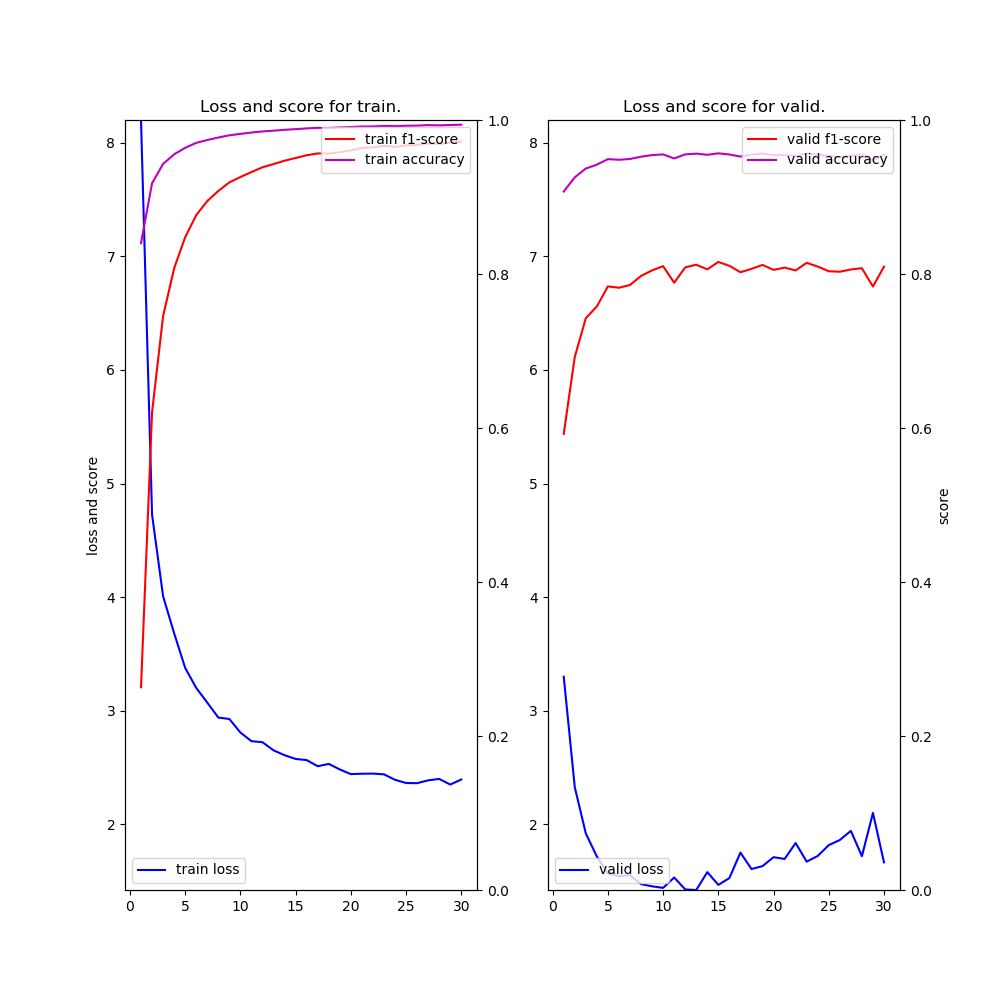
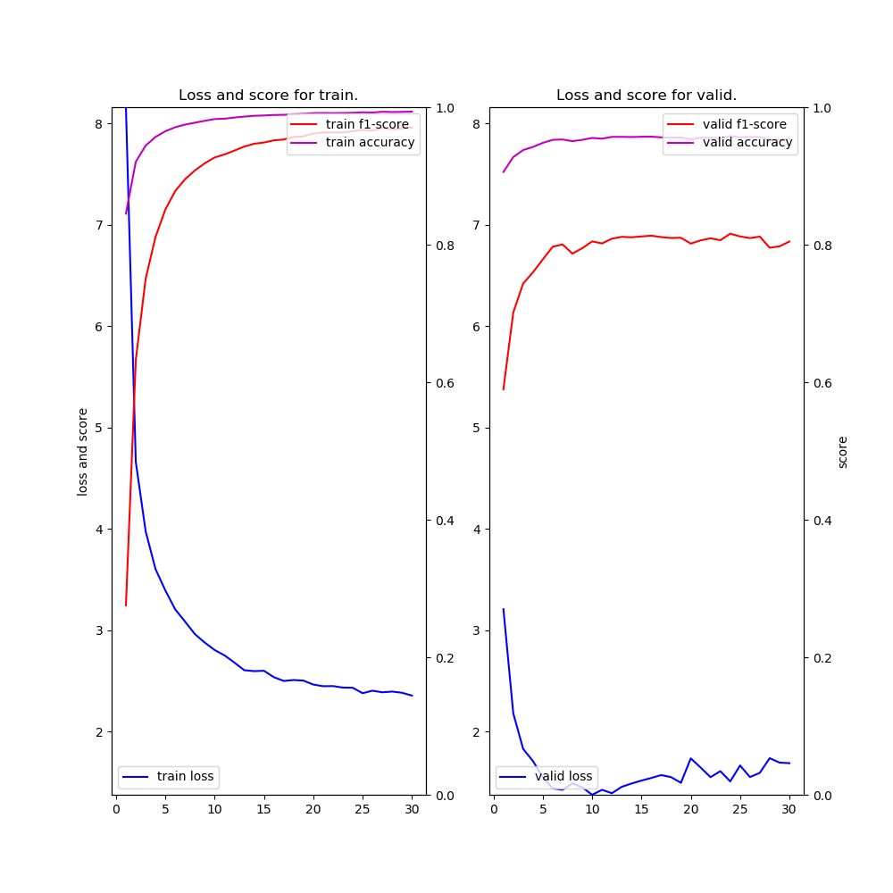
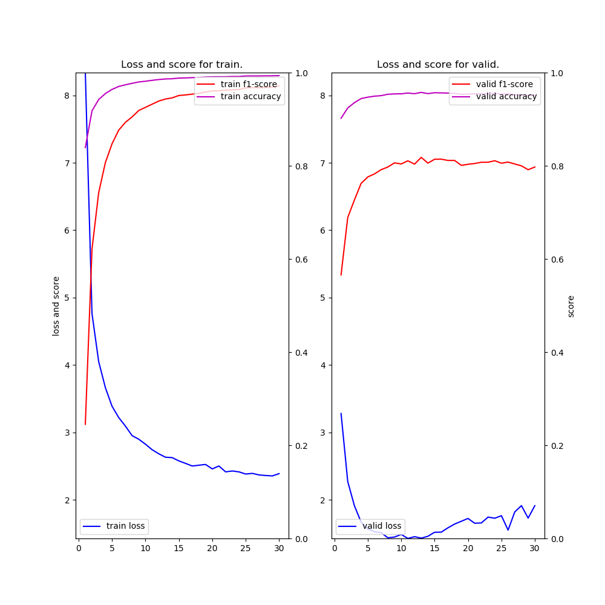

# NER (Neural Architectures for Named Entity Recognition) example

### Description

This example code is a named entity recognition using, Bidirectional LSTM-CRF for Sequence Labeling based on the following two papers.
- ["Neural Architectures for Named Entity Recognition" by Lample, Guillaume, et al., NAACL 2016](https://arxiv.org/abs/1603.01360)
- ["End-to-end Sequence Labeling via Bi-directional LSTM-CNNs-CRF" by Ma and Hovy, ACL 2016](https://arxiv.org/abs/1603.01354)
- ["Reporting Score Distributions Makes a Difference: Performance Study of LSTM-networks for Sequence Tagging" by Reimers and Gurevych, ACL 2017](http://aclweb.org/anthology/D17-1035)

### Dependencies
- python 3.6
- chainer 3.4

In addition, please add the project folder to PYTHONPATH and `conca install` the following packages:
- `matplotlib`
- `seqeval`

### Usage ###

***Data***

  - Downlod [CoNLL-2003 Datasets](https://www.clips.uantwerpen.be/conll2003/ner/) and put them in the appropriate place.

  - Convert from BIO to IOBES format as follows.

```
cd datasets
python ../conv_iobes.py --file train.txt > train-iobes.txt
python ../conv_iobes.py --file valid.txt > valid-iobes.txt
python ../conv_iobes.py --file test.txt  > test-iobes.txt 
```


***Run and Evaluate***

- Words embedding BiLSTM + CRF

```
python train_ner-blstm.py      --gpu -1 --epoch 30 --batchsize 32 --train datasets/train-iobes.txt --valid datasets/test-iobes.txt --test datasets/test-iobes.txt --out results --glove datasets/glove.6B.100d.txt 2>&1 | tee train_ner-blstm-b032.log     
```

- (Chars w/BiLSTM + Words) embedding BiLSTM + CRF
```
python train_ner-blstm-lstm.py --gpu -1 --epoch 30 --batchsize 32 --train datasets/train-iobes.txt --valid datasets/test-iobes.txt --test datasets/test-iobes.txt --out results --glove datasets/glove.6B.100d.txt 2>&1 | tee train_ner-blstm-lstm-b032.log
```

- (Chars w/CNN + Words) embedding BiLSTM + CRF
```
python train_ner-blstm-cnn.py  --gpu -1 --epoch 30 --batchsize 32 --train datasets/train-iobes.txt --valid datasets/test-iobes.txt --test datasets/test-iobes.txt --out results --glove datasets/glove.6B.100d.txt 2>&1 | tee train_ner-blstm-cnn-b032.log 
```

***Input***

- format
```
[word] [tag]
[word] [tag]
...
```

- train.txt  (**BIO** format)
```
EU   B-ORG
rejects O
German  B-MISC
call    O
to  O
boycott O
British B-MISC
lamb    O
.   O

Peter   B-PER
Blackburn   I-PER
...
```

- train-iobes.txt  (**IOBES** format)
```
EU	S-ORG
rejects	O
German	S-MISC
call	O
to	O
boycott	O
British	S-MISC
lamb	O
.	O

Peter	B-PER
Blackburn	E-PER
...
```

***Output***

- iobes-train_ner-blstm-b032.log (use **train_ner-blstm.py**)
```
2018-09-09 17:13:45,868 - main - INFO - vocabulary size: 19925
2018-09-09 17:13:45,868 - main - INFO - number of word embedding dims: 100
2018-09-09 17:13:45,868 - main - INFO - number of lstm units: 200
2018-09-09 17:13:45,868 - main - INFO - number of tags: 17
2018-09-09 17:13:45,868 - main - INFO - train data length: 14986
2018-09-09 17:13:45,869 - main - INFO - valid data length: 3683
2018-09-09 17:13:45,869 - main - INFO - test  data length: 3683
Initialize word embedding by pre-trained model: datasets/glove.6B.100d.txt
2018-09-09 17:15:28,501 - main - INFO - [  1] T/loss=8.200171 T/f1=0.263339 T/acc=0.840107 T/sec= 92.706947 V/loss=3.298893 V/f1=0.592474 V/acc=0.907080 V/sec= 9.648419 lr=0.015000
saving early stopped-model at epoch 1
 :
2018-09-09 18:05:04,141 - main - INFO - [ 30] T/loss=2.394020 T/f1=0.972153 T/acc=0.993863 T/sec= 93.162972 V/loss=1.664761 V/f1=0.809514 V/acc=0.954950 V/sec= 9.724496 lr=0.012971
loading early stopped-model at epoch 15
             precision    recall  f1-score   support

       MISC       0.83      0.67      0.74       702
        ORG       0.85      0.69      0.76      1661
        LOC       0.87      0.87      0.87      1668
        PER       0.95      0.83      0.89      1617

avg / total       0.88      0.78      0.83      5648

2018-09-09 18:05:07,214 - <module> - INFO - time spent: 3143.983434 sec
```

- iobes-train_ner-blstm-lstm-b032.log (use **train_ner-blstm-lstm.py**)
```
2018-09-09 20:52:20,204 - main - INFO - vocabulary size: 19925
2018-09-09 20:52:20,204 - main - INFO - number of word embedding dims: 100
2018-09-09 20:52:20,204 - main - INFO - number of lstm units: 200
2018-09-09 20:52:20,204 - main - INFO - number of tags: 17
2018-09-09 20:52:20,204 - main - INFO - train data length: 14986
2018-09-09 20:52:20,204 - main - INFO - valid data length: 3683
2018-09-09 20:52:20,204 - main - INFO - test  data length: 3683
Initialize word embedding by pre-trained model: datasets/glove.6B.100d.txt
2018-09-09 20:57:55,977 - main - INFO - [  1] T/loss=8.158633 T/f1=0.275498 T/acc=0.845075 T/sec= 296.269768 V/loss=3.206927 V/f1=0.589665 V/acc=0.905811 V/sec= 39.221648 lr=0.015000
saving early stopped-model at epoch 1
 :
2018-09-10 01:24:07,466 - main - INFO - [ 30] T/loss=2.354789 T/f1=0.970175 T/acc=0.993518 T/sec= 600.644815 V/loss=1.687922 V/f1=0.804591 V/acc=0.954173 V/sec= 83.912150 lr=0.012971
loading early stopped-model at epoch 24
             precision    recall  f1-score   support

        LOC       0.87      0.88      0.87      1668
        ORG       0.83      0.71      0.77      1661
        PER       0.95      0.83      0.89      1617
       MISC       0.84      0.70      0.76       702

avg / total       0.88      0.79      0.83      5648

2018-09-10 01:24:44,900 - <module> - INFO - time spent: 16406.942858 sec
```

- iobes-train_ner-blstm-cnn-b032.log (use **train_ner-blstm-cnn.py**)
```
2018-09-09 18:06:10,068 - main - INFO - vocabulary size: 19925
2018-09-09 18:06:10,068 - main - INFO - number of word embedding dims: 100
2018-09-09 18:06:10,068 - main - INFO - number of lstm units: 200
2018-09-09 18:06:10,068 - main - INFO - number of tags: 17
2018-09-09 18:06:10,069 - main - INFO - train data length: 14986
2018-09-09 18:06:10,069 - main - INFO - valid data length: 3683
2018-09-09 18:06:10,069 - main - INFO - test  data length: 3683
Initialize word embedding by pre-trained model: datasets/glove.6B.100d.txt
2018-09-09 18:11:38,498 - main - INFO - [  1] T/loss=8.337113 T/f1=0.245024 T/acc=0.839083 T/sec= 285.710185 V/loss=3.280862 V/f1=0.565797 V/acc=0.901937 V/sec= 42.440532 lr=0.015000
saving early stopped-model at epoch 1
 :
2018-09-09 20:50:55,774 - main - INFO - [ 30] T/loss=2.389700 T/f1=0.971382 T/acc=0.993553 T/sec= 287.763226 V/loss=1.914406 V/f1=0.797260 V/acc=0.950933 V/sec= 42.869426 lr=0.012971
loading early stopped-model at epoch 13
             precision    recall  f1-score   support

        ORG       0.85      0.70      0.76      1661
        LOC       0.90      0.86      0.88      1668
        PER       0.95      0.83      0.89      1617
       MISC       0.82      0.67      0.74       702

avg / total       0.89      0.78      0.83      5648

2018-09-09 20:51:15,826 - <module> - INFO - time spent: 9966.545819 sec
```

- iobes-result-{blstm,blstm-lstm,blstm-cnn}-b032.png (use **train_ner-{blstm,blstm-lstm,blstm-cnn}.py**)

|Words only<br>BiLSTM-CRF|Chars (w/BiLSTM) + Words<br>BiLSTM-CRF|Chars (w/CNN) + Words<br>BiLSTM-CRF|
|---|---|---|
||||
