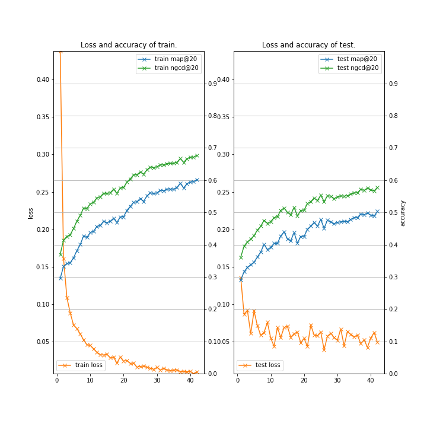
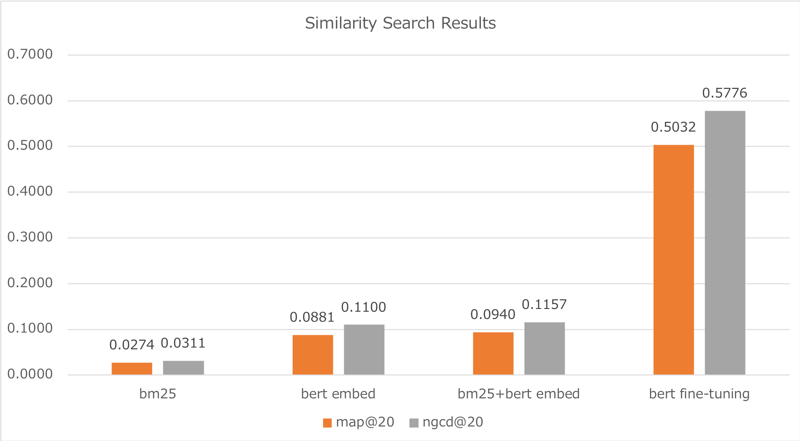

# Patient (Convert Patient disease expression to Standard expression using BERT fine-tuning)

### Description

This example code is to convert a patient disease expression to a standard expression using BERT fine-tuning.

### Dependencies
- python 3.6
- chainer 5.4

In addition, please add the project folder to PYTHONPATH and `conca install` the following packages:
- `matplotlib`

### Preparation ###

***BERT Pretrained model***

  - Downlod [BERT Japanese Pretrained model](http://nlp.ist.i.kyoto-u.ac.jp/index.php?BERT日本語Pretrainedモデル) and extract them in "BERT".

***Data***

  - Downlod [Patient Disease Expression](http://sociocom.jp/~data/2019-pde/data/D3_20190326.xlsx), convert them to tsv format, and put in "datasets/patient".

```
cd datasets/patient
cat d3_20190326.txt \
| cut -f 1-2 \
| sort -u \
| python ../tools/sampling.py /dev/stdin 8483 \
| grep -v "^$" > train-all.txt

cat train-all.txt | head -n  1000 >  test.txt
cat train-all.txt | tail -n +1001 > train.txt
python ../make_datasets.py train.txt
python ../make_datasets.py  test.txt

cat train.queries | cut -f 2 > _train-q.txt
cat  test.queries | cut -f 2 > __test-q.txt
cat train.docs    | cut -f 2 > _train-d.txt
cat  test.docs    | cut -f 2 > __test-d.txt

python ../tools/juman-wakachi.py _train-q.txt > _train-q-wakachi.txt
python ../tools/juman-wakachi.py __test-q.txt > __test-q-wakachi.txt
python ../tools/juman-wakachi.py _train-d.txt > _train-d-wakachi.txt
python ../tools/juman-wakachi.py __test-d.txt > __test-d-wakachi.txt

paste train.queries _train-q-wakachi.txt | cut -f 1,3 > train-wakachi.queries
paste  test.queries __test-q-wakachi.txt | cut -f 1,3 >  test-wakachi.queries
paste train.docs    _train-d-wakachi.txt | cut -f 1,3 > train-wakachi.docs   
paste  test.docs    __test-d-wakachi.txt | cut -f 1,3 >  test-wakachi.docs   

cd ../../
```

***Run and Evaluate***

```
python trainpatient.py \
--gpu 0 \
--batchsize 64 \
--learnrate 5e-05 \
--weightdecay 0.01 \
--epoch 50 \
--train_docs datasets/nfcorpus/train-wakachi.docs \
--train_queries datasets/nfcorpus/train-wakachi.queries \
--train_qrels datasets/nfcorpus/train-wakachi.qrel \
--test_docs datasets/nfcorpus/test-wakachi.docs \
--test_queries datasets/nfcorpus/test-wakachi.queries \
--test_qrels datasets/nfcorpus/test-wakachi.qrel
--init_checkpoint  BERT/Japanese_L-12_H-768_A-12_E-30_BPE/arrays_bert_model.ckpt.npz \
--bert_config_file BERT/Japanese_L-12_H-768_A-12_E-30_BPE/bert_config.json \
--vocab_file       BERT/Japanese_L-12_H-768_A-12_E-30_BPE/vocab.txt \
--max_eval 1000 \
2>&1 | tee trainpatient.log
```

```
/Data/haradatm/src/trec_eval.9.0/trec_eval -m all_trec datasets/patient/test.qrel results_patient-6/test.results.txt | grep -E "ndcg|map" | grep "20 "
```

***Output***

|OpenSMILE|Bert Embeddings|Fusion (OpenSMILE + Bert)|
|---|---|
|


