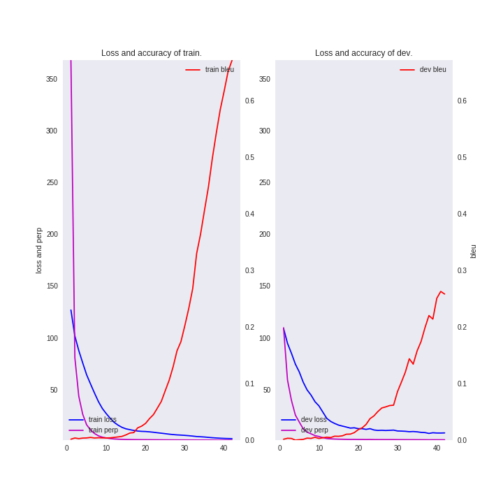
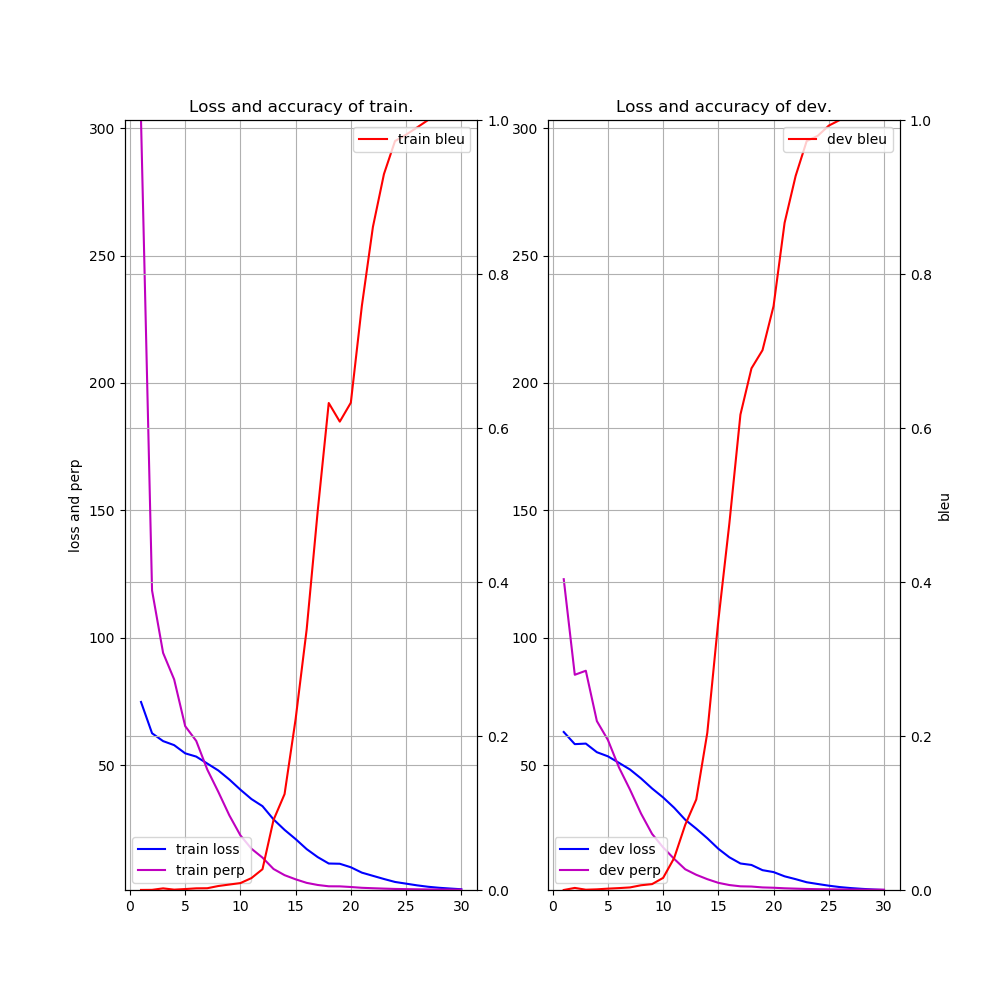

# Seq2Seq (Sequence-to-sequnce learning model) example

### Description

This example code is a Sequence-to-sequnce model for the writing assistance tools.

### Dependencies
- python 3.6
- chainer 3.4

In addition, please add the project folder to PYTHONPATH and `conca install` the following packages:
- `matplotlib`

### Usage ###

***Data***

  - Downlod [青空文庫](https://www.aozora.gr.jp/cards/000148/card789.html) and put them in the appropriate place.
  - Create train and test datasets and put them in the appropriate place.

```
cd datasets/soseki
cat neko.txt | mecab -b 81920 -Owakati > neko-word.txt
python preprocess.py -N 3 neko-word.txt > enc-dec.txt
wc -l enc-dec.txt
   18099 enc-dec.txt
cut -f 1 enc-dec.txt > soseki.preprocess.en
cut -f 2 enc-dec.txt > soseki.preprocess.de
cat soseki.preprocess.en soseki.preprocess.de | tr " " "\n" | sort -u > vocab.txt
```

***Run and Evaluate***
- training

```
python train_seq2seq.py --gpu=0 --SOURCE datasets/soseki/soseki.preprocess.en --TARGET datasets/soseki/soseki.preprocess.de --VOCAB  datasets/soseki/vocab.txt --validation-source datasets/soseki/soseki.preprocess.en --validation-target datasets/soseki/soseki.preprocess.de --out results/soseki --epoch 50 2>&1 | tee results/train_seq2seq-soseki.log
```

- test (your own text-generating)
```
python test_seq2seq.py --gpu=-1 --VOCAB results/soseki/word_ids.bin --validation-source datasets/soseki/test.preprocess.en --validation-target datasets/soseki/test.preprocess.de --model results/soseki/early_stopped.model 2>&1 | tee results/test_seq2seq-soseki.log```
```

***Input***

- format for encode texts (use **preprocess.py**)
```
[sentence 1]
[sentence 1] [sentence 2]
[sentence 1] [sentence 2] [sentence 3]
 :
```

- format for decode texts (use **preprocess.py**)
```
[sentence 2]
[sentence 3]
[sentence 4]
 :
```

- soseki.preprocess.en
```
吾輩 は 猫 で ある 。
名前 は まだ 無い 。
どこ で 生れ た か とんと 見当 が つか ぬ 。
 :
```

- soseki.preprocess.de
```
名前 は まだ 無い 。
どこ で 生れ た か とんと 見当 が つか ぬ 。
何 でも 薄暗い じめじめ し た 所 で ニャーニャー 泣い て いた事 だけ は 記憶 して いる 。
 :
```

***Output***

- results/train_seq2seq-soseki.log (use **train_seq2seq.py**)
```
2018-09-28 11:40:32,761 - load_data - INFO - loading...: datasets/soseki.preprocess.en
2018-09-28 11:40:33,655 - load_data - INFO - loading...: datasets/soseki.preprocess.de
2018-09-28 11:40:34,783 - main - INFO - Source vocabulary size: 13949
2018-09-28 11:40:34,785 - main - INFO - Target vocabulary size: 13949
2018-09-28 11:40:34,786 - main - INFO - Train data size: 18099
2018-09-28 11:40:34,791 - main - INFO - Train source unknown ratio: 0.00%
2018-09-28 11:40:34,794 - main - INFO - Train target unknown ratio: 0.00%
2018-09-28 11:40:34,804 - load_data - INFO - loading...: datasets/soseki.preprocess.en
2018-09-28 11:40:35,126 - load_data - INFO - loading...: datasets/soseki.preprocess.de
2018-09-28 11:40:35,510 - main - INFO - Validation data: 18099
2018-09-28 11:40:35,512 - main - INFO - Validation source unknown ratio: 0.00%
2018-09-28 11:40:35,513 - main - INFO - Validation target unknown ratio: 0.00%
2018-09-28 11:57:30,833 - main - INFO - # source : 是非 連れ て 行っ て やり たい が こう 悪寒 が し て 眼 が くらん で は 電車 へ 乗る どころか 、 靴 脱 へ 降りる 事 も 出来 ない 。 ああ 気の毒 だ 気の毒 だ と 思う と なお 悪寒 が し て なお 眼 が くらん で くる 。
2018-09-28 11:57:30,835 - main - INFO - #  result : 僕 は この 人 の よう に なる 。
2018-09-28 11:57:30,836 - main - INFO - #  expect : 早く 医者 に 見 て もらっ て 服薬 で も し たら 四 時 前 に は 全快 する だろ う と 、 それから 細君 と 相談 を し て 甘木 医 学士 を 迎い に やる と 生憎 昨夜 が 当番 で まだ 大学 から 帰ら ない 。
2018-09-28 11:57:30,842 - main - INFO - [  1] T/loss=126.872520 T/perp=368.058096 T/bleu=0.002239 T/sec= 586.270346 D/loss=109.134123 D/perp=109.708360 D/bleu=0.002128 D/sec= 398.951533 lr=0.001000
2018-09-28 11:57:30,846 - main - INFO - saving early stopped-model at epoch 1
 :
2018-09-28 23:16:57,637 - main - INFO - saving early stopped-model at epoch 41
2018-09-28 23:34:16,590 - main - INFO - # source : 今 まで は 単に 序幕 です 。
2018-09-28 23:34:16,592 - main - INFO - #  result : 第一 買う の に 困り まし た よ 先生 。
2018-09-28 23:34:16,593 - main - INFO - #  expect : まだ ある の かい 。
2018-09-28 23:34:16,597 - main - INFO - [ 42] T/loss=2.565629 T/perp=1.119352 T/bleu=0.671325 T/sec= 633.648177 D/loss=8.090283 D/perp=1.459690 D/bleu=0.258614 D/sec= 405.295306 lr=0.001000
```

- results/test_seq2seq-soseki.log (use **test_seq2seq.py**)
```
2018-09-29 11:28:47,868 - main - INFO - Source vocabulary size: 13949
2018-09-29 11:28:47,868 - main - INFO - Target vocabulary size: 13949
2018-09-29 11:28:47,871 - load_data - INFO - loading...: datasets/soseki/test.preprocess.en
2018-09-29 11:28:47,871 - load_data - INFO - loading...: datasets/soseki/test.preprocess.de
2018-09-29 11:28:47,873 - main - INFO - Validation data: 4
2018-09-29 11:28:47,873 - main - INFO - Validation source unknown ratio: 0.00%
2018-09-29 11:28:47,873 - main - INFO - Validation target unknown ratio: 0.00%

### full enc-dec ###

No.1	(bleu 1.0000)
 source: 吾輩 は 猫 で ある 。
 result: 名前 は まだ 無い 。
 expect: 名前 は まだ 無い 。
No.2	(bleu 1.0000)
 source: 吾輩 は 死ぬ 。 死ん で この 太平 を 得る 。
 result: 太平 は 死な なけれ ば 得 られ ぬ 。
 expect: 太平 は 死な なけれ ば 得 られ ぬ 。
No.3	(bleu 1.0000)
 source: 死ん で この 太平 を 得る 。 太平 は 死な なけれ ば 得 られ ぬ 。
 result: 南無阿弥陀仏 南無阿弥陀仏 。
 expect: 南無阿弥陀仏 南無阿弥陀仏 。
No.4	(bleu 1.0000)
 source: 太平 は 死な なけれ ば 得 られ ぬ 。 南無阿弥陀仏 南無阿弥陀仏 。
 result: ありがたい ありがたい 。
 expect: ありがたい ありがたい 。

### output the word following the ”lead” words. ###

No.1	(bleu 1.0000)
 source: 吾輩 は 猫 で ある 。
   lead: 名前
 result: は まだ 無い 。
 expect: は まだ 無い 。
No.2	(bleu 1.0000)
 source: 吾輩 は 死ぬ 。 死ん で この 太平 を 得る 。
   lead: 太平
 result: は 死な なけれ ば 得 られ ぬ 。
 expect: は 死な なけれ ば 得 られ ぬ 。
No.3	(bleu 1.0000)
 source: 死ん で この 太平 を 得る 。 太平 は 死な なけれ ば 得 られ ぬ 。
   lead: 南無阿弥陀仏
 result: 南無阿弥陀仏 。
 expect: 南無阿弥陀仏 。
No.4	(bleu 1.0000)
 source: 太平 は 死な なけれ ば 得 られ ぬ 。 南無阿弥陀仏 南無阿弥陀仏 。
   lead: ありがたい
 result: ありがたい 。
 expect: ありがたい 。
 ```

- results/train_seq2seq-ogra.log (use **train_seq2seq.py**)
```
2018-09-28 08:12:28,160 - load_data - INFO - loading...: datasets/ogura/ogura.preprocess.en
2018-09-28 08:12:28,161 - load_data - INFO - loading...: datasets/ogura/ogura.preprocess.de
2018-09-28 08:12:28,163 - main - INFO - Source vocabulary size: 317
2018-09-28 08:12:28,163 - main - INFO - Target vocabulary size: 317
2018-09-28 08:12:28,163 - main - INFO - Train data size: 100
2018-09-28 08:12:28,163 - main - INFO - Train source unknown ratio: 0.00%
2018-09-28 08:12:28,163 - main - INFO - Train target unknown ratio: 0.00%
2018-09-28 08:12:28,164 - load_data - INFO - loading...: datasets/ogura/ogura.preprocess.en
2018-09-28 08:12:28,164 - load_data - INFO - loading...: datasets/ogura/ogura.preprocess.de
2018-09-28 08:12:28,166 - main - INFO - Validation data: 100
2018-09-28 08:12:28,166 - main - INFO - Validation source unknown ratio: 0.00%
2018-09-28 08:12:28,166 - main - INFO - Validation target unknown ratio: 0.00%
2018-09-28 08:13:21,483 - main - INFO - # source : 浅 茅 生 の 小 野 の 篠 原 し の ぶ れ ど
2018-09-28 08:13:21,483 - main - INFO - #  result : の の の の
2018-09-28 08:13:21,483 - main - INFO - #  expect : あ ま り て な ど か 人 の 恋 し き
2018-09-28 08:13:21,483 - main - INFO - [  1] T/loss=74.773455 T/perp=303.238386 T/bleu=0.000610 T/sec= 30.353869 D/loss=62.988200 D/perp=122.972371 D/bleu=0.000516 D/sec= 17.097511 lr=0.001000
2018-09-28 08:13:21,483 - main - INFO - saving early stopped-model at epoch 1
 :
2018-09-28 08:45:42,816 - main - INFO - # source : め ぐ り あ ひ て 見 し や そ れ と も わ か ぬ 間 に
2018-09-28 08:45:42,816 - main - INFO - #  result : 雲 が く れ に し 世 半 の 月 か な
2018-09-28 08:45:42,816 - main - INFO - #  expect : 雲 が く れ に し 世 半 の 月 か な
2018-09-28 08:45:42,816 - main - INFO - [ 30] T/loss=1.252660 T/perp=1.100752 T/bleu=1.000000 T/sec= 36.302938 D/loss=0.956569 D/perp=1.075973 D/bleu=1.000000 D/sec= 17.272949 lr=0.001000
2018-09-28 08:45:43,041 - main - INFO - saving final-model at epoch 30
```

- results/test_seq2seq-ogura.log (use **test_seq2seq.py**)
```
2018-09-28 09:06:05,743 - main - INFO - Source vocabulary size: 317
2018-09-28 09:06:05,743 - main - INFO - Target vocabulary size: 317
2018-09-28 09:06:05,743 - load_data - INFO - loading...: datasets/ogura/test.preprocess.en
2018-09-28 09:06:05,743 - load_data - INFO - loading...: datasets/ogura/test.preprocess.de
2018-09-28 09:06:05,746 - main - INFO - Validation data: 4
2018-09-28 09:06:05,746 - main - INFO - Validation source unknown ratio: 0.00%
2018-09-28 09:06:05,746 - main - INFO - Validation target unknown ratio: 0.00%

### full enc-dec ###

No.1	(bleu 1.0000)
 source: 秋 の 田 の 仮 庵 の 庵 の 苫 を あ ら み
 result: わ が 衣 手 は 露 に ぬ れ つ つ
 expect: わ が 衣 手 は 露 に ぬ れ つ つ
No.2	(bleu 1.0000)
 source: 春 過 ぎ て 夏 来 に け ら し 白 妙 の
 result: 衣 ほ す て ふ 天 の 香 具 山
 expect: 衣 ほ す て ふ 天 の 香 具 山
No.3	(bleu 1.0000)
 source: あ し び き の 山 鳥 の 尾 の し だ り 尾 の
 result: な が な が し 夜 を ひ と り か も 寝 む
 expect: な が な が し 夜 を ひ と り か も 寝 む
No.4	(bleu 1.0000)
 source: 田 子 の 浦 に う ち 出 で て み れ ば 白 妙 の
 result: 富 士 の 高 嶺 に 雪 は 降 り つ つ
 expect: 富 士 の 高 嶺 に 雪 は 降 り つ つ

### output the word following the ”lead” words. ###

No.1	(bleu 1.0000)
 source: 秋 の 田 の 仮 庵 の 庵 の 苫 を あ ら み
   lead: わ
 result: が 衣 手 は 露 に ぬ れ つ つ
 expect: が 衣 手 は 露 に ぬ れ つ つ
No.2	(bleu 1.0000)
 source: 春 過 ぎ て 夏 来 に け ら し 白 妙 の
   lead: 衣
 result: ほ す て ふ 天 の 香 具 山
 expect: ほ す て ふ 天 の 香 具 山
No.3	(bleu 1.0000)
 source: あ し び き の 山 鳥 の 尾 の し だ り 尾 の
   lead: な
 result: が な が し 夜 を ひ と り か も 寝 む
 expect: が な が し 夜 を ひ と り か も 寝 む
No.4	(bleu 1.0000)
 source: 田 子 の 浦 に う ち 出 で て み れ ば 白 妙 の
   lead: 富
 result: 士 の 高 嶺 に 雪 は 降 り つ つ
 expect: 士 の 高 嶺 に 雪 は 降 り つ つ
 ```

- train_seq2seq-{soseki,ogura}.png (use **train_seq2seq.py**)

|||
|---|---|
