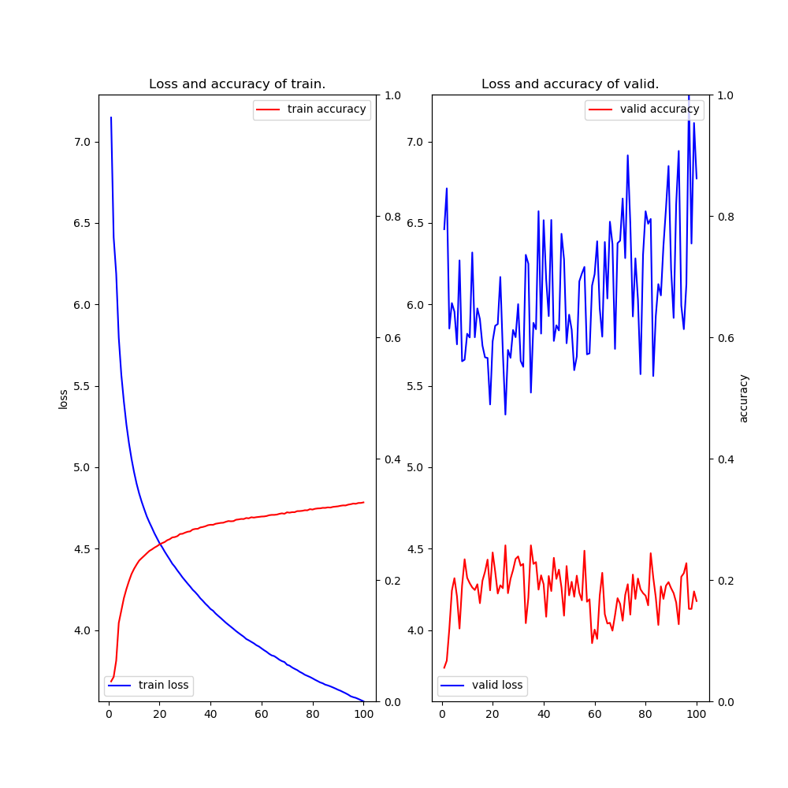
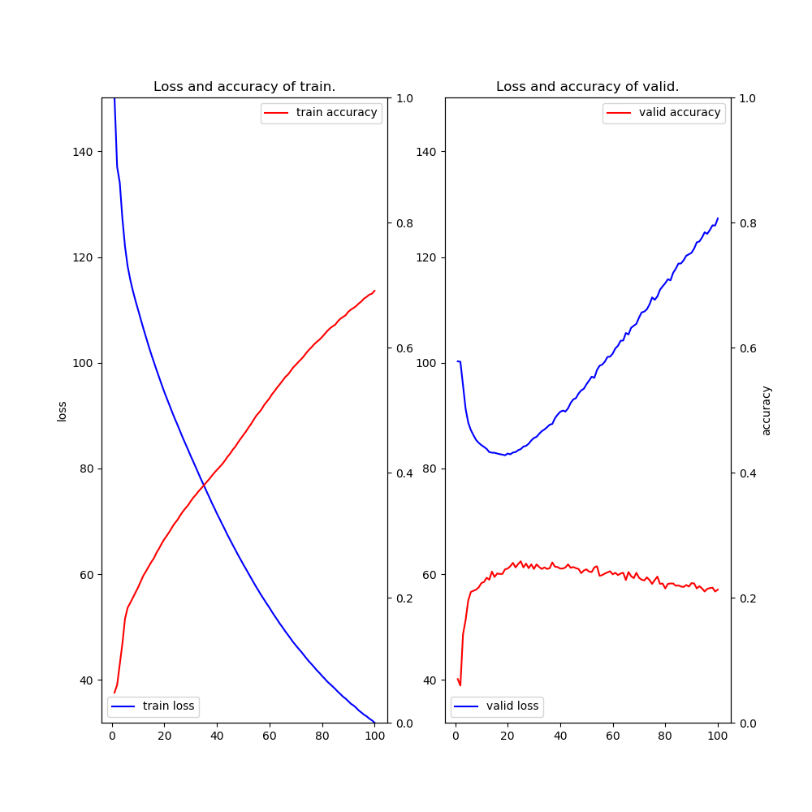

# RNNLM (Recurrent Net Language Model) example

### Description

This example code is a recurrent net for language modeling using three kinds of approaches, `BPTT (back-propagation through time) LSTM`, `NStep LSTM`.

### Dependencies
- python 3.6
- chainer 3.4

In addition, please add the project folder to PYTHONPATH and `conca install` the following packages:
- `matplotlib`

### Usage ###

***Data***

  - Downlod [青空文庫](https://www.aozora.gr.jp/cards/000148/card789.html) and put them in the appropriate place.
  - Create train and test datasets and put them in the appropriate place.

```
cd datasets/soseki
cat neko.txt | sed -e "s/\(.\)/\1 /g" | sed -e "s/ $//g" > neko-char.txt
cat neko.txt | mecab -b 81920 -Owakati > neko-word.txt
word2vec -train neko-word.txt -output neko_w2v.bin -cbow 0 -size 200 -window 5 -negative 1 -hs 1 -sample 0.001 -threads 4 -min-count 1 -binary 1

head -n 8951 neko-word.txt > neko-word-train.txt
tail -n 100  neko-word.txt > neko-word-test.txt

wc -l neko-word*.txt
    8951 neko-word-train.txt
     100 neko-word-test.txt
    9051 neko-word.txt
   18102 total

cd ../../
```

***Run and Evaluate***
- training

```
python train_rnnlm-bptt.py  --train datasets/soseki/neko-word-train.txt --test datasets/soseki/neko-word-test.txt --w2v datasets/soseki/neko_w2v.bin --gpu 0 --epoch 300 --batchsize 100 --unit 200 --bproplen 35 --out results/rnnlm-w2v-bptt  2>&1 | tee results/train_rnnlm-w2v-bptt.log
python train_rnnlm-nstep.py --train datasets/soseki/neko-word-train.txt --test datasets/soseki/neko-word-test.txt --w2v datasets/soseki/neko_w2v.bin --gpu 0 --epoch 300 --batchsize 100 --unit 200               --out results/rnnlm-w2v-nstep 2>&1 | tee results/train_rnnlm-w2v-nstep.log 
```

- test (your own text-generating)
```
python  test_rnnlm-bptt.py  --model results/rnnlm-w2v-bptt/early_stopped.model  --text "吾輩 は 猫 で ある 。" 2>&1 | tee results/test_rnnlm-w2v-bptt.log 
python  test_rnnlm-nstep.py --model results/rnnlm-w2v-nstep/early_stopped.model --text "吾輩 は 猫 で ある 。" 2>&1 | tee results/test_rnnlm-w2v-nstep.log
```

***Input***

- format (space-separated test)
```
[token] [token] ... [token]
[token] [token] ... [token]
 :
```

- neko-word-train.txt
```
吾輩 は 猫 で ある 。
名前 は まだ 無い 。
どこ で 生れ た か とんと 見当 が つか ぬ 。
 :
```

- neko-word-test.txt
```
こんな 豪傑 が すでに 一 世紀 も 前 に 出現 し て いる なら 、 吾輩 の よう な
碌 で なし は とうに 御 暇 を 頂戴 し て 無 何 有 郷 に 帰臥 し て も いい はず で あっ た 。
主人 は 早晩 胃病 で 死ぬ 。
金田 の じいさん は 慾 で もう 死ん で いる 。
 :
```

***Output***

- train_rnnlm-w2v-bptt_-e100-b100.log (use **train_rnnlm-bptt.py**)
```
2018-08-29 19:53:36,717 - main - INFO - vocabulary size: 13948
2018-08-29 19:53:36,717 - main - INFO - train data size: 208502
2018-08-29 19:53:36,717 - main - INFO - train data starts with: 主人 は 例 の 書斎 で ...
2018-08-29 19:53:36,717 - main - INFO - test  data size: 1735
Initialize the embedding from word2vec model: datasets/soseki/neko_w2v.bin
going to train 208500 iterations (100 epochs)
2018-08-29 19:57:37,806 - main - INFO - [  1] T/loss=7.147375 T/acc=0.032825 T/perp=2586.280501 T/sec= 239.736605 D/loss=6.461586 D/acc=0.055294 D/perp=1212.939676 D/sec= 0.531904 lr=0.001000
SAMPLE #=> 主人は例の書斎でにとすれ御に心配小でいい</s>のままだんとだ大きな連れもしくはて
 :
2018-08-30 05:23:41,565 - main - INFO - [100] T/loss=3.562461 T/acc=0.327851 T/perp=36.772139 T/sec= 276.349750 D/loss=6.773683 D/acc=0.165294 D/perp=879.905358 D/sec= 0.549611 lr=0.001000
SAMPLE #=> 主人は例の書斎で竹垣を出して人間の重みに伝える。</s>果してあの両洲得意がない以上は
loading early stopped-model at epoch 25
2018-08-30 05:23:56,806 - main - INFO - time spent: 34246.168786 sec
主人は例の書斎で去るまま舟に叩いて困らないならないはずはない。
おとなしく繰り返して一三中へかかる事遣極ても弱りぬほどまで休養に見縊皿顔色ではない。
よく存外本から食ったぎりほとんどにゃーにゃーと逼籠で盛り込まずの倔強になっでは、明日が真理が横っ面てくれる。
そうですか、持主に買って使わない。
あの中葉は冗談になる。
2018-08-30 05:23:56,806 - main - INFO - time spent: 34246.168786 sec
```

- train_rnnlm-w2v-nstep-e100-b100.log (use **train_rnnlm-nstep.py**)
```
2018-08-29 11:03:46,678 - main - INFO - vocabulary size: 13948
2018-08-29 11:03:46,679 - main - INFO - train data size: 8951
2018-08-29 11:03:46,679 - main - INFO - train data starts with: 主人 は 例 の 書斎 で ...
2018-08-29 11:03:46,679 - main - INFO - test  data size: 100
Initialize the embedding from word2vec model: datasets/soseki/neko_w2v.bin
2018-08-29 11:13:54,818 - main - INFO - [  1] T/loss=150.217396 T/acc=0.048060 T/perp=1767.524140 T/sec= 606.075045 D/loss=100.281563 D/acc=0.069725 D/perp=461.014233 D/sec= 1.366586 lr=0.001000
SAMPLE #=> 主人は例の書斎でがするたらがかい</s>ところ、ならじゃででたら髪作っをない写っ葉それ
 :
2018-08-30 09:08:37,407 - main - INFO - [100] T/loss=31.886349 T/acc=0.690738 T/perp=4.185218 T/sec= 561.818781 D/loss=127.326591 D/acc=0.212844 D/perp=2410.426815 D/sec= 1.106925 lr=0.001000
SAMPLE #=> 主人は例の書斎で胡坐を前へ通う時のような事を見て、したり顔に捨てます。</s>
loading early stopped-model at epoch 19
主人は例の書斎で見ているんだぜ。
どうも吠え棒を食って、知って大きな方を利かしてない付きで、生える記をもったこちら控え挟むようといて寝るそうだ。と聞く事が笑う。
人間が妻君は言った。う。
細君に、極めて一方なちょっと保険の前をした以上は聞きん胃病は幸い日本が何まではも云う男だが、当人の相談を甥のその後請求中な大と欧州をやる事にする。
かな御分といいから、分ると決して金剛石絞めるに聞いていたん。綯っ見て見る。
2018-08-30 09:09:15,689 - main - INFO - time spent: 79545.055571 sec
```

- rnnlm-w2v-{bptt_,nstep}-e100-b100.png (use **train_rnnlm-{bptt,nstep}.py**)

|BPTT|NStep|
|---|---|
|||
