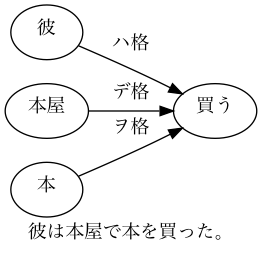
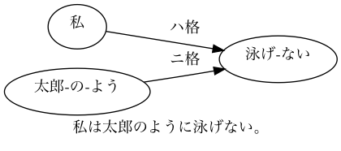

# Triple and Tree (Japanese dependency analysis)

### Dependencies
- python 3.6
- graphviz (tree3.py only)

In addition, please add the project folder to PYTHONPATH and `conca install` the following packages:
- `networkx`

**Usage**

***Command line***
- extract triple: `python triples3.py --input test.txt 2> log-triples3.txt 1> output-triples3.txt`
- draw dependency tree: `python tree3.py --input test.txt 2> log-tree3.txt`

***Input***
- test.txt
```
彼は本屋で本を買った。私は太郎のように泳げない。
```

***Output***
- output-triples3.txt (use **triples3.py**)
```
[d001-s001-p001]	subject=彼	predicate=買う	object=本	others=本屋
[d001-s002-p001]	subject=私	predicate=泳げ-ない	object=	others=太郎-の-よう
```
- graph_d001-s001-p001.png (use **tree3.py**)




- graph_d001-s002-p001.png (by **tree3.py**)



